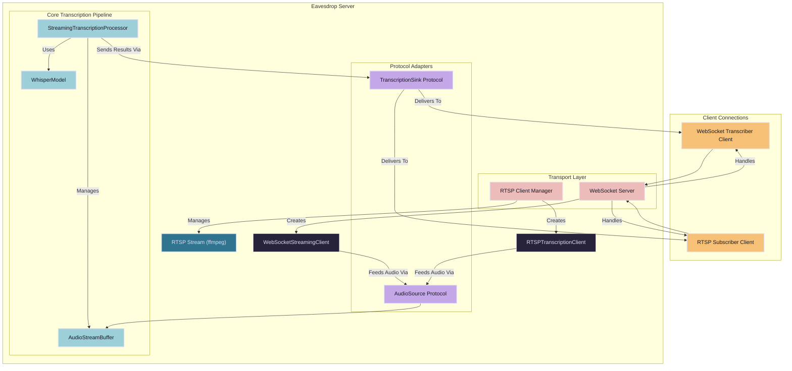
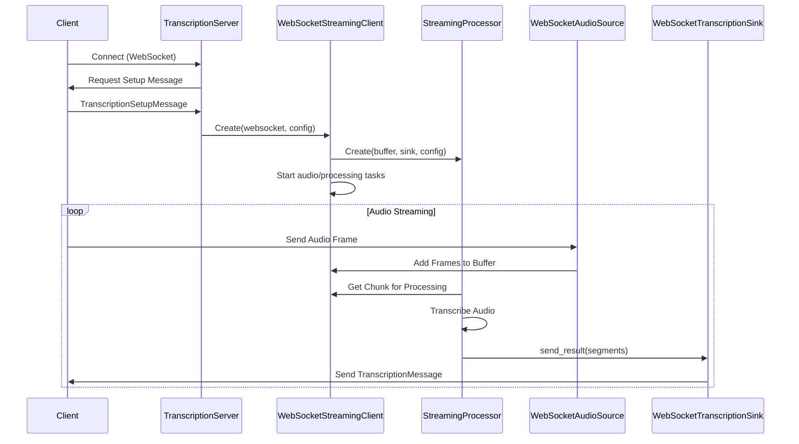
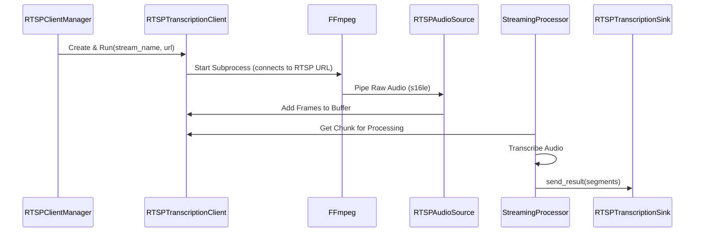
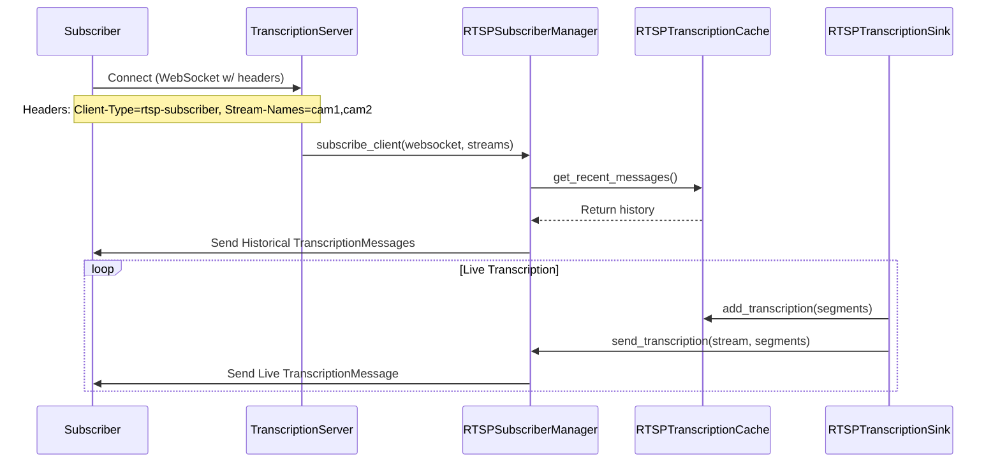
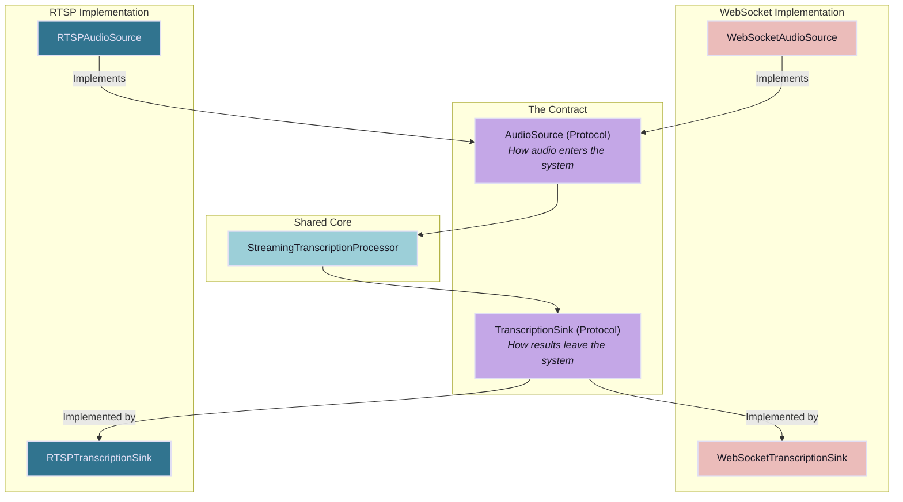

# Eavesdrop Server Architecture

This document provides a detailed overview of the Eavesdrop server architecture, its core components, and the data flows for its primary modes of operation: WebSocket-based transcription and RTSP stream transcription.

## High-Level Architecture

The Eavesdrop server is designed around a central, reusable transcription pipeline. This core pipeline is agnostic to the source of the audio and the destination of the transcription results. It uses a system of protocol-based adapters (`AudioSource`, `TranscriptionSink`) to integrate with different transport layers, namely WebSockets and RTSP streams.

### Core Components

-   **TranscriptionServer (`server.py`):** The main application class. It initializes and manages all other components, including the WebSocket server and the RTSP client manager. It acts as the entry point for handling new client connections.
-   **WebSocketServer (`websocket.py`):** A robust wrapper around the `websockets` library that handles incoming WebSocket connections and passes them to the `TranscriptionServer` for processing.
-   **StreamingTranscriptionProcessor (`streaming/processor.py`):** The heart of the transcription engine. It orchestrates the process of taking audio from an `AudioStreamBuffer`, running it through the `WhisperModel`, and sending the results to a `TranscriptionSink`. It is designed to be completely independent of the audio source or result destination.
-   **AudioStreamBuffer (`streaming/buffer.py`):** A thread-safe buffer that manages incoming audio frames. It handles memory management, cleanup of old audio, and provides chunks of audio to the `StreamingTranscriptionProcessor`.
-   **WhisperModel (`transcription/pipeline.py`):** A wrapper around the `faster-whisper` library. It loads the ML model and exposes the `transcribe` method. It is used by the `StreamingTranscriptionProcessor`.
-   **Configuration (`config.py`):** A set of Pydantic models (`EavesdropConfig`, `TranscriptionConfig`, `RTSPConfig`) that load and validate the server's configuration from a YAML file. This provides strongly-typed and validated access to all settings.

## The Core Abstraction: A Pluggable Pipeline

The architecture is built on a powerful abstraction that separates the audio source and transcription destination from the core transcription logic. This is achieved through two key protocols defined in `streaming/interfaces.py`:

1.  **`AudioSource`**: A protocol that defines how audio is provided to the system. Any class that implements the `read_audio()` async method can act as an audio source.
2.  **`TranscriptionSink`**: A protocol that defines how transcription results are handled. Any class that implements methods like `send_result()` and `send_error()` can be a destination for transcriptions.

This design allows the `StreamingTranscriptionProcessor` to operate on these abstract interfaces, making it highly reusable.

```mermaid
graph LR
    subgraph "Input (AudioSource)"
        WebSocketAudioSource[WebSocketAudioSource]
        RTSPAudioSource[RTSPAudioSource]
    end

    subgraph "Core Pipeline"
        AudioStreamBuffer
        StreamingTranscriptionProcessor
    end

    subgraph "Output (TranscriptionSink)"
        WebSocketTranscriptionSink[WebSocketTranscriptionSink]
        RTSPTranscriptionSink[RTSPTranscriptionSink]
    end

    WebSocketAudioSource -- Implements --> AudioSource[AudioSource Protocol]
    RTSPAudioSource -- Implements --> AudioSource

    AudioSource --> AudioStreamBuffer --> StreamingTranscriptionProcessor

    StreamingTranscriptionProcessor --> TranscriptionSink[TranscriptionSink Protocol]

    TranscriptionSink -- Implemented By --> WebSocketTranscriptionSink
    TranscriptionSink -- Implemented By --> RTSPTranscriptionSink

    %% Rose Pine color scheme
    style WebSocketAudioSource fill:#ebbcba,stroke:#e0def4,stroke-width:2px,color:#191724
    style RTSPAudioSource fill:#ebbcba,stroke:#e0def4,stroke-width:2px,color:#191724

    style AudioStreamBuffer fill:#9ccfd8,stroke:#e0def4,stroke-width:2px,color:#191724
    style StreamingTranscriptionProcessor fill:#9ccfd8,stroke:#e0def4,stroke-width:2px,color:#191724

    style WebSocketTranscriptionSink fill:#ebbcba,stroke:#e0def4,stroke-width:2px,color:#191724
    style RTSPTranscriptionSink fill:#ebbcba,stroke:#e0def4,stroke-width:2px,color:#191724

    style AudioSource fill:#c4a7e7,stroke:#e0def4,stroke-width:2px,color:#191724
    style TranscriptionSink fill:#c4a7e7,stroke:#e0def4,stroke-width:2px,color:#191724
```

## Workflow 1: WebSocket Transcriber

This is the primary mode where a client sends audio data over a WebSocket connection and receives transcription results back on the same connection.

**Component Roles:**

-   **`TranscriptionServer`**: Detects the client is a transcriber, validates the setup message, and creates a `WebSocketStreamingClient`.
-   **`WebSocketClientManager`**: Tracks the active `WebSocketStreamingClient`.
-   **`WebSocketStreamingClient`**: A high-level facade that instantiates and connects all the necessary components for a WebSocket session:
    -   **`WebSocketAudioSource`**: Implements the `AudioSource` protocol. It wraps the `websocket.recv()` call to read incoming audio frames.
    -   **`AudioStreamBuffer`**: Buffers the audio from the source.
    -   **`WebSocketTranscriptionSink`**: Implements the `TranscriptionSink` protocol. It sends `TranscriptionMessage` objects back to the client over the WebSocket.
    -   **`StreamingTranscriptionProcessor`**: The core engine, configured with the WebSocket-specific source and sink.

## Workflow 2: RTSP Stream Processing & Subscribing

This mode involves two distinct parts:
1.  **Ingestion**: The server connects to an external RTSP stream, ingests the audio, and transcribes it continuously.
2.  **Subscription**: WebSocket clients can connect to subscribe to the transcription results from one or more of these streams.

### RTSP Ingestion Flow

### RTSP Subscription Flow

**Component Roles:**

-   **`RTSPClientManager`**: Manages the lifecycle of all RTSP streams defined in the configuration. It creates and runs an `RTSPTranscriptionClient` for each stream.
-   **`RTSPTranscriptionClient`**: A facade similar to its WebSocket counterpart. It manages the `ffmpeg` process and wires together the components for RTSP transcription.
    -   **`RTSPClient`**: A lower-level class that manages the `ffmpeg` subprocess lifecycle, including automatic reconnection.
    -   **`RTSPAudioSource`**: Implements the `AudioSource` protocol. It reads raw audio bytes from a queue populated by the `ffmpeg` process and converts them into the numpy arrays expected by the pipeline.
    -   **`RTSPTranscriptionSink`**: Implements the `TranscriptionSink` protocol. This is a critical fan-out component. When it receives a result, it does two things:
        1.  Adds the transcription to the `RTSPTranscriptionCache`.
        2.  Notifies the `RTSPSubscriberManager` to broadcast the result to any connected subscribers.
-   **`RTSPTranscriptionCache`**: A thread-safe, in-memory cache that stores recent transcription segments for each stream. This allows new subscribers to immediately receive a history of recent transcriptions. Its retention policy cleverly changes based on whether a stream has active listeners.
-   **`RTSPSubscriberManager`**: Manages WebSocket clients that are subscribed to RTSP streams. It handles subscription requests, validates stream names, sends historical data from the cache, and broadcasts live results received from the `RTSPTranscriptionSink`.

## The Contract: WebSocket vs. RTSP

The user's primary interest is the contract between the WebSocket and RTSP parts of the application. This "contract" is masterfully defined by the `AudioSource` and `TranscriptionSink` protocols. The core `StreamingTranscriptionProcessor` is completely decoupled from the transport layer, allowing for clean separation of concerns.

### Similarities

-   **Core Engine**: Both pathways use the exact same `StreamingTranscriptionProcessor` and `WhisperModel` for transcription.
-   **Audio Buffering**: Both use `AudioStreamBuffer` to manage the audio being fed to the processor.
-   **Configuration**: Both start from the same `TranscriptionConfig`, although WebSocket clients can provide per-session overrides.

### Differences

The differences lie entirely in the concrete implementations of the `AudioSource` and `TranscriptionSink` protocols.

| Concern | WebSocket (`TRANSCRIBER`) | RTSP (`SUBSCRIBER`) |
| :--- | :--- | :--- |
| **Audio Input** | **`WebSocketAudioSource`**: Receives pre-formatted `float32` numpy arrays directly from the `TranscriptionServer`'s `recv()` loop. The connection is **client-to-server**. | **`RTSPAudioSource`**: Receives raw `s16le` byte chunks from an `asyncio.Queue` that is populated by an `ffmpeg` subprocess. It is responsible for converting these bytes to `float32` numpy arrays. The connection is **server-to-stream**. |
| **Transcription Output** | **`WebSocketTranscriptionSink`**: Sends transcription results directly back to the single client that provided the audio. It's a 1-to-1 relationship. | **`RTSPTranscriptionSink`**: Fans out results to two places: the `RTSPTranscriptionCache` (for history) and the `RTSPSubscriberManager` (for live broadcast). It's a 1-to-many relationship. |
| **Client Management** | `WebSocketClientManager` tracks each individual transcriber client. | `RTSPClientManager` tracks the ingestion process for each RTSP stream. `RTSPSubscriberManager` tracks the WebSocket clients that are listening to the streams. |
| **State & History** | The transcription is ephemeral and exists only for the life of the connection. | The transcription is cached via `RTSPTranscriptionCache`, allowing it to persist and be available to new subscribers, even if no one was listening when it was generated. |

### Shared Components

The key shared component is the `StreamingTranscriptionProcessor`. By programming to the `AudioSource` and `TranscriptionSink` interfaces, it remains blissfully unaware of whether it's processing audio from a live client WebSocket or a background `ffmpeg` process. This is the cornerstone of the server's elegant and extensible design.