# Eavesdrop Architecture Documentation

## Overview

Eavesdrop is a real-time audio transcription system built on a modern, streaming-first, multi-package architecture. It provides WebSocket-based speech-to-text services using Whisper models, designed for high performance in AMD ROCm GPU environments with support for both containerized and native deployments.

The system consists of three main packages that work together:
- **eavesdrop-server**: The core transcription server
- **eavesdrop-client**: Client library and microphone client
- **eavesdrop-wire**: Shared protocol definitions and message types

The architecture emphasizes modularity, scalability, and resource efficiency through a protocol-based design that cleanly separates concerns between audio input, processing, output delivery, and client-server communication.

## High-Level Architecture

```mermaid
graph TD
    subgraph PACKAGES ["📦 Package Architecture"]
        subgraph CLIENT_PKG ["eavesdrop-client"]
            MIC_CLIENT[MicrophoneClient]
            WS_CLIENT[WebSocket Clients]
        end
        
        subgraph WIRE_PKG ["eavesdrop-wire"]
            MESSAGES[Message Types]
            TRANSCRIPTION[Transcription Models]
            CODEC[MessageCodec]
        end
        
        subgraph SERVER_PKG ["eavesdrop-server"]
            subgraph SERVER ["🖥️ Server Layer"]
                WS_SERVER[WebSocketServer]
                RTSP_MANAGER[RTSPClientManager]
                CLIENT_MGR[WebSocketClientManager]
                CONFIG_MGR[EavesdropConfig]
            end
            
            subgraph PROCESSING ["⚙️ Processing Layer"]
                WS_STREAMING_CLIENT[WebSocketStreamingClient]
                RTSP_CLIENT[RTSPClient]
                AUDIO_BUFFER[AudioStreamBuffer]
                AUDIO_SOURCE[WebSocketAudioSource]
            end
            
            subgraph MODEL ["🤖 Model Layer"]
                WHISPER_MODEL[WhisperModel]
                SHARED_PROCESSOR[StreamingTranscriptionProcessor]
                MODEL_CACHE[Model Cache]
            end
            
            subgraph OUTPUT ["📤 Output Layer"]
                WS_SINK[WebSocketTranscriptionSink]
                RTSP_CACHE[RTSPTranscriptionCache]
                SUBSCRIBER_MGR[RTSPSubscriberManager]
            end
        end
    end
    
    subgraph EXTERNAL ["🌐 External"]
        RTSP_STREAM[RTSP Streams]
    end

    %% Package interactions
    CLIENT_PKG -.-> WIRE_PKG
    SERVER_PKG -.-> WIRE_PKG
    
    %% Client connections
    CLIENT_PKG --> SERVER
    RTSP_STREAM --> SERVER
    
    %% Layer-to-layer connections (vertical flow)
    SERVER --> PROCESSING
    PROCESSING --> MODEL
    MODEL --> OUTPUT
```



## Package Architecture

The Eavesdrop system is organized as a multi-package namespace project with three core packages:

### eavesdrop-server (`packages/server/`)
The core transcription server containing all audio processing, model management, and WebSocket server functionality.

**Key Modules:**
- `server/` - Main server implementation and WebSocket handling
- `streaming/` - Audio streaming, buffering, and transcription processing
- `rtsp/` - RTSP stream management and caching
- `transcription/` - Whisper model integration and utilities
- `config.py` - Configuration management system

### eavesdrop-client (`packages/client/`)
Client library and applications for connecting to the Eavesdrop transcription server.

**Key Components:**
- `MicrophoneClient` - Full-featured microphone recording client with WebSocket integration
- Command-line interface for real-time transcription
- Integration with the wire protocol for type-safe communication

### eavesdrop-wire (`packages/wire/`)
Shared protocol definitions and message types used for communication between server and clients.

**Key Components:**
- `messages.py` - Pydantic-based message types for WebSocket communication
- `transcription.py` - Transcription data structures (Segment, Word, etc.)
- `MessageCodec` - Serialization/deserialization utilities
- Client type definitions and WebSocket headers

## Core Components

### 1. TranscriptionServer (`packages/server/src/eavesdrop/server/server.py`)

The main orchestrator that coordinates all components and manages the server lifecycle.

**Responsibilities:**
- WebSocket connection handling
- Client initialization and lifecycle management
- RTSP stream coordination (when configured)
- Configuration management and validation
- Resource cleanup and graceful shutdown

**Key Features:**
- Debug audio capture capability
- Single model mode support for resource efficiency

### 2. Streaming Transcription System

#### WebSocketStreamingClient (`packages/server/src/eavesdrop/server/streaming/websocket_client.py`)

High-level facade that combines all streaming components for WebSocket clients using protocol-based architecture.


**Key Features:**
- Protocol-based design using AudioSource and TranscriptionSink interfaces
- Configurable buffer management with automatic cleanup
- Integration with shared model resources in single model mode

#### AudioStreamBuffer (`packages/server/src/eavesdrop/server/streaming/buffer.py`)

Manages audio frame buffering with intelligent cleanup and processing coordination.

**Key Features:**
- Configurable automatic buffer cleanup (default: removes old audio after 45s, keeps 30s)
- Thread-safe audio frame addition with numpy array management
- Configurable stall detection and optional audio clipping
- Precise timestamp management for seamless transcription
- Configurable transcription intervals (default: 2.0s) for latency vs performance tuning
- Memory-efficient buffering with duration-based management

#### StreamingTranscriptionProcessor (`packages/server/src/eavesdrop/server/streaming/processor.py`)

The core transcription engine that integrates Faster Whisper model management with streaming processing.

**Responsibilities:**
- Model loading and initialization (with automatic CTranslate2 conversion)
- Continuous transcription loop with configurable VAD integration
- Segment processing and completion detection with configurable thresholds
- Single model mode support with thread-safe access via shared locks
- Hotwords integration for improved recognition accuracy
- Language detection and initial prompt support
- Multi-worker processing coordination (when configured)
- Integration with BufferConfig for intelligent audio processing

### 3. Protocol-Based Architecture

The system uses Protocol interfaces for clean separation and extensibility:


### Wire Protocol System

The `eavesdrop-wire` package provides a comprehensive, type-safe communication protocol between clients and the server using Pydantic models.

#### Message Types (`packages/wire/src/eavesdrop/wire/messages.py`)

Structured message types for all WebSocket communication:

```python
class ClientType(StrEnum):
    TRANSCRIBER = "transcriber"
    RTSP_SUBSCRIBER = "rtsp_subscriber"
    HEALTH_CHECK = "health_check"

@dataclass
class TranscriptionMessage(BaseMessage):
    type: Literal["transcription"] = "transcription"
    stream: str
    segments: list[Segment]
    language: str | None = None

@dataclass
class ErrorMessage(BaseMessage):
    type: Literal["error"] = "error"
    message: str

@dataclass
class ServerReadyMessage(BaseMessage):
    type: Literal["server_ready"] = "server_ready"
    backend: str
```

#### Transcription Models (`packages/wire/src/eavesdrop/wire/transcription.py`)

Core data structures for transcription results:

```python
@dataclass
class Segment:
    id: int
    seek: int
    start: float
    end: float
    text: str
    tokens: list[int]
    avg_logprob: float
    compression_ratio: float
    no_speech_prob: float
    words: list[Word] | None
    temperature: float | None
    completed: bool = False

class UserTranscriptionOptions(BaseModel):
    initial_prompt: str | None = None
    hotwords: str | None = None
    beam_size: int = 5
    word_timestamps: bool = False
```

#### MessageCodec

Type-safe serialization and deserialization utilities for WebSocket communication, ensuring consistent message formats across the entire system.

### 4. Client Library System

#### MicrophoneClient (`packages/client/src/eavesdrop/client/microphone_client.py`)

Full-featured client application for real-time microphone transcription.

**Features:**
- Real-time audio capture using sounddevice
- WebSocket connection management with automatic reconnection
- Type-safe communication using the wire protocol
- Interactive session control (spacebar to toggle recording)
- Integration with server-side transcription configuration
- Support for user transcription options (hotwords, initial prompt, etc.)

**Key Components:**
```python
class MicrophoneClient:
    def __init__(self, host: str = "home-brainbox", port: int = 9090)
    async def connect(self) -> None
    async def start_transcription_session(self, options: UserTranscriptionOptions) -> None
    async def send_audio_data(self, audio: np.ndarray) -> None
    def start_recording(self) -> None
    def stop_recording(self) -> None
```

### 5. RTSP Support System

#### RTSPClientManager (`packages/server/src/eavesdrop/server/rtsp/manager.py`)

Manages multiple RTSP streams with centralized model sharing and health monitoring.

**Features:**
- Concurrent RTSP stream processing with named stream support
- Stream failure detection and automatic restart capability
- Centralized statistics and monitoring
- Graceful shutdown coordination
- Integration with RTSPTranscriptionCache for result persistence
- Shared model resource management across all RTSP streams

#### RTSPTranscriptionCache (`packages/server/src/eavesdrop/server/rtsp/cache.py`)

Intelligent caching system for RTSP transcription results with listener-aware retention policies.

**Features:**
- Dual cache duration modes: longer retention when no listeners, shorter when active
- Thread-safe cache operations with automatic cleanup
- Integration with subscriber notifications
- Configurable cache durations via YAML config
- Memory-efficient storage with timestamp-based expiration

#### RTSPSubscriberManager (`packages/server/src/eavesdrop/server/rtsp/subscriber.py`)

Manages WebSocket subscribers that receive transcription results from named RTSP streams.

**Features:**
- Single subscriber per RTSP stream policy enforcement
- Stream status notifications and error propagation
- Automatic delivery of cached transcriptions on connection
- Integration with RTSPTranscriptionCache for history delivery
- WebSocket client lifecycle management for subscribers

### 6. Configuration Management System

#### EavesdropConfig (`packages/server/src/eavesdrop/server/config.py`)

Pydantic-based configuration system providing comprehensive validation and type safety.

**Configuration Classes:**
- `BufferConfig` - Audio buffer management parameters with validation
- `TranscriptionConfig` - Whisper model and processing configuration
- `RTSPConfig` - RTSP stream and caching configuration
- `RTSPCacheConfig` - Cache duration and behavior settings
- `EavesdropConfig` - Root configuration combining all subsystems

**Key Features:**
- YAML file loading with comprehensive validation
- Environment variable integration
- Default value management with type conversion
- Validation relationships (e.g., cleanup_duration < max_buffer_duration)
- Hotwords and VAD parameter configuration

### 7. Model Management and Backend

#### WhisperModel (`packages/server/src/eavesdrop/server/transcription/whisper_model.py`)

Wrapper around Faster Whisper with CTranslate2 optimization and GPU selection.

**Features:**
- Automatic model download and CTranslate2 conversion
- GPU device selection and precision optimization
- Model caching in standardized directory structure
- Integration with hotwords and language configuration

## Data Flow Patterns

### WebSocket Client Flow


### RTSP Stream Flow with Subscriber System


### Model Resource Management


## Critical Types and Data Structures

### Wire Protocol Types

The `eavesdrop-wire` package defines the core communication types:

```python
# Message types for WebSocket communication
class ClientType(StrEnum):
    TRANSCRIBER = "transcriber"
    RTSP_SUBSCRIBER = "rtsp_subscriber"
    HEALTH_CHECK = "health_check"

@dataclass
class TranscriptionMessage(BaseMessage):
    type: Literal["transcription"] = "transcription"
    stream: str
    segments: list[Segment]
    language: str | None = None

# Transcription data structures
@dataclass
class Segment:
    id: int
    seek: int
    start: float
    end: float
    text: str
    tokens: list[int]
    avg_logprob: float
    compression_ratio: float
    no_speech_prob: float
    words: list[Word] | None
    temperature: float | None
    completed: bool = False

class UserTranscriptionOptions(BaseModel):
    initial_prompt: str | None = None
    hotwords: str | None = None
    beam_size: int = 5
    word_timestamps: bool = False
```

### Configuration Types

```python
@dataclass
class BufferConfig:
    sample_rate: int = Field(default=16000, gt=0)
    max_buffer_duration: float = Field(default=45.0, gt=0.0)
    cleanup_duration: float = Field(default=30.0, gt=0.0)
    min_chunk_duration: float = Field(default=1.0, gt=0.0)
    transcription_interval: float = Field(default=2.0, gt=0.0)
    clip_audio: bool = False
    max_stall_duration: float = Field(default=25.0, gt=0.0)

class TranscriptionConfig(BaseModel):
    model: str = "distil-medium.en"
    custom_model: str | None = None
    language: str = "en"
    initial_prompt: str | None = None
    hotwords: list[str] = Field(default_factory=list)
    use_vad: bool = True
    num_workers: int = Field(default=1, ge=1)
    send_last_n_segments: int = Field(default=10, ge=1)
    no_speech_thresh: float = Field(default=0.45, ge=0.0, le=1.0)
    same_output_threshold: int = Field(default=10, ge=1)
    gpu_name: str | None = None
    vad_parameters: VadOptions = Field(default_factory=VadOptions)
    buffer: BufferConfig = Field(default_factory=BufferConfig)

class RTSPCacheConfig(BaseModel):
    waiting_for_listener_duration: float = Field(default=10800.0, ge=0.0)
    has_listener_cache_duration: float = Field(default=600.0, ge=0.0)

class RTSPConfig(BaseModel):
    streams: dict[str, str] = Field(default_factory=dict)
    cache: RTSPCacheConfig = Field(default_factory=RTSPCacheConfig)

class EavesdropConfig(BaseModel):
    transcription: TranscriptionConfig = Field(default_factory=TranscriptionConfig)
    rtsp: RTSPConfig = Field(default_factory=RTSPConfig)
```

### Core Data Types

Core data types are now defined in the `eavesdrop-wire` package for type-safe communication:

```python
# From packages/wire/src/eavesdrop/wire/transcription.py
@dataclass
class TranscriptionResult:
    """Structured transcription result containing segments and metadata."""
    segments: list[Segment]
    language: str | None = None
    language_probability: float | None = Field(default=None, ge=0.0, le=1.0)

# From packages/server/src/eavesdrop/server/streaming/interfaces.py
class AudioSource(Protocol):
    async def read_audio(self) -> np.ndarray | None: ...
    def close(self) -> None: ...

class TranscriptionSink(Protocol):
    async def send_result(self, result: TranscriptionResult) -> None: ...
    async def send_error(self, error: str) -> None: ...
    async def send_language_detection(self, language: str, probability: float) -> None: ...
    async def send_server_ready(self, backend: str) -> None: ...
    async def disconnect(self) -> None: ...
```

## Resource Management

### GPU and Device Selection

The system automatically detects and optimizes for available hardware:

- **CUDA Detection**: Automatic GPU capability detection with precision optimization
- **ROCm Support**: AMD GPU support with configurable architecture targeting
- **CPU Fallback**: Automatic fallback to CPU with int8 quantization
- **Device Index**: Configurable GPU device selection for multi-GPU systems

### Memory Management

- **Buffer Limits**: Automatic audio buffer cleanup to prevent memory exhaustion
- **Model Sharing**: Single model mode reduces memory footprint for multiple clients
- **Resource Cleanup**: Comprehensive cleanup on client disconnection

### Concurrency Model

- **Async/Await**: Full async implementation for non-blocking I/O
- **Thread Safety**: Critical sections protected with locks for model access
- **Task Management**: Proper task lifecycle management with graceful cancellation
- **Connection Pools**: Efficient WebSocket connection management

## Configuration and Deployment

### Environment Variables

Command-line arguments and environment variables:

- `EAVESDROP_PORT` (default: 9090) - WebSocket server port
- `EAVESDROP_CONFIG` - **REQUIRED** path to YAML configuration file
- `JSON_LOGS` (default: false) - Enable structured JSON logging
- `LOG_LEVEL` (default: INFO) - Logging verbosity
- `CORRELATION_ID` - Request correlation ID for distributed tracing

**Note**: Most configuration is now handled via the YAML configuration file rather than environment variables.

### Docker Architecture

```mermaid
graph LR
    subgraph "Docker Container"
        subgraph "ROCm Runtime"
            ROCM[ROCm 6.4.2]
            PYTORCH[PyTorch with ROCm]
        end

        subgraph "Python Environment"
            WHISPER[Faster Whisper]
            CTRANSLATE2[CTranslate2]
            SERVER[Eavesdrop Server]
        end

        subgraph "GPU Access"
            KFD[/dev/kfd]
            DRI[/dev/dri]
        end
    end

    ROCM --> PYTORCH
    PYTORCH --> WHISPER
    WHISPER --> CTRANSLATE2
    CTRANSLATE2 --> SERVER
    KFD --> ROCM
    DRI --> ROCM
```

### Model Caching Strategy

- **Local Cache**: Models cached in `/app/.cache/eavesdrop/whisper-ct2-models/` (see `packages/server/src/eavesdrop/server/constants.py`)
- **Auto-conversion**: HuggingFace models automatically converted to CTranslate2
- **Version Management**: Safe model name transformation for filesystem storage
- **Quantization**: Automatic precision selection based on device capability
- **Shared Resources**: Single model mode enables sharing across WebSocket clients and RTSP streams

### RTSP Transcription Caching

- **Listener-Aware Retention**: Different cache durations based on subscriber presence
- **Default Durations**: 3 hours when waiting for listeners, 10 minutes with active subscribers
- **Memory Management**: Automatic cleanup with configurable thresholds
- **Thread-Safe Operations**: Concurrent access from multiple RTSP streams and subscribers

## Performance Characteristics

### Latency Optimization

- **Streaming Processing**: Sub-second latency for real-time transcription
- **VAD Integration**: Voice Activity Detection reduces unnecessary processing
- **Efficient Buffering**: Minimal memory copy operations in audio pipeline
- **Model Reuse**: Single model mode eliminates initialization overhead

### Scalability Features

- **Connection Limits**: Configurable client limits prevent resource exhaustion
- **Timeout Management**: Automatic cleanup of stale connections
- **RTSP Scaling**: Multiple concurrent RTSP streams with shared resources
- **Error Recovery**: Robust error handling with graceful degradation

### Resource Efficiency

- **Memory Bounds**: Automatic buffer cleanup prevents memory leaks
- **GPU Utilization**: Efficient GPU memory usage with precision optimization
- **Thread Management**: Minimal thread usage through async architecture
- **Model Sharing**: Reduced memory footprint in multi-client scenarios

## Extensibility Points

### Protocol System

The protocol-based architecture enables easy extension:

- **AudioSource**: Custom audio input sources (file, network, etc.)
  - Current implementations: WebSocketAudioSource, RTSPAudioSource
- **TranscriptionSink**: Custom output destinations (files, databases, etc.)
  - Current implementations: WebSocketTranscriptionSink
- **Configuration System**: Pydantic-based validation with YAML support
  - Extensible configuration classes for new components

### Configuration System

- **Pydantic-Based**: Type-safe configuration with validation
- **YAML Configuration**: Comprehensive file-based configuration system
- **Hierarchical Structure**: Nested configuration for transcription, RTSP, and buffer settings
- **Default Management**: Sensible defaults with environment variable integration
- **Validation**: Field validation and relationship constraints

### Processing Pipeline

- **Buffer Management**: Configurable audio buffering with automatic cleanup
- **Custom Processing**: Pluggable segment processing via processor configuration
- **Output Filtering**: Configurable segment filtering and validation
- **Hotwords Integration**: Custom vocabulary enhancement for domain-specific terms
- **VAD Integration**: Configurable voice activity detection parameters
- **Caching System**: Intelligent transcription result caching for RTSP streams
- **Wire Protocol**: Type-safe message serialization through the `eavesdrop-wire` package
- **Client Integration**: Seamless client-server communication via the `eavesdrop-client` package

This architecture provides a robust, scalable foundation for real-time audio transcription with clear separation of concerns, efficient resource management, and extensive configurability.
