# Eavesdrop Architecture Documentation

## Overview

Eavesdrop is a real-time audio transcription server built on a modern, streaming-first architecture. It provides WebSocket-based speech-to-text services using Whisper models, designed for high performance in AMD ROCm GPU environments with support for both containerized and native deployments.

The architecture emphasizes modularity, scalability, and resource efficiency through a protocol-based design that cleanly separates concerns between audio input, processing, and output delivery.

## High-Level Architecture

```mermaid
graph TD
    subgraph CLIENT ["🌐 Client Layer"]
        WS_CLIENT[WebSocket Clients]
        RTSP_STREAM[RTSP Streams]
    end

    subgraph SERVER ["🖥️ Server Layer"]
        WS_SERVER[WebSocketServer]
        RTSP_MANAGER[RTSPClientManager]  
        CLIENT_MGR[WebSocketClientManager]
    end

    subgraph PROCESSING ["⚙️ Processing Layer"]
        WS_STREAMING_CLIENT[WebSocketStreamingClient]
        RTSP_TRANSCRIPTION_CLIENT[RTSPTranscriptionClient]
        AUDIO_BUFFER[AudioStreamBuffer]
        TRANSCRIPTION_PROC[StreamingTranscriptionProcessor]
    end

    subgraph MODEL ["🤖 Model Layer"]
        WHISPER_BACKEND[ServeClientFasterWhisper]
        WHISPER_MODEL[WhisperModel]
        RTSP_MODEL_MGR[RTSPModelManager]
    end

    subgraph OUTPUT ["📤 Output Layer"]
        WS_SINK[WebSocketTranscriptionSink]
        RTSP_SINK[RTSPAudioSource]
        TRANSLATION_QUEUE[Translation Queue]
    end

    %% %% Layer-to-layer connections (vertical flow)
    CLIENT --> SERVER
    SERVER --> PROCESSING  
    PROCESSING --> MODEL
    MODEL --> OUTPUT
```



## Core Components

### 1. TranscriptionServer (`src/eavesdrop/server.py`)

The main orchestrator that coordinates all components and manages the server lifecycle.

**Responsibilities:**
- WebSocket connection handling
- Client initialization and lifecycle management
- RTSP stream coordination (when configured)
- Configuration management and validation
- Resource cleanup and graceful shutdown

**Key Features:**
- Max client limit enforcement (default: 4 clients)
- Connection timeout management (default: 300s)
- Debug audio capture capability
- Single model mode support for resource efficiency

### 2. Streaming Transcription System

#### WebSocketStreamingClient (`src/eavesdrop/streaming/websocket_client.py`)

High-level facade that combines all streaming components for WebSocket clients.


#### AudioStreamBuffer (`src/eavesdrop/streaming/buffer.py`)

Manages audio frame buffering with intelligent cleanup and processing coordination.

**Key Features:**
- Automatic buffer cleanup (removes old audio after 45s, keeps 30s)
- Thread-safe audio frame addition
- Configurable stall detection and clipping
- Precise timestamp management for seamless transcription

#### StreamingTranscriptionProcessor (`src/eavesdrop/streaming/processor.py`)

The core transcription engine that integrates Faster Whisper model management with streaming processing.

**Responsibilities:**
- Model loading and initialization (with CTranslate2 conversion)
- Continuous transcription loop with VAD integration
- Segment processing and completion detection
- Single model mode support with thread-safe access

### 3. Protocol-Based Architecture

The system uses Protocol interfaces for clean separation and extensibility:


### 4. RTSP Support System

#### RTSPClientManager (`src/eavesdrop/rtsp_manager.py`)

Manages multiple RTSP streams with centralized model sharing and health monitoring.

**Features:**
- Concurrent RTSP stream processing
- Stream failure detection and restart capability
- Centralized statistics and monitoring
- Graceful shutdown coordination

#### RTSPModelManager (`src/eavesdrop/rtsp_models.py`)

Provides shared Whisper model instances for RTSP streams to optimize resource usage.

### 5. Model Management and Backend

#### Faster Whisper Backend (`src/eavesdrop/backend.py`)

Legacy backend implementation, being superseded by the streaming processor architecture.

#### WhisperModel (`src/eavesdrop/transcription/whisper_model.py`)

Wrapper around Faster Whisper with CTranslate2 optimization and GPU selection.

## Data Flow Patterns

### WebSocket Client Flow


### RTSP Stream Flow


### Model Resource Management


## Critical Types and Data Structures

### Configuration Types

```python
@dataclass
class BufferConfig:
    sample_rate: int = 16000
    max_buffer_duration: float = 45.0
    cleanup_duration: float = 30.0
    min_chunk_duration: float = 1.0
    clip_audio: bool = False
    max_stall_duration: float = 25.0

@dataclass  
class TranscriptionConfig:
    send_last_n_segments: int = 10
    no_speech_thresh: float = 0.45
    same_output_threshold: int = 10
    use_vad: bool = True
    model: str = "distil-small.en"
    task: str = "transcribe"
    language: str | None = None
    single_model: bool = False
    cache_path: str = "~/.cache/eavesdrop/"
    device_index: int = 0
```

### Core Data Types

```python
@dataclass
class TranscriptionResult:
    segments: list[dict]
    language: str | None = None
    language_probability: float | None = None

@dataclass
class Segment:
    id: int
    start: float
    end: float  
    text: str
    no_speech_prob: float
    # Additional transcription metadata...

@dataclass
class TranscriptionInfo:
    language: str
    language_probability: float
    duration: float
    # Model and processing metadata...
```

## Resource Management

### GPU and Device Selection

The system automatically detects and optimizes for available hardware:

- **CUDA Detection**: Automatic GPU capability detection with precision optimization
- **ROCm Support**: AMD GPU support with configurable architecture targeting
- **CPU Fallback**: Automatic fallback to CPU with int8 quantization
- **Device Index**: Configurable GPU device selection for multi-GPU systems

### Memory Management

- **Buffer Limits**: Automatic audio buffer cleanup to prevent memory exhaustion
- **Model Sharing**: Single model mode reduces memory footprint for multiple clients
- **Resource Cleanup**: Comprehensive cleanup on client disconnection

### Concurrency Model

- **Async/Await**: Full async implementation for non-blocking I/O
- **Thread Safety**: Critical sections protected with locks for model access
- **Task Management**: Proper task lifecycle management with graceful cancellation
- **Connection Pools**: Efficient WebSocket connection management

## Configuration and Deployment

### Environment Variables

All command-line arguments have environment variable equivalents:

- `EAVESDROP_PORT` (default: 9090)
- `EAVESDROP_BACKEND` (default: faster_whisper)  
- `EAVESDROP_MAX_CLIENTS` (default: 4)
- `EAVESDROP_MAX_CONNECTION_TIME` (default: 300)
- `EAVESDROP_CACHE_PATH` (default: /app/.cache/eavesdrop/)
- `JSON_LOGS` - Enable structured JSON logging
- `LOG_LEVEL` (default: INFO)

### Docker Architecture

```mermaid
graph LR
    subgraph "Docker Container"
        subgraph "ROCm Runtime"
            ROCM[ROCm 6.4.2]
            PYTORCH[PyTorch with ROCm]
        end
        
        subgraph "Python Environment"  
            WHISPER[Faster Whisper]
            CTRANSLATE2[CTranslate2]
            SERVER[Eavesdrop Server]
        end
        
        subgraph "GPU Access"
            KFD[/dev/kfd]
            DRI[/dev/dri]
        end
    end
    
    ROCM --> PYTORCH
    PYTORCH --> WHISPER
    WHISPER --> CTRANSLATE2
    CTRANSLATE2 --> SERVER
    KFD --> ROCM
    DRI --> ROCM
```

### Model Caching Strategy

- **Local Cache**: Models cached in `~/.cache/eavesdrop/whisper-ct2-models/`
- **Auto-conversion**: HuggingFace models automatically converted to CTranslate2
- **Version Management**: Safe model name transformation for filesystem storage
- **Quantization**: Automatic precision selection based on device capability

## Performance Characteristics

### Latency Optimization

- **Streaming Processing**: Sub-second latency for real-time transcription
- **VAD Integration**: Voice Activity Detection reduces unnecessary processing
- **Efficient Buffering**: Minimal memory copy operations in audio pipeline
- **Model Reuse**: Single model mode eliminates initialization overhead

### Scalability Features

- **Connection Limits**: Configurable client limits prevent resource exhaustion
- **Timeout Management**: Automatic cleanup of stale connections
- **RTSP Scaling**: Multiple concurrent RTSP streams with shared resources
- **Error Recovery**: Robust error handling with graceful degradation

### Resource Efficiency

- **Memory Bounds**: Automatic buffer cleanup prevents memory leaks
- **GPU Utilization**: Efficient GPU memory usage with precision optimization
- **Thread Management**: Minimal thread usage through async architecture
- **Model Sharing**: Reduced memory footprint in multi-client scenarios

## Extensibility Points

### Protocol System

The protocol-based architecture enables easy extension:

- **AudioSource**: Custom audio input sources (file, network, etc.)
- **TranscriptionSink**: Custom output destinations (files, databases, etc.)
- **Backend Interfaces**: Support for different transcription engines

### Configuration System

- **Modular Config**: Separate configuration classes for different components
- **Environment Integration**: Comprehensive environment variable support
- **YAML Configuration**: File-based configuration for RTSP streams

### Processing Pipeline

- **Translation Integration**: Built-in translation queue support
- **Custom Processing**: Pluggable segment processing
- **Output Filtering**: Configurable segment filtering and validation

This architecture provides a robust, scalable foundation for real-time audio transcription with clear separation of concerns, efficient resource management, and extensive configurability.
