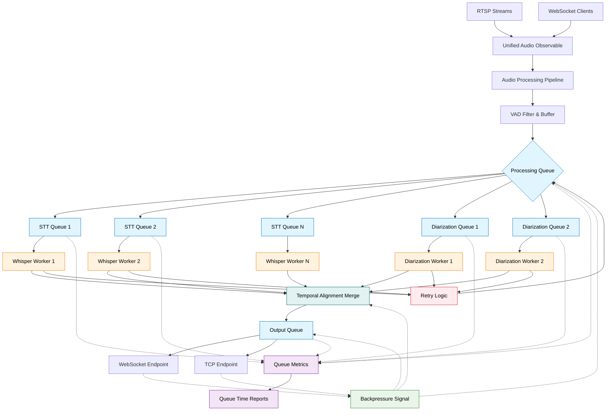

# RxPy Reactive Audio Pipeline Design

## Overview

This document explores integrating RxPy (Reactive Extensions for Python) into the Eavesdrop audio pipeline, particularly for the upcoming speaker diarization feature and RTSP stream processing. RxPy's reactive programming model offers compelling advantages for temporal audio processing, stream composition, and speaker tracking.

## Reactive Programming Benefits for Audio Processing

### Temporal Operations
Audio transcription and diarization are inherently temporal problems:
- **Windowing**: Audio chunks need buffering across time windows
- **Correlation**: Transcription segments must align with speaker embeddings
- **Context**: Previous segments influence current transcription quality
- **Synchronization**: Multiple streams need temporal coordination

### Stream Composition
Current architecture will handle multiple concurrent sources:
- RTSP streams (multiple, configured)
- WebSocket clients (multiple, dynamic)
- Transcription results (unified output)
- Diarization events (speaker changes)

## Proposed RxPy Architecture

### High-Level Reactive Flow



### Core Reactive Components

#### 1. Audio Source Observables

```python
from rx import Observable, operators as ops
from rx.subject import Subject
import asyncio

class RTSPStreamObservable:
    """Convert asyncio RTSP stream to RxPy Observable"""
    
    def create_stream_observable(self, stream_config: StreamConfig) -> Observable:
        def subscribe(observer, scheduler):
            async def stream_task():
                try:
                    async for audio_chunk in self.stream_rtsp_audio(stream_config):
                        tagged_chunk = AudioChunk(
                            stream_id=stream_config.id,
                            stream_name=stream_config.name,
                            data=audio_chunk,
                            timestamp=time.time(),
                            source_type="rtsp"
                        )
                        observer.on_next(tagged_chunk)
                except Exception as e:
                    observer.on_error(e)
                else:
                    observer.on_completed()
            
            # Schedule asyncio task
            task = asyncio.create_task(stream_task())
            return lambda: task.cancel()
        
        return Observable.create(subscribe)

class WebSocketClientObservable:
    """Convert WebSocket client audio to RxPy Observable"""
    
    def create_client_observable(self, websocket) -> Observable:
        def subscribe(observer, scheduler):
            try:
                while True:
                    audio_data = self.get_audio_from_websocket(websocket)
                    if audio_data is False:
                        break
                    
                    tagged_chunk = AudioChunk(
                        stream_id=f"ws_{id(websocket)}",
                        stream_name="WebSocket Client",
                        data=audio_data,
                        timestamp=time.time(),
                        source_type="websocket"
                    )
                    observer.on_next(tagged_chunk)
                observer.on_completed()
            except Exception as e:
                observer.on_error(e)
        
        return Observable.create(subscribe)
```

#### 2. Unified Audio Pipeline

```python
class ReactiveAudioPipeline:
    def __init__(self):
        self.rtsp_manager = RTSPStreamObservable()
        self.websocket_manager = WebSocketClientObservable()
        self.audio_subject = Subject()
        
    def create_unified_pipeline(self) -> Observable:
        """Merge all audio sources into unified processing pipeline"""
        
        # Combine all audio sources
        unified_audio = Observable.merge(
            *self.get_rtsp_observables(),
            *self.get_websocket_observables()
        )
        
        # Audio processing pipeline
        processed_audio = unified_audio.pipe(
            # Buffer audio chunks for processing windows
            ops.buffer_with_time(span=1.0),  # 1-second windows
            ops.filter(lambda chunks: len(chunks) > 0),
            
            # Apply VAD filtering
            ops.map(self.apply_vad_to_buffer),
            ops.filter(lambda result: result.has_voice_activity),
            
            # Prepare for parallel transcription and diarization
            ops.share()  # Share stream for multiple subscribers
        )
        
        return processed_audio

    def apply_vad_to_buffer(self, audio_chunks: List[AudioChunk]) -> VADResult:
        """Apply Voice Activity Detection to buffered chunks"""
        # Combine chunks, apply VAD, return structured result
        pass
```

#### 3. Transcription Observable

```python
class TranscriptionObservable:
    def __init__(self, whisper_backend):
        self.whisper_backend = whisper_backend
    
    def create_transcription_stream(self, audio_observable: Observable) -> Observable:
        """Convert audio chunks to transcription segments"""
        
        return audio_observable.pipe(
            # Group by stream for context continuity
            ops.group_by(lambda chunk: chunk.stream_id),
            
            # Process each stream independently
            ops.flat_map(lambda group: 
                group.pipe(
                    # Accumulate context for better transcription
                    ops.scan(self.accumulate_audio_context, []),
                    ops.filter(lambda context: self.should_transcribe(context)),
                    
                    # Async transcription
                    ops.flat_map_latest(lambda context: 
                        self.async_transcribe(context)
                    ),
                    
                    # Add stream metadata
                    ops.map(lambda result: TranscriptionSegment(
                        stream_id=group.key,
                        **result
                    ))
                )
            ),
            
            # Handle transcription errors with retry
            ops.retry(3),
            ops.catch(lambda error: Observable.just(
                TranscriptionError(stream_id="unknown", error=str(error))
            ))
        )

    async def async_transcribe(self, context: AudioContext) -> Observable:
        """Async transcription with RxPy integration"""
        def subscribe(observer, scheduler):
            async def transcribe_task():
                try:
                    result = await self.whisper_backend.transcribe_async(context)
                    observer.on_next(result)
                    observer.on_completed()
                except Exception as e:
                    observer.on_error(e)
            
            task = asyncio.create_task(transcribe_task())
            return lambda: task.cancel()
        
        return Observable.create(subscribe)
```

#### 4. Diarization Observable

```python
class DiarizationObservable:
    def __init__(self, diarization_model):
        self.diarization_model = diarization_model
        self.speaker_embeddings = {}
    
    def create_diarization_stream(self, audio_observable: Observable) -> Observable:
        """Generate speaker diarization events"""
        
        return audio_observable.pipe(
            # Longer time windows for speaker analysis
            ops.buffer_with_time(span=5.0),  # 5-second windows
            ops.filter(lambda chunks: len(chunks) > 0),
            
            # Group by stream
            ops.group_by(lambda chunks: chunks[0].stream_id if chunks else "unknown"),
            
            ops.flat_map(lambda group:
                group.pipe(
                    # Generate speaker embeddings
                    ops.map(self.extract_speaker_embeddings),
                    
                    # Track speaker changes over time
                    ops.scan(self.track_speaker_changes, {}),
                    
                    # Emit speaker change events
                    ops.flat_map(self.emit_speaker_events),
                    
                    # Add stream metadata
                    ops.map(lambda event: SpeakerEvent(
                        stream_id=group.key,
                        **event
                    ))
                )
            )
        )

    def track_speaker_changes(self, previous_state: dict, embeddings: SpeakerEmbeddings) -> dict:
        """Track speaker transitions using embedding similarity"""
        # Compare current embeddings with previous speakers
        # Emit change events when speaker transitions occur
        pass
```

#### 5. Combined Results Stream

```python
class CombinedResultsObservable:
    def create_combined_stream(
        self, 
        transcription_observable: Observable, 
        diarization_observable: Observable
    ) -> Observable:
        """Combine transcription and diarization results"""
        
        return Observable.combine_latest(
            transcription_observable,
            diarization_observable
        ).pipe(
            # Temporal alignment of transcription and speaker events
            ops.map(self.align_transcription_with_speakers),
            
            # Enrich transcription with speaker information
            ops.map(self.enrich_with_speaker_info),
            
            # Format for output
            ops.map(self.format_final_result),
            
            # Handle alignment errors gracefully
            ops.catch(lambda error: Observable.just(
                ErrorResult(error=str(error), timestamp=time.time())
            ))
        )

    def align_transcription_with_speakers(
        self, 
        combined: Tuple[TranscriptionSegment, SpeakerEvent]
    ) -> AlignedResult:
        """Temporally align transcription segments with speaker events"""
        transcription, speaker_event = combined
        
        # Find overlapping time windows
        # Associate transcription segments with active speakers
        pass
```

## Integration with Existing Architecture

### Retrofitting Current Components

**Minimal Changes Needed**:
1. `TranscriptionServer.recv_audio()` → Convert to Observable source
2. `ClientManager` → Subscribe to WebSocket observables  
3. Audio processing → Wrap in RxPy operators
4. Results broadcasting → Subscribe to combined results observable

**Gradual Migration Path**:
1. **Phase 1**: Wrap existing asyncio streams in RxPy Observables
2. **Phase 2**: Replace manual audio buffering with RxPy operators
3. **Phase 3**: Add diarization as parallel observable stream
4. **Phase 4**: Implement advanced temporal operations (context, alignment)

### Error Handling and Resilience

```python
class ResilientPipeline:
    def create_resilient_stream(self, base_observable: Observable) -> Observable:
        return base_observable.pipe(
            # RTSP reconnection with exponential backoff
            ops.retry_when(lambda errors: 
                errors.pipe(
                    ops.scan(lambda acc, _: acc + 1, 0),
                    ops.flat_map(lambda retry_count:
                        Observable.timer(min(2 ** retry_count, 60))  # Cap at 60s
                    )
                )
            ),
            
            # Log errors without stopping stream
            ops.do_action(
                on_error=lambda error: self.logger.error(f"Stream error: {error}")
            ),
            
            # Fallback to silence on persistent errors
            ops.catch(lambda error: Observable.interval(1).map(lambda _: SilenceChunk()))
        )
```

## Performance Considerations

### Memory Management
- **Backpressure**: RxPy's built-in backpressure prevents memory accumulation
- **Buffer Limits**: Time-based buffering with automatic cleanup
- **Stream Sharing**: `share()` operator prevents duplicate processing

### Concurrency
- **Async Integration**: RxPy schedulers integrate with asyncio event loop
- **Parallel Processing**: Independent observables for each stream
- **Resource Pooling**: Shared Whisper models across reactive streams

### Queue Management and Monitoring

```python
from collections import deque
from dataclasses import dataclass
from typing import Dict, Optional
import time

@dataclass
class QueueMetrics:
    queue_name: str
    current_size: int
    max_size: int
    total_processed: int
    avg_queue_time: float
    max_queue_time: float
    throughput_per_sec: float

class MonitoredQueue:
    """RxPy operator for queue monitoring and backpressure management"""
    
    def __init__(self, name: str, max_size: int = 100, max_queue_time: float = 5.0):
        self.name = name
        self.max_size = max_size
        self.max_queue_time = max_queue_time
        self.queue = deque(maxlen=max_size)
        self.queue_times = deque(maxlen=1000)  # Recent queue time samples
        self.total_processed = 0
        self.start_time = time.time()
        
    def __call__(self, source: Observable) -> Observable:
        def subscribe(observer, scheduler):
            def on_next(item):
                enqueue_time = time.time()
                
                # Check backpressure conditions
                if len(self.queue) >= self.max_size * 0.9:  # 90% full
                    self.emit_backpressure_signal()
                
                # Enqueue with timestamp
                queued_item = QueuedItem(
                    item=item,
                    enqueue_time=enqueue_time,
                    queue_name=self.name
                )
                
                try:
                    self.queue.append(queued_item)
                    self.process_next_item(observer)
                except Exception as e:
                    observer.on_error(e)
            
            def on_error(error):
                observer.on_error(error)
                
            def on_completed():
                # Process remaining queue items
                while self.queue:
                    self.process_next_item(observer)
                observer.on_completed()
            
            return source.subscribe(on_next, on_error, on_completed, scheduler)
        
        return Observable.create(subscribe)
    
    def process_next_item(self, observer):
        if not self.queue:
            return
            
        queued_item = self.queue.popleft()
        dequeue_time = time.time()
        queue_time = dequeue_time - queued_item.enqueue_time
        
        # Track queue time metrics
        self.queue_times.append(queue_time)
        self.total_processed += 1
        
        # Emit warning if queue time exceeds threshold
        if queue_time > self.max_queue_time:
            self.emit_queue_time_warning(queue_time, queued_item)
        
        # Update item with queue metrics
        processed_item = ProcessedItem(
            original_item=queued_item.item,
            queue_time=queue_time,
            queue_name=self.name,
            process_timestamp=dequeue_time
        )
        
        observer.on_next(processed_item)
    
    def get_metrics(self) -> QueueMetrics:
        current_time = time.time()
        uptime = current_time - self.start_time
        
        return QueueMetrics(
            queue_name=self.name,
            current_size=len(self.queue),
            max_size=self.max_size,
            total_processed=self.total_processed,
            avg_queue_time=sum(self.queue_times) / len(self.queue_times) if self.queue_times else 0,
            max_queue_time=max(self.queue_times) if self.queue_times else 0,
            throughput_per_sec=self.total_processed / uptime if uptime > 0 else 0
        )
    
    def emit_backpressure_signal(self):
        # Emit backpressure signal to upstream operators
        backpressure_event = BackpressureEvent(
            queue_name=self.name,
            current_size=len(self.queue),
            max_size=self.max_size,
            timestamp=time.time()
        )
        # This could trigger upstream operators to slow down or buffer
        
    def emit_queue_time_warning(self, queue_time: float, item: QueuedItem):
        logger.warning(
            f"High queue time in {self.name}: {queue_time:.2f}s "
            f"(threshold: {self.max_queue_time}s) for item type: {type(item.item).__name__}"
        )

class QueueMetricsReporter:
    """Collects and reports queue metrics across the pipeline"""
    
    def __init__(self):
        self.queues: Dict[str, MonitoredQueue] = {}
        self.metrics_subject = Subject()
    
    def register_queue(self, queue: MonitoredQueue):
        self.queues[queue.name] = queue
    
    def create_metrics_stream(self) -> Observable:
        """Create observable stream of queue metrics"""
        return Observable.interval(5).pipe(  # Every 5 seconds
            ops.map(lambda _: self.collect_all_metrics()),
            ops.do_action(self.log_metrics_summary)
        )
    
    def collect_all_metrics(self) -> Dict[str, QueueMetrics]:
        return {name: queue.get_metrics() for name, queue in self.queues.items()}
    
    def log_metrics_summary(self, metrics: Dict[str, QueueMetrics]):
        logger.info("=== Queue Metrics Summary ===")
        for name, metric in metrics.items():
            logger.info(
                f"{name}: {metric.current_size}/{metric.max_size} items, "
                f"avg queue time: {metric.avg_queue_time:.3f}s, "
                f"throughput: {metric.throughput_per_sec:.1f}/sec"
            )
            
            # Alert on high queue times
            if metric.avg_queue_time > 2.0:  # 2 second threshold
                logger.warning(f"HIGH QUEUE TIME: {name} averaging {metric.avg_queue_time:.2f}s")
            
            # Alert on queue backup
            utilization = metric.current_size / metric.max_size
            if utilization > 0.8:  # 80% full
                logger.warning(f"HIGH QUEUE UTILIZATION: {name} at {utilization:.1%} capacity")

# Usage in pipeline
class EnhancedReactivePipeline:
    def __init__(self):
        self.metrics_reporter = QueueMetricsReporter()
        self.processing_queue = MonitoredQueue("audio_processing", max_size=50)
        self.transcription_queue = MonitoredQueue("transcription", max_size=25) 
        self.output_queue = MonitoredQueue("output_broadcast", max_size=100)
        
        # Register queues for monitoring
        self.metrics_reporter.register_queue(self.processing_queue)
        self.metrics_reporter.register_queue(self.transcription_queue)
        self.metrics_reporter.register_queue(self.output_queue)
    
    def create_monitored_pipeline(self) -> Observable:
        unified_audio = self.create_unified_audio_stream()
        
        return unified_audio.pipe(
            # Audio processing with queue monitoring
            self.processing_queue,
            ops.buffer_with_time(span=1.0),
            ops.map(self.apply_vad_to_buffer),
            
            # Transcription with queue monitoring  
            self.transcription_queue,
            ops.flat_map_latest(self.async_transcribe),
            
            # Output with queue monitoring
            self.output_queue,
            ops.map(self.format_for_output),
            
            # Error handling with queue state
            ops.catch(self.handle_error_with_queue_context)
        )
    
    def start_metrics_reporting(self):
        """Start background metrics collection and reporting"""
        metrics_stream = self.metrics_reporter.create_metrics_stream()
        return metrics_stream.subscribe(
            on_next=lambda metrics: self.handle_metrics_update(metrics),
            on_error=lambda error: logger.error(f"Metrics reporting error: {error}")
        )

@dataclass
class QueuedItem:
    item: any
    enqueue_time: float
    queue_name: str

@dataclass 
class ProcessedItem:
    original_item: any
    queue_time: float
    queue_name: str
    process_timestamp: float

@dataclass
class BackpressureEvent:
    queue_name: str
    current_size: int
    max_size: int
    timestamp: float
```

### Debugging and Monitoring

```python
def create_monitored_stream(observable: Observable, queue_name: str) -> Observable:
    monitored_queue = MonitoredQueue(queue_name, max_size=100)
    
    return observable.pipe(
        # Queue monitoring and backpressure
        monitored_queue,
        
        # Performance monitoring
        ops.do_action(
            on_next=lambda item: metrics.increment(f"processed_{item.type}"),
            on_error=lambda error: metrics.increment("stream_errors"),
            on_completed=lambda: metrics.increment("stream_completions")
        ),
        
        # Debug logging with queue context
        ops.tap(lambda item: logger.debug(
            f"Processing: {item.original_item} (queued {item.queue_time:.3f}s)"
        )),
        
        # Health checks with queue-aware timeouts
        ops.timeout(30),  # 30-second timeout for processing
        
        # Queue time alerts
        ops.do_action(lambda item: 
            logger.warning(f"Slow processing in {queue_name}: {item.queue_time:.2f}s")
            if item.queue_time > 5.0 else None
        )
    )
```

## Benefits Summary

**For Current RTSP Feature**:
- Elegant stream merging and error recovery
- Built-in backpressure management
- Temporal windowing for audio processing

**For Future Diarization**:
- Perfect temporal alignment of transcription and speaker events
- Speaker tracking across time windows
- Context accumulation for speaker recognition

**For Overall Architecture**:
- Unified reactive model for all audio sources
- Composable processing pipeline
- Excellent error handling and recovery patterns

## Implementation Recommendation

**Start Incrementally**: Begin by wrapping your existing asyncio RTSP streams in RxPy Observables. This provides immediate benefits (error handling, stream composition) while maintaining your proven asyncio approach.

**Expand Gradually**: Add RxPy operators for buffering, filtering, and combining streams as you build out the diarization feature.

The reactive model aligns perfectly with audio stream processing and will pay significant dividends when you add speaker diarization temporal correlation.