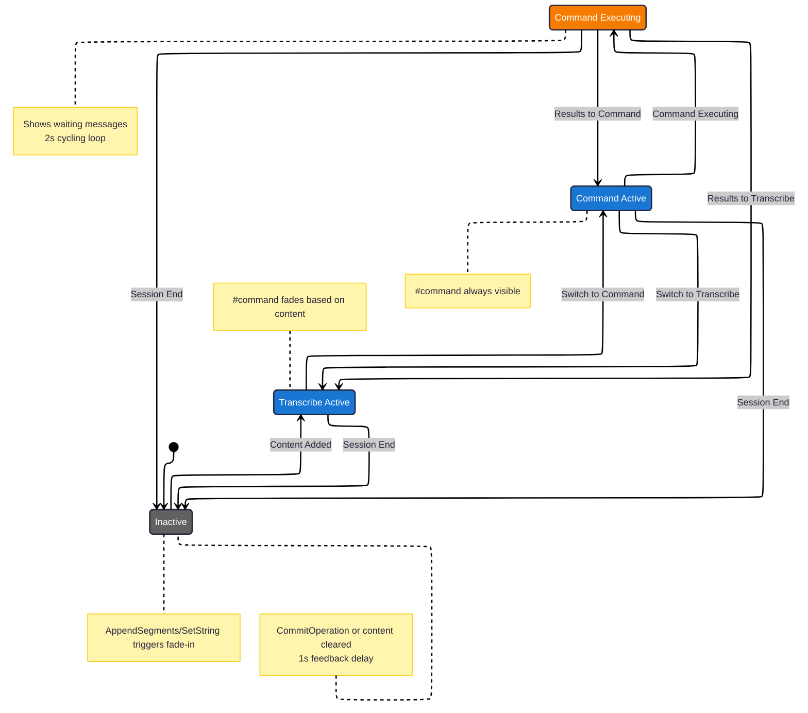

# UI State Machine Diagram

## State Annotations

### inactive

- **Body class**: None (or `inactive`)
- **Body opacity**: 0
- **Content**: Both #transcription and #command empty
- **#command visibility**: Hidden
- **#overlay-layer**: Hidden

### transcribe_active

- **Body class**: `transcribe-active`
- **Body opacity**: 1
- **Content**: #transcription has content (min &nbsp;), #command may/may not
- **#command visibility**: Visible only if has content
- **#overlay-layer**: Hidden

### command_active

- **Body class**: `command-active`
- **Body opacity**: 1
- **Content**: #transcription has content, #command visible regardless of content
- **#command visibility**: Always visible
- **#overlay-layer**: Hidden

### command_executing

- **Body class**: `command-executing`
- **Body opacity**: 1
- **Content**: Previous content preserved
- **#command visibility**: Always visible
- **#overlay-layer**: Visible with cycling waiting messages (2s each)

## Transition Details

### Content Addition Transitions

- **inactive → transcribe_active**: Any content-adding message triggers fade-in
- **Within active states**: Content messages update DOM but don't change state

### Mode Switching

- **transcribe_active ↔ command_active**: Immediate body class change + #command fade
- **No content clearing**: Mode switches preserve all existing content

### Command Execution

- **command_active → command_executing**: Only possible from command mode
- **Exit**: Only via SetString with command results
- **Determines return state**: Based on target_mode in result message

### Session End

- **Any state → inactive**: CommitOperation OR SetString that empties all content
- **Special commit feedback**: 1-second visual indication before fade-out
- **Cleanup**: All overlays hidden, body class reset after fade completes
