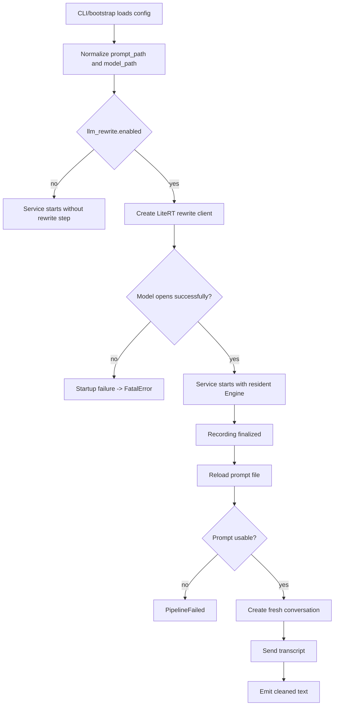

## Context

`active-listener` currently finalizes each recording by rendering the committed transcript, loading a prompt file, parsing that file as markdown plus YAML front matter, rendering the markdown body through Jinja, and then sending the transcript to an OpenAI-compatible chat endpoint chosen by `base_url` plus the prompt's front-matter `model`. That design made the prompt file do two unrelated jobs at once: it carried the human-authored rewrite instructions, and it secretly carried runtime routing/configuration.

The desired product shape is different. The rewrite model should be a local compiled LiteRT `.litertlm` bundle, loaded once and kept resident in memory for the lifetime of the service. Prompt editing should stay in the GNOME prefs workflow and stay file-based, but the prompt file should be treated as markdown content only. The already-locked runtime invariant from earlier prompt work remains in force: the prompt must be reloaded on every rewrite request so prompt edits take effect without restarting the service.

This design touches multiple modules and one new external dependency:
- `packages/active-listener/src/active_listener/settings.py`: rewrite config schema changes from network endpoint settings to local model settings.
- `packages/active-listener/src/active_listener/config.py`: `llm_rewrite` paths must resolve relative to the loaded config file and normalize to absolute paths during config load.
- `packages/active-listener/src/active_listener/rewrite.py`: prompt parsing and rewrite transport both change completely.
- `packages/active-listener/src/active_listener/bootstrap.py` and `service.py`: rewrite client startup and cleanup become native-resource lifecycle concerns.
- `packages/active-listener-ui-gnome/src/prefs.ts` plus its packaged fallback prompt asset: the editor remains markdown-based, but the fallback prompt no longer relies on front matter or templating semantics.

Locked product decisions from discussion:
- the rewrite model is a local compiled `.litertlm` bundle, not an auto-downloaded runtime artifact.
- the service should fail fast at startup if the LiteRT model cannot be loaded.
- prompt files remain markdown files.
- markdown is treated as raw prompt content; YAML front matter, `model` metadata, and Jinja rendering go away.
- `model_path` and `prompt_path` should resolve relative to the config file location, not the repo root.
- config loading should normalize those paths to absolute values before the rest of the runtime sees them.
- an empty override prompt is a hard per-recording failure and must surface through DBus pipeline-failure signaling.

## Current API inventory implementors must rely on

These are the verified repository APIs and behaviors the implementation will change. They are documented here so the implementor does not need to rediscover them.

### Configuration loading and validation

- `packages/active-listener/src/active_listener/config.py`
  - `resolve_default_active_listener_config_path() -> Path` currently resolves to `XDG_CONFIG_HOME/eavesdrop/active-listener.yaml`, falling back to `~/.config/eavesdrop/active-listener.yaml`.
  - `load_active_listener_config(*, config_path: str | None = None, overrides: Mapping[str, object | None]) -> ActiveListenerConfig` currently:
    - chooses the explicit `config_path` when provided, else the default XDG path
    - calls `load_active_listener_config_file(resolved_path)`
    - applies only top-level CLI overrides by replacing keys in the loaded mapping
    - validates with `ActiveListenerConfig.model_validate(merged_config, strict=True)`
  - `load_active_listener_config_file(path: Path) -> dict[str, object]` reads YAML, requires the document root to be a mapping, and raises `ActiveListenerConfigFileError` for missing files or invalid YAML.
- `packages/active-listener/src/active_listener/settings.py`
  - `LlmRewriteConfig` is currently a strict Pydantic model with exactly `enabled: bool`, `base_url: str`, `timeout_s: int = 30`, and `prompt_path: str`.
  - `ActiveListenerConfig` is currently a strict Pydantic model with `keyboard_name`, `host`, `port`, `audio_device`, `ydotool_socket`, and `llm_rewrite`.
- Current gap to close: `llm_rewrite.prompt_path` is currently an opaque `str`; no nested-path normalization happens in `config.py` or `settings.py` today. This is an implementation gap to close, not behavior to preserve.

### Current rewrite module surface

- `packages/active-listener/src/active_listener/rewrite.py`
  - `LlmRewriteClient` is the concrete rewrite implementation used by `bootstrap.build_rewrite_client(config)`.
  - `LlmRewriteClient.rewrite_text(*, model_name: str, instructions: str, transcript: str) -> str` currently:
    - creates `OpenAIProvider(base_url=self.base_url, api_key="ollama")`
    - creates `OpenAIChatModel(model_name, provider=provider)`
    - creates `Agent(model, instructions=instructions)`
    - runs `agent.run(transcript)` under `asyncio.wait_for(..., timeout=self.timeout_s)`
    - strips `result.output` and raises `RewriteClientError` on empty output
  - Prompt-loading APIs currently exposed:
    - `load_active_listener_rewrite_prompt(configured_prompt_path: str) -> LoadedRewritePromptFile`
    - `resolve_active_listener_prompt_path(configured_prompt_path: str) -> Path`
    - `resolve_active_listener_override_prompt_path() -> Path`
    - `load_rewrite_prompt(prompt_path: str | Path) -> LoadedRewritePrompt`
  - Current prompt behavior:
    - override path is `~/.config/eavesdrop/active-listener.system.md`
    - when no override exists, configured prompt paths are resolved relative to `REPO_ROOT`
    - prompt files are parsed with the `python-frontmatter` library via `frontmatter.load(...)`
    - expected old structure is: YAML front matter at the top of the markdown file, followed by the markdown body
    - front matter must define `model`
    - body rendering uses `jinja2.Environment(undefined=StrictUndefined, autoescape=False)`
    - `StrictUndefined` means a missing template variable is a hard failure, not a silent empty string
    - tests confirm list rendering through normal Jinja filters and confirm missing template variables fail fast
- Current exceptions in active use:
  - `RewritePromptError(message, prompt_path=...)`
  - `RewriteClientError`
  - `RewriteClientTimeoutError`

### Current rewrite call path

- `packages/active-listener/src/active_listener/recording_finalizer.py`
  - `RecordingFinalizer._rewrite_with_llm()` deliberately reloads the prompt on every finalized recording by calling `rewrite_module.load_active_listener_rewrite_prompt(self.config.llm_rewrite.prompt_path)` inside the request path.
  - `_run_pipeline()` catches exceptions from pipeline steps, logs `dictation pipeline step failed`, and emits `await self.dbus_service.pipeline_failed(step.__name__, str(exc))`.
  - This is the existing per-recording failure boundary the LiteRT migration must preserve for bad prompt contents.
  - `RecordingFinalizer` does not construct a rewrite implementation itself. It receives a `rewrite_client: ActiveListenerRewriteClient` through dependency injection from `ActiveListenerService`/bootstrap. That means `rewrite.py` owns the concrete implementation, while `recording_finalizer.py` only owns the call site and failure boundary.

### Startup, shutdown, and dependency ownership

- `packages/active-listener/src/active_listener/bootstrap.py`
  - `create_service(...)` currently constructs dependencies in this order:
    1. `keyboard = keyboard_resolver(config.keyboard_name)`
    2. `emitter = resolved_emitter_factory(config.ydotool_socket)`
    3. `client = resolved_client_factory(config)`
    4. `rewrite_client = resolved_rewrite_client_factory(config.llm_rewrite)`
    5. `await client.connect()`
  - On failure inside that startup-prerequisite block, current code closes only `keyboard`; `emitter` has no close API, and `client` is not explicitly disconnected there today.
  - `build_rewrite_client(config: LlmRewriteConfig) -> ActiveListenerRewriteClient` currently returns `LlmRewriteClient(base_url=config.base_url, timeout_s=config.timeout_s)`.
  - `emit_fatal_error_if_possible(...)` is already the single startup/runtime fatal-publication helper. It returns early when `dbus_service` is `NoopDbusService`; otherwise it calls `await dbus_service.fatal_error(reason)` and logs publication failures.
- `packages/active-listener/src/active_listener/cli.py`
  - `main()` calls `setup_logging_from_env()`, parses `ActiveListenerCommand`, and starts it.
  - `ActiveListenerCommand.run()` builds DBus first with `build_app_state_service(no_dbus=self.no_dbus)`, then loads config, then calls `run_service(...)`.
  - If config loading fails after DBus is live, `ActiveListenerCommand.run()` publishes startup `FatalError`, closes DBus, and re-raises.
- `packages/active-listener/src/active_listener/service.py`
  - `ActiveListenerService.close()` currently cancels background tasks, stops recording if needed, disconnects the transcription client, and always closes the keyboard.
  - It does **not** currently close `rewrite_client`, `emitter`, or `dbus_service`.
  - `dbus_service.close()` is handled in `bootstrap.run_service()` rather than `ActiveListenerService.close()`.
- `packages/active-listener/src/active_listener/service_ports.py`
  - `ActiveListenerRewriteClient` currently defines only `rewrite_text(*, model_name: str, instructions: str, transcript: str) -> str`.
  - `TextEmitter` currently defines only `initialize()` and `emit_text(text: str) -> None`; there is no emitter close hook today.

### DBus APIs that implementation must preserve

- `packages/active-listener/src/active_listener/dbus_service.py`
  - `AppStateService` protocol methods relevant here are:
    - `pipeline_failed(step: str, reason: str) -> None`
    - `fatal_error(reason: str) -> None`
    - `close() -> None`
  - Concrete DBus signal definitions are:
    - `PipelineFailed` with signature `ss` and args `(step, reason)`
    - `FatalError` with signature `s` and arg `(reason)`
  - `NoopDbusService` is the explicit "DBus unavailable/disabled" implementation used by fatal-publication guards.
  - The current mechanism for deciding whether `FatalError` can be published is `emit_fatal_error_if_possible(...)` in `bootstrap.py`:
    - it returns immediately when `dbus_service` is `NoopDbusService`
    - otherwise it calls `await dbus_service.fatal_error(reason)` inside a protective `try/except`
    - if publication itself fails, it logs the publication failure instead of replacing the original startup/runtime exception

### GNOME prefs and packaged prompt asset APIs

- `packages/active-listener-ui-gnome/src/prefs.ts`
  - override path constants are already:
    - `PROMPT_OVERRIDE_DIRNAME = 'eavesdrop'`
    - `PROMPT_OVERRIDE_FILENAME = 'active-listener.system.md'`
    - `FALLBACK_PROMPT_FILENAME = 'rewrite_prompt.md'`
  - `loadPromptContents()` reads the override file first and otherwise reads the packaged fallback file from `this.path/assets/rewrite_prompt.md`.
  - `flushAutosave()` writes raw `Gtk.TextBuffer` contents directly with no prompt validation.
  - Revert behavior resets the buffer to the initially loaded contents and then writes those contents back through the same autosave path.
- `packages/active-listener-ui-gnome/esbuild.js`
  - build output bundles `src/extension.ts` and `src/prefs.ts`
  - copies `packages/active-listener/src/active_listener/rewrite_prompt.md` into the extension as `assets/rewrite_prompt.md`
- `packages/active-listener-ui-gnome/package.json`
  - build command: `node esbuild.js`
  - typecheck script: `npm run typecheck`, which executes `tsc --noEmit`
  - package manager is pnpm, but existing scripts invoke `npm run ...` internally; this is current repo behavior and not itself part of the LiteRT change unless the implementation deliberately chooses to normalize script conventions
- `packages/active-listener-ui-gnome/tsconfig.json`
  - explicitly includes `ambient.d.ts` in the `files` array, so any new ambient declarations needed for typechecking must be added there rather than assumed to be discovered indirectly

### Current dependency surface relevant to the cutover

- `packages/active-listener/pyproject.toml`
  - the direct runtime `dependencies` list currently includes `jinja2`, `pydantic-ai`, and `python-frontmatter`
  - `rewrite.py` actively imports and uses those libraries today; they are not stale manifest entries
  - there is currently no LiteRT dependency declared
  - `pydantic` remains a useful shared dependency for config models before and after the LiteRT cutover

### Verified third-party dependency plan

- **Required new runtime dependency**: `litert-lm-api`
  - Verified current stable PyPI version: `0.10.1` (`https://pypi.org/project/litert-lm-api/0.10.1/`)
  - Import module: `import litert_lm`
  - Project page points to the same official Python docs currently hosted at `https://ai.google.dev/edge/litert-lm/python`
  - Recommended spec constraint: allow minor updates, e.g. `litert-lm-api>=0.10,<0.11`
- **Alternative dependency track**: `litert-lm-api-nightly`
  - Verified current nightly PyPI version: `0.11.0.dev20260418` (`https://pypi.org/project/litert-lm-api-nightly/`)
  - Same `litert_lm` import module and same official docs target
  - Use only if implementation hits a stable-package gap that is fixed only in nightly; otherwise prefer stable to reduce churn
- **Not required for this feature**:
  - `litert-lm` CLI package is not needed because the locked design uses the Python API, not subprocess CLI execution
  - `huggingface_hub` is not needed because the locked design uses a local pre-provisioned `.litertlm` bundle only
  - no new GNOME GIR dependencies are needed for this LiteRT cutover because `@girs/gtk-4.0` and `@girs/adw-1` are already present in `packages/active-listener-ui-gnome/package.json`

### Verified LiteRT Python API surface to implement against

The official Python docs currently describe the following APIs and constraints:

- Installation guidance in docs still shows the nightly package (`pip install litert-lm-api-nightly` / `uv pip install litert-lm-api-nightly`), even though stable `litert-lm-api 0.10.1` is published on PyPI.
- Supported platforms called out by docs: Linux and macOS; Windows support is stated as upcoming.
- Engine construction:

```python
import litert_lm

with litert_lm.Engine(
    "path/to/model.litertlm",
    backend=litert_lm.Backend.CPU,
    # cache_dir="/tmp/litert-lm-cache",  # optional
) as engine:
    ...
```

- Conversation creation with a system message:

```python
messages = [
    {
        "role": "system",
        "content": [{"type": "text", "text": "You are a helpful assistant."}],
    },
]

with engine.create_conversation(messages=messages) as conversation:
    ...
```

- Synchronous send shape:

```python
response = conversation.send_message("What is the capital of France?")
text = response["content"][0]["text"]
```

- Streaming send shape (documented but not needed for this feature):

```python
for chunk in conversation.send_message_async("Tell me a long story."):
    for item in chunk.get("content", []):
        if item.get("type") == "text":
            print(item["text"], end="")
```

- Documented cleanup guarantee:
  - docs explicitly guarantee resource cleanup when `Engine` and `Conversation` are used as context managers
  - docs do **not** explicitly document an `Engine.close()` or `Conversation.close()` method
- Documented omissions and limits relevant to implementation:
  - official Python docs do not document sampler configuration knobs for `create_conversation`; a current upstream issue tracks missing Python sampler-config support
  - official Python docs do not document `cancel_process()` in the getting-started guide, so this feature should not assume or require cancellation support

### Existing automated coverage relevant to the cutover

- `packages/active-listener/tests/test_rewrite.py` currently covers prompt parsing, prompt override resolution, and current rewrite client behavior.
- `packages/active-listener/tests/test_app.py` currently covers service orchestration with `FakeRewriteClient` and is the main place where rewrite behavior is exercised inside the application flow.
- `packages/active-listener/tests/test_cli.py` currently covers config-path discovery and CLI override behavior.
- `packages/active-listener/tests/test_state.py` and `tests/test_reducer.py` are not rewrite-content tests, but they remain adjacent coverage for the event/reducer machinery that feeds finalization.

Implementation testing note:
- `test_rewrite.py`, `test_app.py`, and `test_cli.py` are the core files that will change directly.
- However, they are not the whole behavioral story. `test_app.py` is especially important because it is the place where the service-level orchestration is exercised with fake rewrite clients.
- The LiteRT cutover must preserve service behavior around transcription -> finalization -> rewrite failure -> emission/non-emission, not just prompt parsing and config loading.
- If a change to the rewrite boundary or shutdown behavior causes adjacent service tests to fail (for example in `test_state.py` or reducer-driven flows), those failures are in scope and should be fixed rather than treated as unrelated noise.

## Goals / Non-Goals

**Goals:**
- Replace the current OpenAI-compatible rewrite integration with a resident LiteRT-LM Python engine.
- Move rewrite model selection out of prompt content and into explicit runtime config.
- Preserve markdown authoring for prompts and GNOME prefs editing.
- Preserve prompt reload-on-each-request semantics.
- Resolve `llm_rewrite` paths relative to the loaded config file and expose only absolute paths to the runtime.
- Fail startup immediately when rewrite is enabled but the LiteRT model path is missing, unreadable, or not loadable.
- Keep prompt-content failures as per-recording pipeline failures so the service can stay up while reporting the bad prompt state.
- Ensure LiteRT engine/native resources are released during service shutdown.

**Non-Goals:**
- Add automatic model download from Hugging Face or any other remote source.
- Add prompt validation or guarded-save behavior to GNOME prefs.
- Change the existing per-recording prompt override resolution order.
- Rework the transcription pipeline outside the rewrite step.
- Introduce prompt variants, runtime prompt templating, multi-model routing, or prompt-selection logic.
- Redesign DBus beyond using the already-existing startup fatal-error path and per-recording pipeline-failure path.
- Replace markdown prompt files with another storage format.

## Implementation walkthrough

This section is intentionally procedural. A junior engineer should be able to read it top to bottom and understand what changes, in what order, and why each change belongs where it does.

### Before this feature

Today the rewrite pipeline behaves like this:

1. `RecordingFinalizer` finishes collecting the committed transcript for one recording.
2. It calls `load_active_listener_rewrite_prompt(prompt_path)`.
3. `rewrite.py` chooses either the user override prompt or the configured fallback prompt.
4. That prompt file is parsed as front matter + markdown body.
5. `model` is pulled out of front matter.
6. Remaining front-matter keys are passed into Jinja to render the markdown body.
7. `LlmRewriteClient` sends the transcript to an OpenAI-compatible model endpoint using `base_url`, `timeout_s`, and the prompt-derived `model_name`.

### After this feature

After the LiteRT cutover, the rewrite pipeline should behave like this:

1. Service startup loads config and normalizes `llm_rewrite.model_path` and `llm_rewrite.prompt_path` to absolute paths.
2. If `llm_rewrite.enabled` is true, startup constructs one LiteRT-backed rewrite client.
3. That rewrite client opens the local `.litertlm` bundle immediately and keeps the engine resident.
4. Each finished recording still reloads the prompt file on demand.
5. The prompt file is read as plain markdown text only.
6. The rewrite client creates a fresh LiteRT conversation for that one request, seeds it with the current markdown prompt as the system message, sends the raw transcript as the user message, extracts the returned text, and returns it to the finalizer.
7. On shutdown, the service explicitly releases the rewrite-client-owned LiteRT resources.

### Why this split matters

There are two distinct classes of failure, and the code must preserve that distinction:

- **Startup dependency failure**: the model file is missing, unreadable, or invalid. This means the service is not correctly configured, so startup must fail and publish `FatalError` when DBus is available.
- **Per-recording input failure**: the prompt file exists but is empty or otherwise unusable. The service can stay running because the user might fix the prompt and try again. This must fail only the current rewrite request and publish `PipelineFailed(step, reason)`.

If implementation collapses those two classes together, the runtime will lie about what is broken.



## File-by-file change plan

This section names the exact files and what should change in each one. It is intentionally concrete.

### `packages/active-listener/src/active_listener/settings.py`

Change the rewrite config model from network-client settings to local-model settings.

Expected result:

- remove `base_url`
- remove `timeout_s`
- keep `enabled`
- keep `prompt_path`
- add `model_path`

This is a breaking config-schema change. The model must stay strict Pydantic config; do not add permissive fallback parsing.

### `packages/active-listener/src/active_listener/config.py`

Add nested path normalization for `llm_rewrite.prompt_path` and `llm_rewrite.model_path`.

Important boundary:

- normalize relative to the loaded config file's parent directory
- preserve absolute paths as-is
- do this before `ActiveListenerConfig.model_validate(..., strict=True)` returns the final config object

Do **not** leave this responsibility in `rewrite.py`. Configuration semantics belong in the config loader.

### `packages/active-listener/src/active_listener/rewrite.py`

This file is the main conceptual simplification.

It should stop doing all of these things:

- repo-root path resolution for configured prompt paths
- front-matter parsing
- `model` extraction from prompt metadata
- Jinja rendering
- OpenAI-compatible request construction

It should start doing all of these things:

- read prompt markdown as raw text
- reject empty/whitespace-only prompt contents with `RewritePromptError`
- own the LiteRT engine lifecycle behind a rewrite-client class
- create one fresh conversation per `rewrite_text()` call
- extract text from the LiteRT response payload
- raise a rewrite-client error if the model returns empty output

### `packages/active-listener/src/active_listener/bootstrap.py`

Update `build_rewrite_client()` to construct the LiteRT-backed rewrite client from `model_path`.

Keep the existing ownership model:

- bootstrap still owns startup prerequisite construction
- bootstrap still owns startup `FatalError` publication through `emit_fatal_error_if_possible(...)`

But the implementor should be aware that startup cleanup is incomplete today. If rewrite-client construction fails after `emitter` or `client` already exists, current code only closes `keyboard`. The LiteRT cutover should not make that situation worse.

Junior-engineer guidance:
- treat this as an existing bug-shaped edge in the startup path
- if the LiteRT rewrite client is introduced without changing cleanup behavior, startup failure could leave more partially initialized resources behind than before
- minimum acceptable outcome: do not regress cleanup semantics
- preferred outcome: make startup prerequisite cleanup more complete for dependencies already constructed before the failure occurs, while keeping the existing fatal-publication flow intact

### `packages/active-listener/src/active_listener/service_ports.py`

Change the `ActiveListenerRewriteClient` protocol so it matches the new truth:

- current input contract: prompt-derived `model_name` + rendered `instructions` + `transcript`
- new input contract: `system_prompt` + `transcript`
- add `close()` to the protocol so service shutdown can manage the engine lifecycle explicitly

### `packages/active-listener/src/active_listener/service.py`

Update `ActiveListenerService.close()` so it also closes the rewrite client.

Do **not** move DBus shutdown into the service. `bootstrap.run_service()` already owns `dbus_service.close()`, and that ownership should stay there.

### `packages/active-listener/src/active_listener/recording_finalizer.py`

Keep the current pipeline shape and keep request-time prompt reload.

Only the data passed through the pipeline changes:

- today: prompt loader returns `model_name` + rendered `instructions`
- after cutover: prompt loader returns `prompt_path` + raw markdown `prompt_text`

This file must stay the place where prompt-content failures become `PipelineFailed`.

### `packages/active-listener-ui-gnome/src/prefs.ts`

Keep the editor behavior the same from the user's perspective:

- override file path stays `~/.config/eavesdrop/active-listener.system.md`
- editor still loads override first, fallback second
- editor still autosaves raw markdown text with no validation

Only the meaning of the fallback file changes: it is now just markdown prompt content, not a markdown-plus-front-matter template.

### `packages/active-listener-ui-gnome/esbuild.js`

Keep bundling a fallback prompt asset into the extension. The implementation may keep the filename `rewrite_prompt.md` or rename it, but the final state must be consistent between `prefs.ts` and `esbuild.js`.

### `packages/active-listener/pyproject.toml`

Update runtime dependencies to reflect the new truth:

- add `litert-lm-api>=0.10,<0.11` unless implementation proves a nightly-only API is required
- remove `pydantic-ai`, `python-frontmatter`, and `jinja2` only if no active runtime code path still imports them after the cutover

Do not remove a dependency simply because the design says it should disappear; remove it only once the imports are actually gone.

## Junior-engineer checklist for non-obvious decisions

These are the places where a junior engineer is most likely to accidentally choose the wrong implementation.

### Do not keep model selection inside the prompt file

The old design hid model routing inside prompt front matter. The new design intentionally removes that because startup validation needs to know which model will load before the first recording happens.

If you find yourself wanting a `model:` key in markdown again, stop. That is a design regression.

### Do not cache the prompt at startup

The prompt must continue to reload on every rewrite request. This is already how the current code works, and GNOME prefs depends on it.

If you cache the prompt in the rewrite client or service constructor, prompt edits will stop taking effect until restart.

### Do not assume undocumented LiteRT cleanup APIs

The public docs explicitly show context-manager usage for `Engine` and `Conversation`, but they do not explicitly document an `Engine.close()` method.

That means the implementation should either:

- wrap engine ownership in a context-manager owner that can be closed safely, or
- verify the installed package exposes a real close-equivalent before using it directly

Do not guess.

### Do not turn prompt failures into startup failures

Prompt files are user-editable inputs. A bad prompt should fail the current request, emit `PipelineFailed`, and let the service remain up.

If startup fails because the prompt file is empty, that is the wrong failure boundary for this feature.

### Do not turn model failures into request failures

The model file is a startup dependency, not a user-editable request input. A bad `.litertlm` bundle should prevent the rewrite-enabled service from starting.

If the service starts successfully and only later discovers the model is unusable on first dictation, that is the wrong startup behavior for this feature.

## Failure-mode matrix

This table is here so an implementor can quickly map a failure to the correct handling path.

| Failure | When discovered | Correct behavior | Wrong behavior |
|---|---|---|---|
| `model_path` missing | startup | startup fails; publish `FatalError` if DBus exists | service starts and fails on first rewrite |
| `.litertlm` invalid/unloadable | startup | startup fails; publish `FatalError` if DBus exists | convert to `PipelineFailed` |
| override prompt file empty | per recording | fail rewrite step; publish `PipelineFailed` | silently fall back or crash service |
| override prompt file missing | per recording | fall back to configured prompt path | startup failure |
| configured fallback prompt empty | per recording | fail rewrite step; publish `PipelineFailed` | silently continue with empty system prompt |
| model output empty | per recording | raise rewrite-client error; publish `PipelineFailed` | emit empty text |

## Suggested implementation order inside one branch

The task list already defines concurrency. Inside a single implementation thread, the least confusing order is:

1. change `settings.py` and `config.py`
2. update config tests and sample config
3. rewrite `rewrite.py`
4. update bootstrap/service protocol/service shutdown
5. update `recording_finalizer.py`
6. update GNOME fallback asset handling
7. update docs
8. run focused automated checks

That order works because each layer becomes simpler as you move outward from the data model and dependency boundary.

## Decisions

### 1. Model loading is a startup dependency owned by the rewrite client
Decision: when `llm_rewrite.enabled` is true, `bootstrap.build_rewrite_client()` creates a LiteRT-backed rewrite client that opens the configured `.litertlm` bundle immediately and keeps the resulting engine resident until service shutdown.

Implementation note: this is a change to an existing startup sequence that currently builds `keyboard`, `emitter`, `client`, `rewrite_client`, then awaits `client.connect()`. The current exception path only closes `keyboard`. The LiteRT cutover should keep rewrite-client construction inside the startup-prerequisite block, but it must not assume the current cleanup is complete.

Rationale:
- The user explicitly chose fail-fast startup over lazy first-use model loading.
- A missing or invalid local model bundle is not a recoverable prompt problem; it is a broken runtime prerequisite analogous to a missing keyboard or emitter dependency.
- Keeping one resident engine in memory matches the intended product shape and avoids per-recording model load cost.

Alternatives considered:
- Lazy-load the engine on first rewrite: rejected because it hides configuration problems until first dictation and adds first-use latency.
- Spawn the LiteRT CLI per rewrite request: rejected because it defeats the resident-model requirement and adds subprocess orchestration overhead.
- Continue using a remote OpenAI-compatible endpoint: rejected because the feature is specifically a cutover to local LiteRT.

### 2. Rewrite config becomes local-model config, not prompt-routed model selection
Decision: replace `llm_rewrite.base_url` and `timeout_s` plus prompt front-matter `model` routing with a config shape centered on a local `model_path` and existing `prompt_path`.

Expected shape:

```yaml
llm_rewrite:
  enabled: true
  model_path: ./models/gemma-4-E2B-it.litertlm
  prompt_path: ./rewrite_prompt.md
```

Rationale:
- Model selection is a runtime dependency decision, not author-facing prompt content.
- The current prompt `model` front matter hides routing behavior in prose files and prevents startup validation from telling the truth.
- The user explicitly rejected repo-relative model resolution in favor of config-file-relative semantics.

Alternatives considered:
- Keep both `model_path` and prompt front-matter `model`: rejected because it preserves two competing sources of truth.
- Support both local model path and auto-download repo/filename fields: rejected because the locked decision is local-only model provisioning.
- Resolve model paths relative to the repo root: rejected because config-file-relative behavior is more truthful and portable.

### 3. Normalize rewrite paths during config load
Decision: `load_active_listener_config()` resolves `llm_rewrite.model_path` and `llm_rewrite.prompt_path` relative to the directory containing the loaded config file, then passes absolute normalized paths into `ActiveListenerConfig`.

Clarification: the current repository does **not** already do this. Current behavior is that nested rewrite paths are left as raw strings and prompt-path resolution later falls back to repo-root logic in `rewrite.py`. This feature intentionally changes that behavior so configuration truth lives in `config.py` instead of being split across modules.

Expected normalization rules:

```python
if raw_path.is_absolute():
    use(raw_path)
else:
    use((config_path.parent / raw_path).resolve())
```

Rationale:
- The rest of the runtime should not need to know where config came from.
- Absolute paths make logs, errors, and tests clearer because they refer to the actual file being used.
- This removes repo-root path resolution from `rewrite.py`, which no longer owns that concern.

Alternatives considered:
- Leave path resolution in `rewrite.py`: rejected because it duplicates configuration semantics in the runtime layer.
- Preserve repo-root-relative behavior for convenience: rejected by the user in favor of config-file-relative truth.

### 4. Keep markdown prompts, but drop front matter and Jinja entirely
Decision: prompt files remain markdown files and GNOME prefs keeps editing markdown, but runtime prompt loading becomes an opaque file read that returns raw markdown text. YAML front matter, required `model` metadata, template variables, and Jinja rendering are removed from the active rewrite path.

Expected prompt behavior:
- read the selected prompt file as UTF-8 text
- if the resulting contents are empty or whitespace-only, raise `RewritePromptError`
- otherwise pass the raw markdown string to LiteRT as the system prompt

Rationale:
- The user explicitly wants to keep markdown authoring and does not want to keep the hidden configuration semantics.
- Existing Jinja support appears to be used only for static metadata substitution, not for any per-request runtime data flow.
- Treating the prompt as raw content keeps GNOME prefs honest: it edits exactly what runtime consumes.
- Removing `python-frontmatter` parsing and the Jinja environment also removes the old failure mode where a missing template variable under `StrictUndefined` breaks prompt loading before the request can even reach the model.

Alternatives considered:
- Convert fallback and override prompts to `.txt`: rejected because markdown authoring is still useful and the user wants to keep it.
- Keep front matter but ignore most of it: rejected because it preserves a misleading dual-purpose file format.
- Keep Jinja templating for DRY prompt authoring: rejected because it adds failure modes without clear product value.

### 5. Preserve per-request prompt reload and override resolution order
Decision: `recording_finalizer.py` continues loading the prompt on every rewrite request; `rewrite.py` continues preferring the user override file at `~/.config/eavesdrop/active-listener.system.md` when present, then falls back to the configured prompt path.

This is a deliberate performance trade-off. The code currently re-reads and re-parses the prompt file on every finalized recording. That adds a small amount of file I/O and prompt-processing work per rewrite, but the files are small and the user-facing requirement is stronger: prompt edits made through GNOME prefs must take effect on the very next rewrite without restarting the service.

Rationale:
- Prompt freshness without restart is already a locked invariant.
- GNOME prefs is already designed around editing the override file directly.
- Keeping the current override-first selection model minimizes behavioral churn while simplifying prompt contents.

Alternatives considered:
- Cache the prompt at startup: rejected because it breaks the editing workflow.
- Collapse override and configured prompt into one path: rejected because the existing fallback/default split is still useful.
- Add a file-watching or invalidation layer: rejected for now because it adds coordination complexity without a demonstrated need; a simple per-request read is easier to reason about and already matches current behavior.

### 6. Use a fresh LiteRT conversation per rewrite request
Decision: the rewrite client owns one long-lived LiteRT engine, but each `rewrite_text()` call creates a fresh conversation seeded with the current system prompt and then sends the transcript as the user message.

Expected interaction shape:

```python
messages = [
    {
        "role": "system",
        "content": [{"type": "text", "text": system_prompt}],
    }
]
with engine.create_conversation(messages=messages) as conversation:
    response = conversation.send_message(transcript)
```

Rationale:
- This matches the official LiteRT Python model documented during planning: engine is the long-lived model holder, conversation is the per-interaction state container.
- A fresh conversation per rewrite prevents prior rewrites from polluting later ones with history.
- It maps naturally onto the current rewrite pipeline, which treats each finalized recording as an independent request.

Alternatives considered:
- Reuse one long-lived conversation across rewrites: rejected because rewrite requests are independent and should not share conversational memory.
- Stream partial outputs into the pipeline: rejected because the current rewrite step needs one final cleaned string, not incremental text.

### 7. Separate startup fatal errors from per-recording prompt failures
Decision: bad or missing LiteRT models fail service startup, which already flows through bootstrap fatal-error publication. Bad prompt contents fail only the current rewrite request and continue to flow through `RecordingFinalizer._run_pipeline()` to DBus `PipelineFailed`.

Rationale:
- This preserves truthful failure boundaries: model load is a process prerequisite, prompt contents are request inputs.
- The user explicitly chose hard failure for empty override prompts, provided it reaches DBus.
- The existing finalizer pipeline already has the right shape for request-scoped failures.

Alternatives considered:
- Treat empty prompt as missing and silently fall back to packaged prompt: rejected because the user chose hard failure.
- Crash the whole service on prompt parse/load errors: rejected because the service can continue operating once the prompt is fixed.

### 8. Extend the rewrite client boundary with explicit cleanup
Decision: `ActiveListenerRewriteClient` gains a cleanup method, and `ActiveListenerService.close()` is responsible for calling it so LiteRT engine resources are released with the rest of the service's long-lived dependencies.

Exact boundary change:
- current protocol: `rewrite_text(*, model_name: str, instructions: str, transcript: str) -> str`
- target protocol: `rewrite_text(*, system_prompt: str, transcript: str) -> str` plus `close()`

Important LiteRT API note:
- the rewrite client should expose `close()` at our boundary even though the public docs currently only guarantee `Engine`/`Conversation` cleanup via context-manager exit
- implementation must therefore wrap LiteRT engine ownership in a way that does not assume a documented `Engine.close()` exists; acceptable approaches include holding the engine inside an `ExitStack`/manual context-manager owner or verifying the installed package exposes an explicit close-equivalent before using it

Ownership note:
- `dbus_service.close()` should remain in bootstrap/run-service ownership, because that is where DBus is opened and already closed today
- `TextEmitter` currently has no close API, so the LiteRT work should not invent emitter shutdown unless a separate need appears
- `rewrite_client.close()` is the only new lifecycle hook required by this feature

Rationale:
- LiteRT engine objects likely own native resources and should not be left to incidental process teardown when a normal shutdown path already exists.
- This keeps the rewrite dependency lifecycle explicit and testable at the service boundary.
- Startup and steady-state code both already treat rewrite as a first-class dependency; cleanup should do the same.

Alternatives considered:
- Rely on Python garbage collection or process exit for cleanup: rejected because it hides resource ownership and weakens shutdown behavior.
- Hide cleanup only inside `rewrite.py` module globals: rejected because the service should explicitly own the lifecycle of the dependency it constructed.

## Risks / Trade-offs

- [LiteRT Python package/API details may differ from the planning docs] → Pin implementation tests around the exact response extraction and cleanup behavior with monkeypatched LiteRT stubs before relying on the live package.
- [The local `.litertlm` bundle becomes a mandatory workstation asset for rewrite-enabled setups] → Fail fast at startup with a clear absolute `model_path` in the error/log output so the broken prerequisite is obvious.
- [Removing front matter and Jinja is a breaking prompt-format change] → Update packaged prompt assets, config docs, and tests in the same change so there is only one supported prompt format after cutover.
- [Config-file-relative path normalization changes existing assumptions in tests and docs] → Normalize paths centrally in `config.py` and update fixtures/assertions there first so the new behavior is explicit.
- [Prompt markdown may contain surrounding whitespace or formatting noise] → Treat non-empty markdown as opaque content and strip only for emptiness checks, not for content-preserving reads.
- [Startup cleanup must remain correct if rewrite client construction fails after other dependencies are initialized] → Keep rewrite-client construction inside the existing startup-prerequisite block so partial startup still cleans up keyboard and other earlier dependencies.

## Migration Plan

1. Change the `llm_rewrite` config model and config loading logic first so runtime code receives absolute `model_path` and `prompt_path` values.
2. Replace `rewrite.py` prompt loading with markdown-content-only reads while preserving override resolution.
3. Introduce the LiteRT-backed rewrite client and wire it through bootstrap.
4. Add rewrite-client cleanup to the service shutdown path.
5. Update the packaged fallback prompt asset and GNOME prefs assumptions so the editor continues to load/save markdown but no longer depends on front matter semantics.
6. Rewrite targeted tests and docs so the old remote-client and prompt-template path is removed as an active design.

Rollback strategy:
- Restore the previous OpenAI-compatible rewrite client and prompt parser in one revert if LiteRT integration proves unusable.
- Because this is an intentional cutover, rollback should revert the full config/prompt format change together rather than attempting to support both designs simultaneously.

## Open Questions

1. **Stable vs nightly LiteRT Python package**
   - Verified options:
     - stable: `litert-lm-api` `0.10.1`
     - nightly: `litert-lm-api-nightly` `0.11.0.dev20260418`
   - Official Python docs currently still show nightly installation commands, while stable PyPI packages exist and point to the same docs.
   - Recommendation: implement against stable `litert-lm-api>=0.10,<0.11` unless the installed package is missing an API required by this feature.

2. **Engine cleanup primitive in the published Python API**
   - Official docs explicitly document context-manager cleanup for `Engine` and `Conversation`, but do not explicitly document `Engine.close()`.
   - The implementation must either:
     - manage the engine through an owned context-manager wrapper, or
     - verify the installed package exposes an explicit close-equivalent before relying on it.
   - This is an implementation question, not a product question, but it remains documented here so nobody assumes an undocumented API.

Locked product decisions remain:
- local compiled `.litertlm` bundle only
- fail-fast startup model loading
- config-file-relative path resolution with normalization to absolute paths
- markdown prompt files kept as raw content only
- hard per-recording failure for empty override prompts with DBus pipeline-failure signaling
