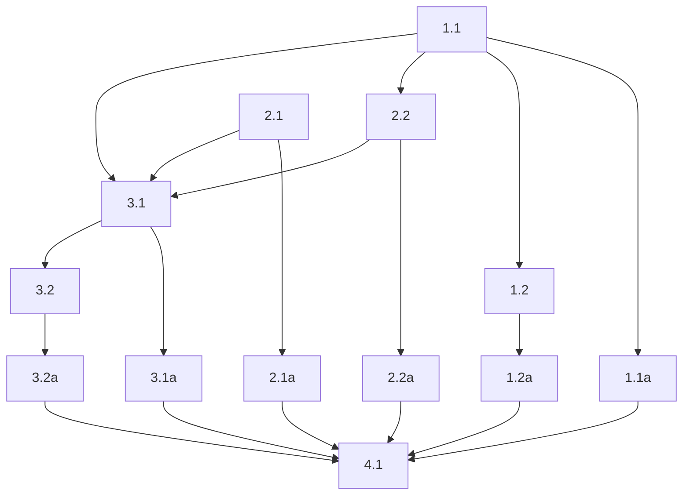

## 1. Configuration model and startup loading
- [x] 1.1 Add file-based `active-listener` config loading with nested Pydantic rewrite settings, making the config file the primary source of truth and CLI arguments the override layer. This task includes choosing where the loader lives, defining the `LlmRewriteConfig` model, and making startup validate the merged config through `ActiveListenerConfig.model_validate(..., strict=True)` instead of reconstructing config only from CLI/env values.
- [x] 1.1a Verify config precedence with focused tests covering: config-only startup, CLI override of config values, config validation failure for missing required rewrite fields, and preservation of file values when a CLI flag was not explicitly provided.
- [x] 1.2 Add `packages/active-listener/config.sample.yaml` plus gitignored `packages/active-listener/config.yaml`, initialized with the user workstation defaults (`AT Translated Set 2 keyboard`, `home-brainbox`, `9090`, `/run/user/1000/.ydotool_socket`) and an explicit `audio_device` value.
- [x] 1.2a Verify `packages/active-listener/config.sample.yaml` and `packages/active-listener/config.yaml` exist, are non-empty, and `packages/active-listener/config.yaml` is ignored by git.

## 2. Prompt loading and rewrite client
- [x] 2.1 Add a prompt-loading component that reloads `rewrite_prompt.md` on every call, parses YAML front matter with `python-frontmatter`, copies metadata into a normal dict, removes the reserved `model` key from template context, and renders the Markdown body with a local `Jinja2` `Environment(undefined=StrictUndefined, autoescape=False)`. Keep this logic in a small helper or module so it can be tested without running the full service.
- [x] 2.1a Verify prompt loading with focused tests covering: valid front matter passthrough, missing `model`, malformed front matter, missing Jinja variables causing hard render failure, and successful rendering with list-valued metadata such as `related_words`.
- [x] 2.2 Add `Jinja2` to package dependencies and implement a small PydanticAI plain-text rewrite client using `OpenAIProvider(base_url=..., api_key='ollama')`, `OpenAIChatModel`, and `Agent(..., instructions=...)` with a 30-second timeout. Keep the client wrapper narrow: input is rendered system prompt + raw transcript, output is rewritten plain text.
- [x] 2.2a Verify the rewrite client with focused tests covering successful plain-text output, timeout/error propagation, empty-or-unusable output handling if implemented, and the expected provider construction for Ollama-style OpenAI-compatible endpoints without requiring structured returns.

## 3. Recording finalization integration and logging
- [x] 3.1 Wire the rewrite path into recording finalization so finalized raw transcripts are rewritten before emission only when rewrite is enabled, with raw-transcript fallback on any rewrite-stage failure. Keep the stale-disconnect guard and empty-text early return in their current positions so the service does not spend time rewriting text that should not be emitted.
- [x] 3.1a Verify finalization behavior with service tests covering: rewrite disabled emits raw text, rewrite success emits rewritten text, rewrite failure emits raw text, and stale disconnect or empty finalized text still skip emission before any rewrite work happens.
- [x] 3.2 Add lifecycle logging that tells the session story and logs full raw and rewritten transcript content at info level for success and fallback paths. Match the existing structured logger pattern: event name plus keyword fields, not interpolated prose strings.
- [x] 3.2a Verify logging with focused tests asserting the expected info/warning/exception events and full transcript payloads for rewrite success, prompt failure, model failure, timeout, and raw-fallback scenarios.

## 4. End-to-end validation
- [x] 4.1 Run the targeted `active-listener` test suite covering config loading, prompt parsing, rewrite integration, and emission behavior; capture the command output as the implementation artifact. The minimum expected command set is the package-local pytest targets that cover the updated CLI, service, and prompt/rewrite helper tests.

