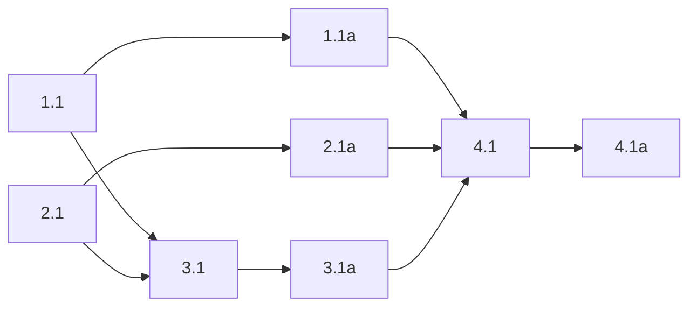

## 1. Animation planning helpers
- [x] 1.1 Add the missing Pango package/type setup, then add a transcript animation helper that returns grapheme spans, common-prefix counts, and transition plans for erase/reveal transitions.

      Required setup:

      ```text
      @girs/pango
      ambient.d.ts import
      gi://Pango import
      OverlayClutterText typing updates
      ```

- [x] 1.1a Validate task 1.1 with:

      ```text
      npm run typecheck
      ```

      plus a package-local scripted harness that prints pass/fail for:

      ```text
      identical strings
      append
      delete
      shared-prefix divergence
      emoji
      combining-mark
      multiline
      ```

## 2. Overlay layout plumbing

- [x] 2.1 Refactor the GNOME overlay actor tree from:

      ```text
      overlay
        -> overlayContent
             -> spectrumFrame
             -> overlayLabel
      ```

      to:

      ```text
      overlay
        -> overlayContent
             -> spectrumFrame
             -> transcriptClip
                  -> overlayLabel
      ```

      Then add explicit measurement helpers and shell/clip height tween plumbing at the swap point.

- [x] 2.1a Validate task 2.1 by running:

      ```text
      npm run typecheck && npm run build
      ```

      in `packages/active-listener-ui-gnome`, and save the build output as the artifact for this step.

## 3. Transcript transition controller

- [x] 3.1 Integrate the transcript animation controller into `extension.ts` so it owns:

      ```text
      canonicalText
      installedText
      transition phase
      active timer
      swap-time height tweening
      ```

      The controller must fade outgoing tail graphemes out, install the full target text once at swap, fade incoming tail graphemes in, and retarget in-flight updates from `installedText` rather than stale canonical state.

- [x] 3.1a Validate task 3.1 with a package-local scripted harness covering:

      ```text
      erase
      swap
      reveal
      attribute clearing
      interruption
      ```

      Capture output showing that the controller always converges to the latest canonical string.

## 4. End-to-end GNOME verification

- [ ] 4.1 Run the extension in a GNOME Shell dev session, exercise rapid live updates plus multiline growth/shrink, and capture visual evidence that:

      ```text
      the transcript stays one flowing layout
      height tweening starts exactly at the swap
      the spectrum path still works during transcript animation
      ```

- [ ] 4.1a (HUMAN_REQUIRED) Review the captured run and confirm the transcript remains one flowing layout with believable per-grapheme fades and acceptable height motion.

