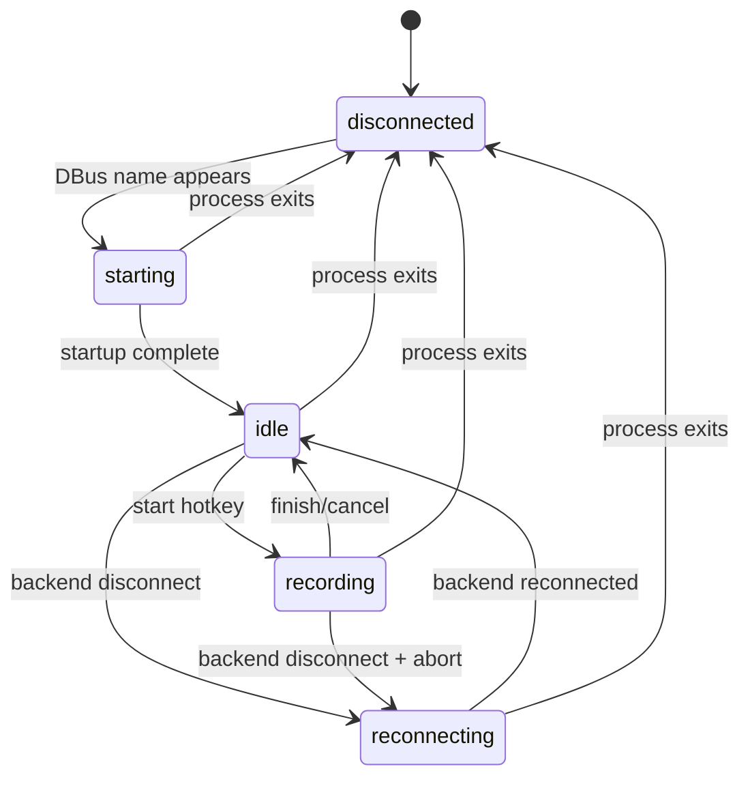
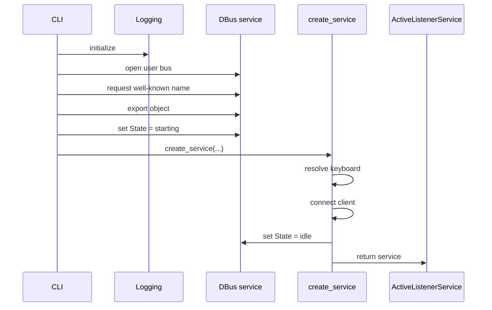

## Context

`active-listener` already has a truthful local foreground state machine in `packages/active-listener/src/active_listener/state.py` and applies it in `packages/active-listener/src/active_listener/app.py`. The service transitions between `STARTING`, `IDLE`, `RECORDING`, and `RECONNECTING`, and it already logs the important lifecycle moments we care about: startup readiness, recording start/cancel/finish, reconnecting, reconnected, and recording abort on disconnect.

What is missing is a machine-readable publication surface for passive desktop consumers. The planned consumer is an Ubuntu/GNOME top-bar extension, but that extension is intentionally out of scope here. This feature only adds the communication mechanism it will consume.

The user locked the following product-level decisions during design:
- Publish a single app-level state value, not separate transport and service enums.
- `disconnected` is not exported by `active-listener`; it is inferred by the consumer when the DBus service is absent.
- DBus must come up first, alongside logging, so consumers can observe `starting` and never miss early publication.
- DBus is required by default; export/name-acquisition failure exits the process.
- `--no-dbus` must replace the real publisher with a `NoopDbusService` implementation.
- The DBus contract is minimal: one state property plus only the explicitly requested one-shot signals.
- Interface name is locked: `ca.lmnop.Eavesdrop.ActiveListener1`.

The design also has to fit the verified `python-sdbus` API rather than a guessed abstraction:
- Use the asyncio API (`DbusInterfaceCommonAsync`) because we need to serve objects and emit signals from an async service.
- Explicitly open the user/session bus with `sd_bus_open_user()` rather than relying on the library default bus, which falls back to the system bus when no session bus is available.
- Acquire the well-known name with `request_default_bus_name_async(...)` before export.
- Export the object with `export_to_dbus(object_path, bus=...)`.
- Define the property with `dbus_property_async(...)` and use a private setter via `@property.setter_private` so the property stays read-only on DBus while local updates still emit `PropertiesChanged`.
- Define bare signals with empty signature `""` and emit them with `emit(None)`.
- Treat `SdBusRequestNameExistsError` as the concrete duplicate-instance failure path.



The consumer-facing state model is intentionally app-level, not transport-level:
- `disconnected`: service absent; inferred by the consumer
- `starting`: service alive, still bringing up prerequisites
- `idle`: ready for dictation
- `recording`: actively capturing dictation
- `reconnecting`: service alive but backend unavailable/retrying

## Goals / Non-Goals

**Goals:**
- Publish `active-listener` state over DBus early enough that `starting` is observable.
- Expose one durable DBus property that answers “what is true now?”
- Expose only the requested one-shot DBus signals for “what notable thing just happened?”
- Keep `ActiveListenerService.phase` as the canonical state owner; DBus mirrors existing truth instead of inventing a second state machine.
- Make DBus enabled-by-default and fail fast when the required session-bus integration cannot be established.
- Provide `--no-dbus` as an explicit escape hatch that preserves the same service boundary with a `NoopDbusService` implementation.
- Use a stable, versioned DBus surface suitable for a future passive shell extension.
- Explain the exact `python-sdbus` APIs to use so implementation does not guess.

**Non-Goals:**
- Building the Ubuntu/GNOME extension itself.
- Adding clickable DBus methods or any active control surface.
- Exporting a DBus `disconnected` state value.
- Publishing any extra lifecycle signals beyond the locked set.
- Attaching reconnect metadata to the DBus signal surface.
- Adding notifications, overlay UI, tray assets, or other presentation concerns inside `active-listener`.
- Replacing the existing `active-listener` foreground state machine.

## Decisions

### 1. Model the contract as one app-level state property plus three one-shot signals

The exported DBus contract is:
- Well-known bus name: `ca.lmnop.Eavesdrop.ActiveListener`
- Object path: `/ca/lmnop/Eavesdrop/ActiveListener`
- Interface: `ca.lmnop.Eavesdrop.ActiveListener1`
- Read-only property: `State`
- Property values: `starting`, `idle`, `recording`, `reconnecting`
- Signals:
  - `RecordingAborted(reason: s)`
  - `Reconnecting()`
  - `Reconnected()`

This is the smallest surface that satisfies the locked product decisions.

**Rationale:**
- The property is the durable source of truth for passive consumers.
- The signals cover only the explicitly requested one-shot moments.
- The surface is stable and minimal, which makes both implementation and future extension code simpler.

**Alternatives considered:**
- Separate transport-state and service-state enums: rejected because it creates an awkward cross-product and does not match the product language the consumer actually wants.
- More signals (`RecordingStarted`, `RecordingFinished`, `RecordingCancelled`): rejected as unnecessary expansion beyond what the user asked for.
- A DBus method surface for start/stop actions: rejected because the consumer is passive by design.

### 2. Do not export `disconnected`; let consumers infer it from service absence

`active-listener` exports only states that are true while the service is alive and serving its DBus object. If the DBus name/object disappears, the consumer treats that as `disconnected`.

**Rationale:**
- This keeps the DBus property honest: it never claims a state when the publisher is absent.
- It cleanly distinguishes “service is alive but starting/reconnecting” from “service is not reachable at all.”
- It avoids adding a synthetic property value that only exists to mirror transport absence.

**Alternatives considered:**
- Exporting `disconnected` as a property value: rejected because the process cannot truthfully keep publishing that state once it is gone.
- Exporting separate connection booleans or transport enums: rejected as over-modeling for the current requirement.

### 3. Initialize DBus first, alongside logging, before any startup prerequisites

Process startup order becomes:
1. Configure logging.
2. If DBus is enabled, open the user/session bus, acquire the DBus name, construct/export the DBus object, and set `State="starting"`.
3. Run remaining service startup (`keyboard` resolution, `client.connect()`, emitter setup).
4. Transition DBus state to `idle` once prerequisites succeed.
5. On startup failure after export, log and exit; consumers observe service disappearance as `disconnected`.



**Rationale:**
- The user explicitly wants `starting` to be observable.
- DBus is a first-class publication sink, not an afterthought wired in after the service is already “ready.”
- This avoids the consumer missing early state because the publisher appeared too late.

**Alternatives considered:**
- Construct/export DBus from inside `create_service()`: rejected because that is already after some startup work and weakens observability of early lifecycle.
- Bring DBus up only after all prerequisites succeed: rejected because the consumer would only ever see `idle` or nothing.

### 4. Treat DBus as required by default, with `--no-dbus` as the only escape hatch

Default startup must fail if the user session bus is unavailable, if the well-known name cannot be acquired, or if export fails. `--no-dbus` disables this entire path by injecting a `NoopDbusService` implementation through the same publisher boundary.

Likely fatal cases include:
- no user session bus / bad DBus session environment
- well-known name already owned by another process
- export/setup failures in the DBus library itself

Failure messaging should explicitly suggest `--no-dbus` when the failure is an environmental bus-availability problem.

**Rationale:**
- The user wants duplicate instances to be a hard failure.
- A default-on integration only stays truthful if failure is not silently downgraded.
- `NoopDbusService` preserves design integrity better than scattering `if dbus_enabled` checks across the app.

**Alternatives considered:**
- Best-effort DBus that logs a warning and continues: rejected because it silently changes product behavior and makes the desktop integration unreliable.
- Make DBus opt-in rather than default-on: rejected because the intended product direction is to always publish state unless explicitly disabled.

### 5. Keep `ActiveListenerService.phase` as the only canonical runtime state owner

The DBus layer mirrors state transitions that already exist in `ActiveListenerService` and `create_service()`. It does not become a second source of truth.

Expected mapping:
- after DBus export, before prerequisites complete -> `starting`
- startup success / initial connection established -> `idle`
- start hotkey accepted -> `recording`
- reconnecting client event -> `reconnecting` plus `Reconnecting()` signal
- reconnected client event -> `idle` plus `Reconnected()` signal
- disconnect during recording -> `reconnecting` plus `RecordingAborted(reason)` and `Reconnecting()`
- cancel/finish from recording -> `idle`

**Rationale:**
- The current service already owns the state machine.
- Mirroring existing truth is safer than introducing a parallel abstraction that can drift.
- This keeps the public DBus surface tightly coupled to actual service behavior.

**Alternatives considered:**
- A new shared state-store object that both app logic and DBus mutate: rejected as an unnecessary second abstraction for a small feature.
- Making DBus callbacks the thing that determines state: rejected because publication should follow truth, not create it.

### 6. Represent DBus behind a small local boundary with real and no-op implementations

The implementation should define a local publisher/service boundary that the CLI/bootstrap path injects into `create_service()` / `ActiveListenerService`.

Suggested shape:

```python
class AppState(StrEnum):
    STARTING = "starting"
    IDLE = "idle"
    RECORDING = "recording"
    RECONNECTING = "reconnecting"


class AppStatePublisher(Protocol):
    def set_state(self, state: AppState) -> None: ...
    def recording_aborted(self, reason: str) -> None: ...
    def reconnecting(self) -> None: ...
    def reconnected(self) -> None: ...
```

Concrete implementations:
- `SdbusDbusService`: real `python-sdbus`-backed publisher
- `NoopDbusService`: same API, no side effects

This boundary is intentionally small and contains only the locked surface.

**Rationale:**
- Keeps DBus-specific code out of the core dictation logic.
- Makes `--no-dbus` a dependency swap, not a proliferation of boolean checks.
- Keeps testing focused: app tests can use a lightweight fake publisher without needing a live bus.

**Alternatives considered:**
- Call `python-sdbus` directly from `app.py`: rejected because it leaks protocol details into core service logic.
- Add a generic event bus abstraction: rejected as over-generalization for one concrete integration.

### 7. Use explicit `python-sdbus` primitives, not implicit defaults

The design should implement against these specific library APIs:
- `sd_bus_open_user()` to open the user/session bus explicitly
- `set_default_bus(...)` only if the implementation chooses to route later object creation through the opened bus
- `request_default_bus_name_async("ca.lmnop.Eavesdrop.ActiveListener")` after the user bus is set as default, or the equivalent explicit-bus pattern if implementation prefers to avoid thread-local defaults
- `DbusInterfaceCommonAsync` for the exported object class
- `super().__init__()` in the exported class constructor
- `export_to_dbus("/ca/lmnop/Eavesdrop/ActiveListener", bus=...)`
- `@dbus_property_async("s", flags=DbusPropertyEmitsChangeFlag, property_name="State")`
- `@state.setter_private` to update the property locally while keeping it read-only on DBus
- `@dbus_signal_async("", signal_name="Reconnecting")` and `emit(None)` for empty signals
- `@dbus_signal_async("", signal_name="Reconnected")` and `emit(None)` for empty signals
- `@dbus_signal_async("s", signal_args_names=("reason",), signal_name="RecordingAborted")` for the abort pulse
- `SdBusRequestNameExistsError` as the concrete duplicate-instance exception to surface

The design doc should explain why each matters:
- explicit user bus avoids accidental system-bus fallback
- `setter_private` is the clean way to get local mutability plus `PropertiesChanged`
- empty-signal support means we do not need fake payloads for pulse-only events
- explicit signal/property names prevent accidental snake_case-to-CamelCase mismatches with the locked DBus contract

**Rationale:**
- The user explicitly asked for comprehensive explanation of which library features to use.
- These APIs map directly onto the locked contract with minimal adapter code.

**Alternatives considered:**
- Rely on library default bus selection: rejected because it can silently choose the system bus when no session bus exists.
- Encode state through signals only: rejected because consumers need a durable source of truth.
- Make the property read/write: rejected because the extension is passive and must not control service state.

## Risks / Trade-offs

- **[Session bus unavailable in some launch contexts]** -> Fail fast by default, log a truthful startup error that suggests `--no-dbus`, and allow intentional headless startup only through the explicit flag.
- **[Second process already owns the DBus name]** -> Treat `SdBusRequestNameExistsError` as a startup failure with a clear duplicate-instance message.
- **[`python-sdbus` default bus fallback could land on the system bus]** -> Explicitly open the user bus and avoid implicit bus selection in startup.
- **[Property and signal publication could drift from real app state]** -> Keep `ActiveListenerService.phase` as the sole state owner and publish only at the same transition points where the app already changes/logs state.
- **[Over-publishing creates an API maintenance burden]** -> Freeze the surface at one property plus three signals and defer everything else.
- **[Consumers may miss one-shot signals during restarts]** -> Use the property as the durable truth and reserve signals only for pulses that do not need replay.
- **[Startup failure after DBus export briefly shows `starting` before disappearance]** -> Accept this as truthful; the service did start and then failed during prerequisites.

## Migration Plan

1. Add the DBus publisher boundary and `NoopDbusService` implementation inside `packages/active-listener`.
2. Add `python-sdbus` as a dependency in `packages/active-listener/pyproject.toml`.
3. Extend the CLI with `--no-dbus` and thread the chosen publisher into startup.
4. Move DBus initialization to the very front of startup, beside logging.
5. Wire state/signal publication into `create_service()` and `ActiveListenerService` transition points.
6. Add tests for the local publisher boundary, startup mode selection, and state-transition publication behavior.
7. Validate the exported contract with an introspection smoke test or equivalent local check before relying on it from a shell extension.

Rollback strategy:
- Remove the DBus publisher wiring and dependency.
- Keep `--no-dbus`-free startup behavior equivalent to the current service.
- Since the feature adds a new external publication surface but does not change transcription semantics, rollback is low-risk and localized to `packages/active-listener`.

## Open Questions

None. The DBus contract, startup behavior, failure policy, and interface naming are locked for this spec.
