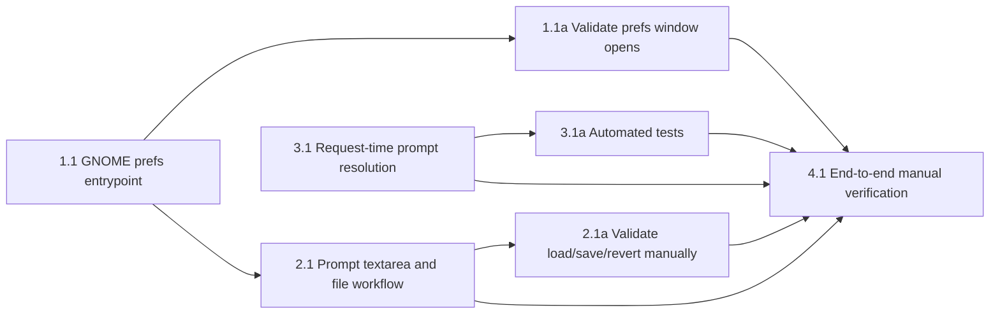

## 1. GNOME prefs surface
- [x] 1.1 Add a GNOME extension prefs entrypoint and package wiring in `packages/active-listener-ui-gnome`, including direct `@girs/gtk-4.0` and `@girs/adw-1` devDependencies, ambient imports, and build output for `prefs.js`.
- [x] 1.1a Validate the GNOME package builds and typechecks with the new prefs entrypoint (`pnpm build`, `pnpm typecheck`), and confirm the preferences window opens with `gnome-extensions prefs eavesdrop@shyndman.ca`. (HUMAN_REQUIRED)

## 2. Rewrite settings prompt control
- [x] 2.1 Implement the rewrite settings section in the prefs window with `Adw.PreferencesPage`/`Adw.PreferencesGroup` plus a `Gtk.ScrolledWindow` + `Gtk.TextView` prompt editor backed by `~/.config/active-listener/system.md`, seeding from the fallback repo prompt when the override file is absent.
- [x] 2.1a Verify the prefs window loads fallback prompt contents when the override file is missing, writes raw contents to `~/.config/active-listener/system.md` on save, and restores on revert. (HUMAN_REQUIRED)

## 3. Runtime prompt resolution
- [x] 3.1 Update `packages/active-listener` prompt loading so each rewrite request resolves the prompt source in this order: user override file first, configured `llm_rewrite.prompt_path` second.
- [x] 3.1a Add targeted automated tests covering override-first resolution, fallback-to-configured-path behavior, and prompt reload across successive requests.

## 4. End-to-end verification
- [x] 4.1 Verify the manual workflow end to end: edit the system prompt in GNOME prefs, save it, trigger two rewrite requests without restarting `active-listener`, and confirm the later request uses the updated prompt. (HUMAN_REQUIRED)

