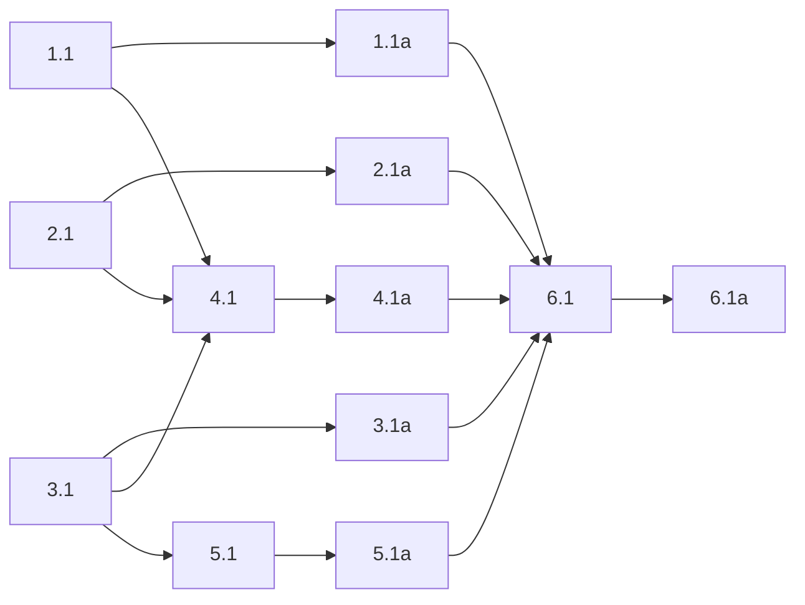

## 1. Client callback surface
- [x] 1.1 Update `packages/client/src/eavesdrop/client/core.py` so `EavesdropClient.__init__` and `EavesdropClient.transcriber(...)` accept `on_capture: Callable[[bytes], None] | None`, store it on the client, and invoke it from `_audio_streaming_loop()` after successful local websocket send with the exact PCM bytes sent on the wire.
- [x] 1.1a Validate client callback behavior with focused `uv run pytest packages/client/tests/test_client_mode_contracts.py` coverage for transcriber callback delivery, send-order semantics, and no-op behavior when callback is unset.

## 2. Active Listener spectrum analyzer
- [x] 2.1 Add `numpy<2` to `packages/active-listener/pyproject.toml`, then implement `packages/active-listener/src/active_listener/recording/spectrum.py` so it ingests callback bytes into a rolling `float32` sample buffer and, on a 16 ms periodic task, computes 50 equal log-spaced bars from a 512-sample Hann-windowed FFT using log-center interpolation, dB compression, normalization, and quantization to `0..255` bytes.
- [x] 2.1a Validate analyzer output with deterministic `uv run pytest packages/active-listener/tests/test_spectrum.py` coverage proving dead low bands are eliminated by interpolation, startup skips publish until 512 samples exist, and emitted frames always contain exactly 50 quantized bar bytes.

## 3. D-Bus spectrum publication
- [x] 3.1 Extend `packages/active-listener/src/active_listener/infra/dbus.py` so `AppStateService`, `NoopDbusService`, `ActiveListenerDbusInterface`, and `SdbusDbusService` expose a live `SpectrumUpdated` signal carrying a 50-byte D-Bus payload (`ay`).
- [x] 3.1a Validate D-Bus publication with focused `uv run pytest packages/active-listener/tests/test_dbus_service.py` coverage asserting signal payload shape, no-op compatibility, Python `bytes` emission, and emitted signal naming/signature behavior.

## 4. Active Listener runtime wiring
- [x] 4.1 Wire `packages/active-listener/src/active_listener/bootstrap.py` and `packages/active-listener/src/active_listener/app/service.py` so the transcriber client receives `on_capture`, the analyzer task starts/stops with service lifecycle, spectrum publication happens during recording flow, callback failures are caught/logged locally, and cleanup cancels analyzer resources cleanly.
- [x] 4.1a Validate runtime wiring with focused `uv run pytest packages/active-listener/tests/test_app.py` coverage for recording start/stop, background task cleanup, disconnect-abort handling, and spectrum emission sequencing through the D-Bus service boundary.

## 5. GNOME extension rendering
- [x] 5.1 Update `packages/active-listener-ui-gnome/src/extension.ts` to listen for `SpectrumUpdated`, unpack the 50-byte payload from the D-Bus argument tuple, render live spectrum bars, and clear local bar state whenever the service state is not recording.
- [x] 5.1a Validate UI integration with `pnpm typecheck`, `pnpm build`, and any focused extension tests or captured build artifacts needed to prove the new signal path compiles.

## 6. End-to-end verification
- [x] 6.1 Run focused cross-package verification that exercises client callback plumbing, Active Listener spectrum publication, and extension consumption together, using `uv run pytest packages/client/tests/test_client_mode_contracts.py packages/active-listener/tests/test_spectrum.py packages/active-listener/tests/test_dbus_service.py packages/active-listener/tests/test_app.py` plus `pnpm typecheck` and `pnpm build` in `packages/active-listener-ui-gnome`, and capture command output or logs that prove the path works end to end.
- [ ] 6.1a (HUMAN_REQUIRED) Confirm in a live session that the overlay shows responsive spectrum bars during recording and that transcript overlay behavior still looks correct.

