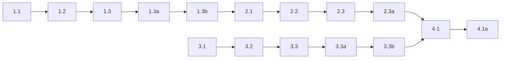

## 1. App action model refactor
- [x] 1.1 In `packages/active-listener/src/active_listener/app/state.py`, rename `KeyboardAction` -> `AppAction`, `KeyboardDecision` -> `AppActionDecision`, and `decide_keyboard_action(...)` -> `decide_app_action(...)`. Keep the existing semantic mapping unchanged and add `StartOrFinishResult` with values `started|finished|ignored`.
- [x] 1.2 In `packages/active-listener/src/active_listener/app/signals.py`, rename `KeyboardSignal` -> `AppActionSignal`, update its field type to `AppAction`, and change `RuntimeSignal` to `AppActionSignal | ClientSignal`.
- [x] 1.3 In `packages/active-listener/src/active_listener/app/service.py` and keyboard boundary files, rename `handle_keyboard_action(...)` -> `handle_action(...)`, update queue dispatch to use `AppActionSignal`, and make the service return the executed `AppActionDecision` so non-keyboard callers can reuse it.
- [x] 1.3a Validate the refactor with targeted tests in `packages/active-listener/tests/test_state.py` and `packages/active-listener/tests/test_app.py`, proving the exact decision matrix and service behavior for start, finish, cancel, and reconnect-suppressed start.
- [x] 1.3b Run `uv run basedpyright` in `packages/active-listener`. If this work also restores Ruff to package dev dependencies, run `uv run ruff check` there and capture that output too.

## 2. Active-listener D-Bus control contract

- [x] 2.1 In `packages/active-listener/src/active_listener/infra/dbus.py`, add a thin inbound control delegation boundary (control protocol + attachment point on the concrete D-Bus service) instead of moving recording policy into the D-Bus layer.
- [x] 2.2 Extend `ca.lmnop.Eavesdrop.ActiveListener1` with `StartOrFinishRecording()` as a zero-argument method returning `started|finished|ignored`, and translate the returned `AppActionDecision` into that public result without exposing cancel on the bus.
- [x] 2.3 In `packages/active-listener/src/active_listener/bootstrap.py`, attach the constructed `ActiveListenerService` as the D-Bus control delegate before publishing `ForegroundPhase.IDLE`, so the extension never sees an enabled start state before the method is usable.
- [ ] 2.3a Validate the D-Bus boundary with focused tests in `packages/active-listener/tests/test_dbus_service.py`, confirming the new method appears in introspection, the property stays read-only, and the method returns the locked strings for start, finish, and reconnect-suppressed requests. [blocked: session bus unavailable in this environment, so bus-backed tests skipped]

## 3. GNOME extension state-transition menu item

- [x] 3.1 In `packages/active-listener-ui-gnome/src/extension.ts`, add the new first menu item before `Preferences`, store it as a field, and update menu construction so the final order is: stateful control, `Preferences`, `Show overlay`, `Restart service`, `Stop service`.
- [x] 3.2 Stop flattening all non-`recording` states to `idle`. Preserve enough phase detail to render the locked menu contract: `No Service` disabled, `Reconnecting` disabled, `Start Recording` enabled, `Stop Recording` enabled, with `starting` and unknown phases rendered as disabled `Start Recording`.
- [x] 3.3 Call `StartOrFinishRecording()` via non-blocking `Gio.DBusProxy.call(...)` / `call_finish(...)`, ignore the returned string for UI rendering, and show `Main.notifyError(...)` only when the method call fails.
- [x] 3.3a Validate the extension changes with `npm run build` and `npm run typecheck` in `packages/active-listener-ui-gnome`.
- [x] 3.3b Add deterministic extension-side coverage following the existing script-validation pattern in `packages/active-listener-ui-gnome/scripts/`, proving menu-state derivation and command-failure handling without inventing a new test framework.

## 4. End-to-end interaction validation

- [ ] 4.1 Validate the cross-control behavior in a GNOME session or devkit run: menu start -> keyboard stop, keyboard start -> menu stop, `No Service` disabled when the D-Bus name disappears, `Reconnecting` disabled during reconnect, and no optimistic label flip before `State` changes arrive.
- [ ] 4.1a (HUMAN_REQUIRED) Capture manual verification evidence for the final behavior, such as screenshots or notes from an `npm run wayland:test` session, including the menu-closes-immediately behavior and the command-failure notification case.

