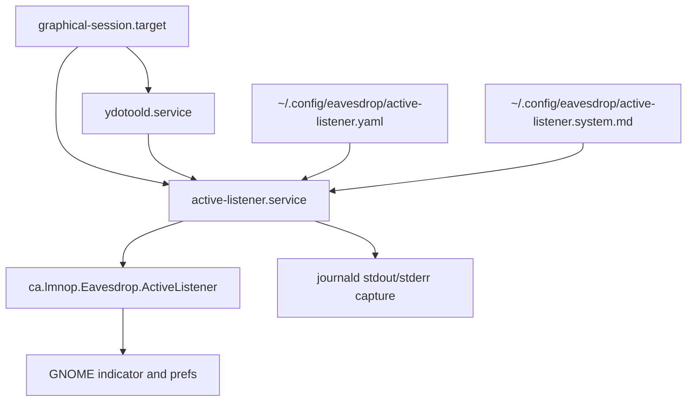

## Context

`active-listener` already behaves like a desktop-session service even though it is currently launched mostly like a developer CLI. The existing runtime has several important properties that this design must preserve:

- `packages/active-listener/src/active_listener/cli.py`
  - initializes logging first
  - initializes DBus before loading config or constructing the service
  - returns a non-zero exit code on startup failure
- `packages/active-listener/src/active_listener/config.py`
  - currently defaults to `packages/active-listener/config.yaml`
  - supports explicit `config_path` override plus field-level CLI overrides
- `packages/active-listener/src/active_listener/rewrite.py`
  - already knows how to resolve a user override prompt under XDG config
  - currently uses the `active-listener` namespace instead of the chosen `eavesdrop` namespace
- `packages/active-listener/src/active_listener/dbus_service.py`
  - acquires the user session bus
  - claims the singleton DBus name
  - exports a stable interface consumed by passive desktop UI
- `packages/active-listener-ui-gnome/src/prefs.ts`
  - currently writes the prompt override to the old XDG path
- `Taskfile.yaml`
  - currently has a manual `run-active-listener` developer task
  - does not yet provide install or uninstall workflow for user-systemd setup

The current runtime truth and the current installation truth do not match:

|Area|Current state|Problem|
|---|---|---|
|Startup|Manual CLI invocation is the primary described path|Looks like a dev tool instead of a desktop-session component|
|Config|Default file lives in the repo package directory|Wrong home for a user-installed service|
|Prompt override|Already uses XDG config, but under `~/.config/active-listener/`|Namespace does not match the product|
|Failure surface|Logs describe fatal failure, DBus does not|Passive consumers cannot distinguish normal disappearance from a crash path they should surface|
|Session lifecycle|Service semantics are already session-scoped|Install/ops story does not say that clearly|

The user locked the following product decisions during design:

- `active-listener` auto-starts under `systemd --user`
- the owning lifecycle is `graphical-session.target`
- config lives at `~/.config/eavesdrop/active-listener.yaml`
- prompt override lives at `~/.config/eavesdrop/active-listener.system.md`
- startup is best-effort, not a hard session blocker
- fatal service failure is published as a single one-shot DBus signal when DBus is already available
- logging remains unchanged and is captured by the user service as-is
- the workstation's installed user dependency is `ydotoold.service`

This is a cross-cutting change because it touches runtime config discovery, systemd lifecycle, DBus publication, GNOME preferences pathing, `Taskfile.yaml`, docs, and operator expectations.



### Current startup shape

Today the startup flow is effectively:

```python
def main():
    setup_logging_from_env()
    command = ActiveListenerCommand.parse()
    dbus_service = build_app_state_service(no_dbus=...)
    config = load_active_listener_config(...)
    run_service(config, dbus_service=dbus_service)
```

That ordering is important. DBus currently comes up before config or dependency validation so desktop consumers can observe `starting`. The design must keep that property.

### Desired startup shape

After this change, the same bootstrap logic should be used by both manual CLI runs and the user systemd unit:

```python
def main():
    setup_logging_from_env()
    command = ActiveListenerCommand.parse()
    dbus_service = build_app_state_service(no_dbus=...)
    try:
        config = load_active_listener_config(default_xdg_path_or_override)
        run_service(config, dbus_service=dbus_service)
    except Exception as exc:
        emit_fatal_error_if_possible(dbus_service, str(exc))
        raise
```

The point is not to invent a second startup flow for systemd. The point is to make the existing flow truthful for both humans and service management.

## Goals / Non-Goals

**Goals:**
- Make `active-listener` installable and runnable as a user-session systemd service bound to the graphical login.
- Move default config discovery into the user's XDG config namespace under `eavesdrop`.
- Keep manual CLI invocation working while making systemd the primary operational path.
- Reuse systemd for startup ordering and retry behavior instead of inventing a second dependency manager in application code.
- Preserve the existing DBus state model where `State` reports current truth and service absence means process absence.
- Add one machine-readable fatal-failure DBus event for startup/runtime exits after DBus is available.
- Preserve the current logging output and let systemd/journald capture it unchanged.
- Add repo-standard Taskfile entrypoints for installation and uninstallation so user-systemd setup is reproducible.
- Prove healthy systemd startup, not only failure behavior, by verifying service reaches normal running state without emitting `FatalError` on successful install/start.
- Give implementation guidance that a junior engineer can follow without having to rediscover why each decision was made.

**Non-Goals:**
- Redesigning log formatting for journald readability.
- Turning remote server reachability into a systemd-modeled dependency.
- Introducing a durable DBus `failed` state value.
- Making graphical login fail or block if `active-listener` cannot start.
- Replacing the existing CLI entrypoint with a systemd-only bootstrap path.
- Adding new end-user UI beyond the prompt-path change required for the GNOME prefs editor.
- Supporting both old and new XDG config paths indefinitely. This is a cutover, not a compatibility bridge.
- Replacing direct `systemctl --user` operator commands entirely. Taskfile gives repo workflow, not magical abstraction over all systemd debugging.

## Decisions

### 1. Model `active-listener` as a user service owned by `graphical-session.target`

The service should be installed as a `systemd --user` unit with:

- `WantedBy=graphical-session.target`
- `PartOf=graphical-session.target`
- `After=graphical-session.target`

Rationale:
- `active-listener` is desktop-session infrastructure, not an always-on per-user daemon.
- Its dependencies are session-scoped: session DBus, desktop input devices, focused-app text emission, and user `ydotool`.
- The user explicitly chose graphical-session ownership over broader `default.target` semantics.

This tells a junior engineer how to think about the service: if the graphical session goes away, `active-listener` should go away too. The service is not supposed to survive logout and keep running headlessly.

Alternatives considered:
- `default.target`: rejected because it is broader than the real desktop-session lifecycle and may start the service before the desktop session is the right place for it.
- lingering/background user daemon: rejected because the service is not meaningful outside the workstation session.

### 2. Keep startup best-effort with systemd ordering plus restart policy

The unit should use:

- `Wants=` for soft dependencies
- `After=` for ordering
- `Restart=on-failure`
- a bounded `RestartSec=` delay

Rationale:
- The user explicitly chose best-effort startup.
- Ordering is useful for dependencies that are actual units, such as `ydotoold.service`.
- Retry behavior is the truthful way to handle transient failures like missing device readiness, temporary socket absence, or server reachability at login time.

Important clarification for juniors: `After=` means order, not readiness. It says "start me later than this unit," not "guarantee this dependency is fully usable." That is why restart policy is still needed.

Alternatives considered:
- `Requires=` hard dependencies: rejected because they turn optional workstation readiness into a brittle session startup graph.
- richer in-app startup polling/backoff as the primary orchestration layer: rejected because systemd already owns service retries.

### 3. Depend on `ydotoold.service`, but not on remote server health

`active-listener` should declare ordering toward the user-managed `ydotoold.service` user unit.

Rationale:
- The current config points at a user-runtime ydotool socket, and the user confirmed `ydotool` is managed with `systemctl --user`.
- The target workstation exposes `ydotoold.service` as the installed user unit.
- Remote transcription server readiness cannot be truthfully expressed as a systemd unit dependency in this repo.

For a junior engineer: this means the unit file can and should mention `ydotoold.service`, but it should not mention the remote transcription server. The server may be reachable, unreachable, or reconnecting at runtime, and that is already handled by the app/client lifecycle.

Alternatives considered:
- no explicit ydotool dependency: rejected because there is an actual user-unit relationship available and it improves startup ordering.
- modeling the remote server as a dependency: rejected because unit ordering does not prove remote health.

### 4. Move the default runtime config to `~/.config/eavesdrop/active-listener.yaml`

The runtime config loader should prefer the XDG path under the `eavesdrop` namespace as the default config location.

Expected resolution rules:

```python
if explicit_config_path:
    use(explicit_config_path)
else:
    use(XDG_CONFIG_HOME / "eavesdrop/active-listener.yaml")
```

Where `XDG_CONFIG_HOME` falls back to `~/.config` if the environment variable is unset.

Rationale:
- The service becomes a user-installed workstation feature, so repo-local defaults are the wrong operational home.
- The user explicitly chose the `eavesdrop` namespace and a flat file layout.
- A single stable config path makes systemd units, docs, and debugging simpler.

Important cutover note: this design does not preserve the old repo-local path as a silent fallback. The new XDG path is the default truth. Manual runs can still pass `--config-path` if a developer wants a repo-local file.

Alternatives considered:
- keep `packages/active-listener/config.yaml` as the default: rejected because it only makes sense for repo-local development.
- use `~/.config/eavesdrop/active-listener/config.yaml`: rejected because the user chose the flatter file layout.

### 5. Move the prompt override to `~/.config/eavesdrop/active-listener.system.md`

The rewrite prompt override should move to the same product namespace as the runtime config, using a flat app-specific filename.

Expected resolution rules:

```python
override = XDG_CONFIG_HOME / "eavesdrop/active-listener.system.md"
if override.exists():
    use(override)
else:
    use(packaged_prompt)
```

Rationale:
- The user explicitly chose the `eavesdrop` namespace and flat layout.
- This unifies runtime config and prompt override under one user-owned directory.
- The GNOME preferences UI can target the same path directly.

Important boundary: this spec changes only the override path. It does not change prompt parsing, prompt rendering, or fallback-to-packaged-prompt semantics.

Alternatives considered:
- keep `~/.config/active-listener/system.md`: rejected because it is inconsistent with the chosen product namespace.
- use `~/.config/eavesdrop/active-listener/system.md`: rejected because the user preferred flat filenames over an app subdirectory.

### 6. Preserve the DBus truth model and add one fatal one-shot signal

The exported DBus surface should keep `State` as the durable current-truth property and add one new one-shot signal:

- `FatalError(reason: s)`

Rationale:
- A fatal exit is an event, not a durable state; once the process exits, the bus name disappears.
- The existing contract already treats service absence as the source of truth for process absence.
- The user explicitly chose one signal rather than separate startup/runtime variants.

This distinction matters for implementation. A junior engineer might be tempted to add a `failed` enum value to `State`. Do not do that. The property would claim the service is still present in a failed state, but the service is about to exit and disappear from DBus entirely. That would make the API lie.

Behavioral boundary:
- if DBus has been acquired, emit `FatalError(reason)` immediately before exiting on a fatal path
- if DBus acquisition itself fails, no fatal signal is possible, and logs remain the only failure surface

Alternatives considered:
- add a durable `failed` state: rejected because the state would disappear with the process and would lie about current truth.
- add separate `StartupFailed` and `RuntimeFailed` signals: rejected because the user chose a single signal.

### 7. Keep logging pass-through and solve readability later

The service design should preserve the current stdout/stderr logging behavior and rely on the user service manager to capture it.

Rationale:
- The user explicitly chose not to alter code for journald formatting right now.
- Logging redesign is orthogonal to the service/config integration work.
- Preserving current behavior avoids coupling service rollout to a logging-format change.

For a junior engineer: do not "improve" this feature by changing logger formatting, stripping ANSI, or forcing JSON in the unit. That is a separate product decision and intentionally out of scope.

Alternatives considered:
- force JSON logs in the unit: rejected as premature and not requested.
- make the app strip ANSI for non-TTY outputs: rejected for this feature because the user wants to leave logging behavior unchanged.

### 8. Keep fatal-path publication in bootstrap, not only inside the service loop

Fatal DBus publication must be reachable from startup/bootstrap failures that happen before `run_service()` settles into steady-state operation.

Rationale:
- fatal startup failures such as missing config, keyboard resolution failure, server connect failure, or ydotool initialization failure occur during CLI/bootstrap orchestration
- emitting `FatalError` only from the long-running service object would miss those paths
- the bootstrap layer already owns DBus-first startup and non-zero process exit behavior

Implementation consequence: the right owner for fatal publication is not just `ActiveListenerService`. The CLI/bootstrap path must participate because some of the most important failures happen before a service instance is fully running.

Alternatives considered:
- service-only fatal publication: rejected because it would miss the most important startup failures.

### 9. Keep one runtime truth for manual and systemd startup

Manual CLI runs and systemd-managed runs should use the same config discovery, DBus bootstrap, and fatal-path behavior.

Rationale:
- Two startup paths would force engineers to debug two different systems.
- Tests become simpler when the service unit is only a launch wrapper around the existing CLI/runtime.
- This preserves the existing command-line entrypoint while still making systemd the primary operational path.

For a junior engineer: the systemd unit should execute the same app entrypoint a human would run. The unit should not reimplement app logic in shell commands.

### 10. Add Taskfile install/uninstall entrypoints for repo-standard operator workflow

`Taskfile.yaml` should gain explicit tasks for:

- installing or updating user-service artifacts
- enabling and starting `active-listener.service`
- uninstalling user-service artifacts and disabling/stopping the service

Rationale:
- repo already uses Taskfile as workstation operator surface
- current file has `run-active-listener` for manual CLI use but no equivalent install/remove workflow for systemd mode
- junior engineer should not need to invent shell command sequence for copying unit files, reloading user manager, enabling service, starting service, stopping service, disabling service, and removing artifacts

Important boundary: Taskfile tasks are convenience and standardization layer. They should call truthful underlying systemd operations. They should not hide failures or swallow service startup errors.

Expected shape:

```python
task install_active_listener_service:
    sync dependencies if needed
    install unit/config assets to user-visible locations
    systemctl --user daemon-reload
    systemctl --user enable --now active-listener.service
    verify active-listener reached healthy running state

task uninstall_active_listener_service:
    systemctl --user disable --now active-listener.service
    remove installed user-service artifacts
    systemctl --user daemon-reload
```

Task names may differ, but spec requires both install and uninstall flow in `Taskfile.yaml`.

### 11. Treat successful startup as explicit acceptance criteria

Implementation must verify not only syntax and failure cases, but also healthy service startup in real `systemd --user` context.

Rationale:
- feature goal is workstation service installability, not only graceful failure
- `FatalError` work makes failure observable, but success path must prove service does not emit fatal signal during normal startup
- junior engineer might otherwise stop after `systemd-analyze verify` and unit tests, which is not enough

Healthy startup means all of following are true after install/start:

- unit reaches active running state under `systemctl --user`
- journald does not show immediate crash-loop or fatal startup exit
- DBus name is present
- durable DBus state advances to normal ready state
- no `FatalError` signal is observed on healthy startup

For final workstation verification, agent should not stop at `enable --now`. Agent should explicitly ask user to log out and log back in, then verify service auto-starts in fresh graphical session. This matters because feature promise is login-time startup, not merely same-session manual start.

## Risks / Trade-offs

- **`graphical-session.target` behavior varies by desktop integration** -> verify the target is driven correctly in the target GNOME environment during implementation and adjust installation docs if the workstation requires a session-specific enablement nuance.
- **Unit ordering does not guarantee readiness** -> use `Restart=on-failure` so transient misses become retries instead of one-shot startup failure.
- **DBus fatal signal cannot exist when DBus startup itself fails** -> document this boundary explicitly and rely on logs for bus-acquisition failures.
- **Prompt/config path move can strand existing user files** -> include migration notes and a clear manual move path from legacy XDG locations if those files already exist.
- **Manual CLI and systemd startup can diverge operationally** -> keep both paths using the same config discovery and bootstrap flow so there is one runtime truth.
- **ANSI-rich logs in journald may be messy to read** -> accept this for now and defer log-consumption improvements to a separate change.
- **A junior engineer may overfit tests to implementation details** -> prefer contract tests that assert paths, signals, and restart-facing behavior rather than internal helper names.
- **Taskfile tasks can become stale wrappers around systemd behavior** -> keep them thin, explicit, and aligned with actual `systemctl --user` commands used in docs and validation.

### Failure matrix

This table is intentionally explicit because startup and failure ownership is easy to misunderstand.

|Failure point|DBus already acquired?|Emit `FatalError`?|Expected process result|
|---|---|---|---|
|Session bus acquisition fails|No|No|Exit non-zero, logs only|
|Duplicate DBus name acquisition fails|No usable exported service|No|Exit non-zero, logs only|
|Config file missing or invalid after DBus startup|Yes|Yes|Exit non-zero|
|Keyboard resolution fails after DBus startup|Yes|Yes|Exit non-zero|
|Client connect fails after DBus startup|Yes|Yes|Exit non-zero|
|ydotool/emitter init fails after DBus startup|Yes|Yes|Exit non-zero|
|Steady-state fatal service-owned exception after DBus startup|Yes|Yes|Exit non-zero|

## Migration Plan

1. Change the default runtime config path constant to `~/.config/eavesdrop/active-listener.yaml`.
2. Change the rewrite prompt override resolver and GNOME preferences path to `~/.config/eavesdrop/active-listener.system.md`.
3. Extend the DBus interface and publisher boundary with the `FatalError` signal and update DBus contract tests.
4. Thread fatal-signal emission through bootstrap and runtime fatal paths that occur after DBus acquisition.
5. Add user-systemd unit artifacts, Taskfile install/uninstall tasks, and installation/docs for `graphical-session.target` startup plus `ydotoold.service` ordering.
6. Verify both manual invocation and `systemd --user` startup against the same config paths and DBus behavior.
7. Validate healthy startup from Taskfile-driven installation: service active, DBus present, ready state published, no `FatalError` on success.
8. Validate that transient startup failures restart cleanly and that fatal DBus events are observable when DBus is available.

### Rollout notes

- The implementation should update documentation at the same time as the code change. Do not land the new unit without telling operators where config moved.
- The implementation should prefer a clean cutover over maintaining multiple default path conventions.
- Existing repo-local developer workflows can still use explicit `--config-path` arguments when needed.
- Taskfile install/uninstall commands should be documented as repo-standard workflow, but docs should still show underlying `systemctl --user` surfaces used for debugging when install verification fails.
- Final acceptance should include fresh-session verification: after install, agent asks user to log out and log back in, then resumes validation against real auto-start behavior.

**Rollback strategy:** revert the systemd integration artifacts, path-default changes, GNOME prefs path changes, and fatal DBus signal together. The prior manual CLI path remains conceptually intact, so rollback is straightforward as long as path changes and consumer assumptions are reverted in the same change.

## Open Questions

- None currently. The target workstation exposes `ydotoold.service` as the user-managed unit to order against.
