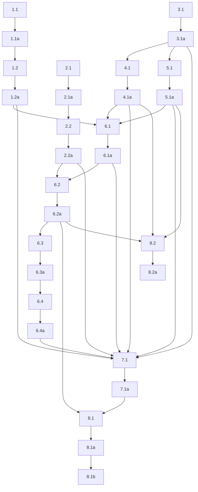

## 1. XDG runtime config migration
- [x] 1.1 Add or update the config-path helper logic in `packages/active-listener/src/active_listener/config.py` so the default config path resolves to `~/.config/eavesdrop/active-listener.yaml`, using `XDG_CONFIG_HOME` when present and `~/.config` otherwise.
- [x] 1.1a Verify config-path resolution with focused `packages/active-listener` tests covering default path resolution, `XDG_CONFIG_HOME` override behavior, and the fallback to `~/.config`; capture the test output as an artifact.
- [x] 1.2 Update the CLI/runtime startup path so manual invocation and systemd invocation both use the new default path while preserving explicit `--config-path` override behavior.
- [x] 1.2a Verify CLI config precedence with focused tests covering config-only startup, explicit `--config-path`, and CLI field overrides on top of the new default location; capture the test output as an artifact.

## 2. Prompt override path migration
- [x] 2.1 Change the Python rewrite prompt override resolver to read `~/.config/eavesdrop/active-listener.system.md` and remove the old `active-listener` XDG namespace from the default resolver.
- [x] 2.1a Verify Python prompt resolution with focused tests covering the new XDG path, packaged-prompt fallback when the override file is absent, and preservation of current prompt-loading behavior; capture the test output as an artifact.
- [x] 2.2 Change the GNOME preferences editor path generation so it reads and writes `~/.config/eavesdrop/active-listener.system.md`.
- [x] 2.2a Verify the GNOME prefs path update with focused TypeScript checks or tests that prove the generated path changed to the new `eavesdrop` namespace and remains writable; capture the typecheck or test output as an artifact.

## 3. DBus contract extension
- [x] 3.1 Extend `packages/active-listener/src/active_listener/dbus_service.py` with a single `FatalError(reason: s)` signal, and update the `AppStateService` protocol plus concrete implementations so the new signal is part of the published contract.
- [x] 3.1a Verify the DBus contract with focused tests that prove introspection now exposes `FatalError`, the signal emits on the user bus, and the durable `State` property still exposes only the existing state values; capture the test output as an artifact.

## 4. Fatal bootstrap publication
- [x] 4.1 Update the CLI/bootstrap path so fatal startup failures that happen after DBus acquisition emit `FatalError(reason)` before the process exits non-zero.
- [x] 4.1a Verify fatal startup publication with focused CLI tests that cover missing or invalid config, startup prerequisite failure, and truthful reason propagation; capture the test output as an artifact.

## 5. Fatal runtime publication
- [x] 5.1 Update the service/runtime fatal paths so fatal exceptions that occur after startup also emit `FatalError(reason)` exactly once before exit, without introducing a new durable `failed` state.
- [x] 5.1a Verify runtime fatal publication with focused service tests that prove `FatalError` emits exactly once on fatal runtime failure and that normal reconnecting or recording-abort paths do not emit it; capture the test output as an artifact.

## 6. User systemd service integration
- [x] 6.1 Add the user-systemd service artifact for `active-listener` so it binds to `graphical-session.target`, orders after `ydotoold.service`, uses best-effort restart behavior, and launches the existing CLI entrypoint instead of a custom shell bootstrap.
- [x] 6.1a Verify the service artifact with unit-level checks such as `systemd-analyze --user verify` or equivalent syntax validation; capture the verification output as an artifact.
- [x] 6.2 Add Taskfile install task or tasks in `Taskfile.yaml` that install user-service artifacts, reload user systemd, enable/start `active-listener.service`, and fail loudly if healthy startup does not occur.
- [x] 6.2a Verify Taskfile install flow in real `systemd --user` context by capturing command output plus post-install `systemctl --user status active-listener.service`; successful verification must show running service rather than fatal startup exit.
- [x] 6.3 Add Taskfile uninstall task or tasks in `Taskfile.yaml` that stop/disable `active-listener.service`, remove installed artifacts, reload user systemd, and leave workstation in clean post-uninstall state.
- [x] 6.3a Verify Taskfile uninstall flow by capturing command output plus post-uninstall evidence that unit is stopped/disabled and installed artifacts no longer remain in expected user-service locations.
- [x] 6.4 Update repo and package documentation so a junior engineer can install, uninstall, inspect, and troubleshoot user service using Taskfile workflow, new config path, and journald-based operator flow.
- [x] 6.4a Verify documentation change by checking that it names exact config path, prompt path, Taskfile install/uninstall commands, unit lifecycle target, `ydotoold.service` dependency, and `journalctl --user -u active-listener.service` log path.

## 7. Integrated behavior validation
- [x] 7.1 Run focused automated validation for changed Python and GNOME touchpoints so path migration, DBus contract extension, and fatal-path behavior are covered together; capture combined output as an artifact.
- [x] 7.1a Verify combined validation artifact includes updated config tests, prompt-path tests, DBus tests, and fatal-path CLI/service tests.

## 8. Workstation rollout validation
- [x] 8.1 Validate integrated behavior on target workstation after Taskfile-driven installation: confirm service auto-starts in graphical session, publishes DBus state, reaches healthy ready state, and does not emit `FatalError` on successful startup.
- [x] 8.1a (HUMAN_REQUIRED) Capture rollout evidence including Taskfile install output, `systemctl --user status active-listener.service`, `journalctl --user -u active-listener.service`, and confirmation that durable DBus state behaves as specified with no `FatalError` on healthy startup.
- [x] 8.1b (HUMAN_REQUIRED) Have agent explicitly ask user to log out and log back in after installation so auto-start is verified in fresh graphical session instead of only same-session `enable --now` behavior.
- [x] 8.2 Validate failure-side workstation behavior by provoking at least one startup failure after DBus acquisition and confirming restart behavior plus `FatalError` publication still work under `systemd --user`.
- [x] 8.2a (HUMAN_REQUIRED) Capture failure-side rollout evidence showing restart behavior, fatal journald trail, and observed `FatalError` event for systemd-managed startup failure.

