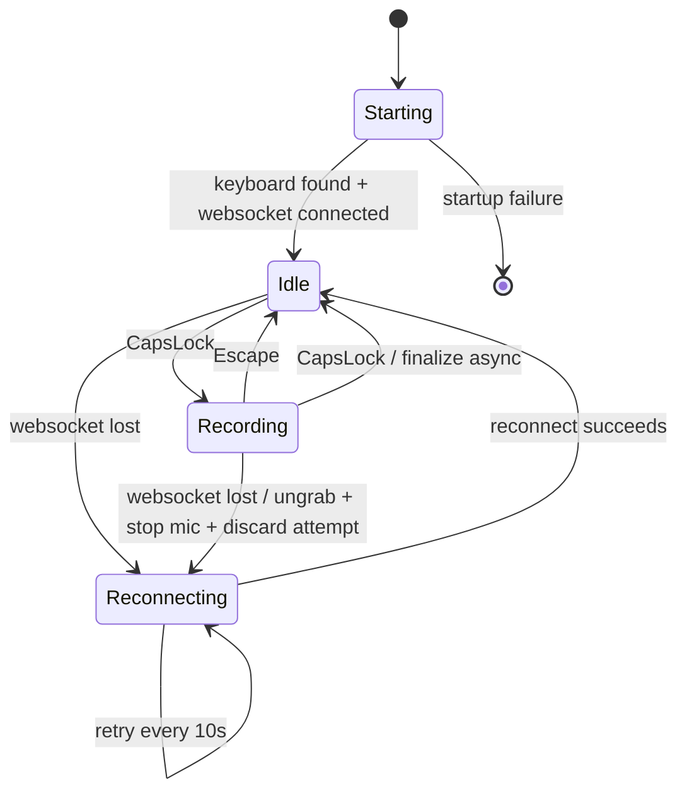

## Context

`active-listener` is being rebuilt as a workstation-specific dictation tool rather than a UI overlay or a general desktop client. The MVP is intentionally narrow: a long-running CLI/service on one Linux workstation watches one keyboard, starts dictation on `Caps Lock`, cancels on `Escape`, finishes on a second `Caps Lock`, and types finalized text into the currently focused application.

The existing `eavesdrop-client` already exposes the core live transcriber operations this tool needs: `connect()`, `start_streaming()`, `stop_streaming()`, and awaitable `flush()`. It does not yet model long-lived dictation truthfully enough for this use case. In particular, repeated `start_streaming()` / `stop_streaming()` cycles on one live connection can overlap stale audio-loop tasks, and reconnect state is not yet exposed as first-class events an application can consume.

Measured timings on the target machine informed the design:
- Keyboard open/grab is effectively cheap; the full open/grab/ungrab/close cycle averaged about 44 ms.
- Microphone create/start/stop/close is usually acceptable, but teardown has jitter, so the MVP keeps microphone lifecycle simple instead of prematurely optimizing around a warm stream.

The common logging setup in `packages/common` is already the repo standard, so `active-listener` should use the same env-driven `setup_logging(...)` / `get_logger(...)` pattern as the server.

Verified third-party baseline for the MVP:
- `clypi` 1.8.2 is the current CLI framework in use and supports an async `Command.run()` with a synchronous `.start()` entrypoint, which matches the desired bare command shape.
- `evdev` 1.9.3 is the current Linux input library in use and documents `InputDevice`, `async_read_loop()`, and explicit `grab()` / `ungrab()` support for whole-device capture.
- `python-ydotool` 1.1.1 is the current Python typing backend in use and documents `pydotool.init(...)` plus text emission helpers, but it depends on an external `ydotoold` daemon and `uinput` availability.
- `sounddevice` 0.5.5 remains the live microphone backend through the client path and documents callback-driven `InputStream` capture backed by PortAudio/NumPy.



To make implementation easier for a junior engineer, this document uses the following terms consistently:
- **Connection**: the long-lived live transcriber WebSocket owned by `eavesdrop-client`. It has one protocol `stream` identifier.
- **Recording**: one local dictation attempt bounded by hotkeys. A recording starts on the first `Caps Lock` press and ends on `Escape` or the second `Caps Lock` press.
- **Finalization**: the background work after finish is requested. For MVP this means: stop local mic capture if not already stopped, request `flush()`, reduce the returned transcription to committed text, and emit that text.
- **Reconnect state**: the period after a live connection is lost and before it is re-established. During this state, the process stays alive but `Caps Lock` does not start a new recording.

The implementation should keep one level of abstraction per module:
- `eavesdrop-client` reports network/transcription truth.
- `active-listener` translates keyboard actions plus client events into local dictation behavior.
- The typing backend only types text; it does not know about hotkeys, reconnect, or transcription.

## API reference for implementation

This section is intentionally explicit. A junior engineer should implement against these APIs directly instead of guessing.

### Repo-standard logging API

Use the shared logging functions from `eavesdrop.common`:

- `setup_logging(level: str = "INFO", json_output: bool = False, correlation_id: str | None = None, filter_to_logger: str | None = None) -> None`
- `get_logger(name: str | None = None, **initial_values) -> BoundLogger`

For MVP, `active-listener` should follow the same pattern as the server:

1. Read logging configuration from environment.
2. Call `setup_logging(...)` once during process startup.
3. Acquire module loggers with `get_logger("al/main")`, `get_logger("al/input")`, etc.

Do not invent a second logging helper inside `active-listener`.

### Clypi API used by the CLI

The CLI should use the documented Clypi command shape:

- subclass `clypi.Command`
- implement `async def run(self) -> None`
- create the command with `YourCommand.parse()`
- start it with `.start()`

That means the expected outer shell is conceptually:

```python
class ActiveListenerCli(Command):
    async def run(self) -> None:
        ...


def main() -> None:
    ActiveListenerCli.parse().start()
```

The CLI is intentionally bare. Do not add subcommands unless the spec is changed later.

### Evdev API used for keyboard control

The implementation should use these evdev entry points:

- `evdev.list_devices()` to enumerate `/dev/input/event*` paths
- `evdev.InputDevice(path)` to open a concrete device
- `device.name` to compare against the configured exact keyboard name
- `async for event in device.async_read_loop()` for the hotkey loop
- `device.grab()` when entering `Recording`
- `device.ungrab()` when leaving `Recording`
- `device.close()` on shutdown
- `evdev.ecodes.EV_KEY` to filter key events
- `evdev.ecodes.KEY_CAPSLOCK` and `evdev.ecodes.KEY_ESC` for the two control keys

Key value semantics matter:

- `event.value == 1` means key-down
- `event.value == 0` means key-up
- `event.value == 2` means key-hold/repeat

MVP should react only to key-down events (`value == 1`).

The input layer should expose local semantic actions upward, not raw evdev events. For example, the app should receive `start_or_finish` / `cancel`, not a naked `InputEvent`.

### Python ydotool API used for text emission

The implementation should use the documented `python-ydotool` / `pydotool` entry points:

- `pydotool.init()` once during setup, or `pydotool.init("/custom/socket")` if a non-default socket is required
- `YDOTOOL_SOCKET` environment variable if the service environment needs to point at a non-default daemon socket
- `pydotool.type_string(text)` to emit finalized text

Important runtime facts:

- This package is only a client library.
- It requires a running `ydotoold` daemon.
- `ydotoold` itself requires usable `uinput` access.

Therefore `active-listener` should keep the typing backend thin: initialize once, type finalized text, and surface failures through logs.

### Sounddevice API used by the live microphone path

The existing client microphone path already uses `sounddevice.InputStream` with a callback. The MVP should continue to rely on that path rather than inventing a second microphone implementation.

Relevant API surface already in use:

- `sd.InputStream(...)` construction with:
  - `device=...`
  - `channels=1`
  - `samplerate=16000`
  - `dtype=np.float32`
  - `latency="low"`
  - `blocksize=0`
  - `callback=...`
- `stream.start()`
- `stream.stop()`
- `stream.close()`

This matters for `active-listener` because microphone ownership stays in the client. The app should ask the client to start and stop streaming; it should not create its own `InputStream`.

### Existing eavesdrop-client API the app is allowed to use

`active-listener` should build on the existing public transcriber methods of `EavesdropClient`:

- `await client.connect(...)`
- `await client.start_streaming()`
- `await client.stop_streaming()`
- `await client.flush(...)`

Mode caveat:

- these streaming methods are transcriber-only
- they are not valid for RTSP subscriber mode

The MVP client work extends this surface with a unified async event iterator. The app should consume that iterator rather than reaching into private client fields.

### Wire/message API shape relevant to the app

The app does not talk to wire messages directly, but design decisions depend on one part of the wire contract:

- `TranscriptionMessage.stream` identifies the live connection
- `TranscriptionMessage.segments` carries transcription segments
- `TranscriptionMessage.flush_complete` marks the response that satisfies a flush request

Because `flush()` already returns a `TranscriptionMessage`, the app should reduce that returned value into committed text for typing. It should not watch arbitrary background transcription updates and type partial text.

## Goals / Non-Goals

**Goals:**
- Provide a bare `active-listener` CLI, implemented with Clypi, whose default behavior is to run the long-lived hotkey loop.
- Use the repo-wide structured logging setup with env-only logging controls.
- Resolve one keyboard by exact device name at startup and fail immediately on zero or multiple matches.
- Connect the live transcriber client at startup and fail immediately if the server is unavailable.
- Keep one persistent live transcriber connection open across recordings.
- Grab the keyboard only while a recording is active so `Caps Lock` and `Escape` do not leak to the focused application.
- Release the keyboard immediately on finish, then finalize transcription and emit text in the background.
- Allow a new recording to begin while a previous recording is still finalizing.
- Extend `eavesdrop-client` with reconnect-aware live behavior and a unified async event stream.
- Make `eavesdrop-client` guarantee at most one live audio-streaming task per client instance.
- Emit committed text through `ydotool` only.

**Non-Goals:**
- No overlay UI, Electron shell, clipboard/paste fallback, notifications, or other visual feedback in this feature.
- No file-transcription entrypoint in `active-listener`.
- No raw key emission API beyond text emission.
- No portability work beyond the user’s current workstation and keyboard.
- No buffering or recovery of a recording interrupted by connection loss.
- No synthetic local session identifier layered on top of the protocol `stream` identifier.
- No replacement of the chosen third-party stack (`clypi`, `evdev`, `python-ydotool`, `sounddevice`) in this feature.

## Decisions

### 1. Keep `active-listener` and `eavesdrop-client` separate
`active-listener` owns workstation concerns: evdev input, keyboard grabs, dictation policy, and `ydotool` emission. `eavesdrop-client` owns live socket lifecycle, reconnect behavior, audio streaming, and flush semantics.

**Rationale:** This keeps Linux desktop assumptions out of the transport library while fixing lifecycle truth at the level where the invariant is actually broken.

**Alternatives considered:**
- Put hotkey and typing logic directly in `client`: rejected because it would turn the transport library into a workstation app.
- Reintroduce an overlay/UI client: rejected because the desired flow is typed-text dictation, not visible UI.

### 2. Use one persistent transcriber connection per service lifetime
`active-listener` connects at startup and fails if the server is unavailable. After startup, the client remains connected across recordings. Disconnects trigger infinite reconnect attempts every 10 seconds.

**Rationale:** Keeping the socket warm removes repeated connection latency and gives the service a single long-lived connection identity (`stream`) for logs.

**Alternatives considered:**
- Connect only on the first hotkey press: rejected because the service would not prove readiness at startup.
- Exit on disconnect and rely on systemd restart: rejected because reconnect is a client concern and should not require process churn.
- Exponential backoff: rejected in favor of a fixed retry interval that is easier to understand in logs.

### 3. Keep microphone ownership simple; optimize the socket instead
The MVP opens and closes microphone capture per recording. Keyboard grab/release also follows the recording window. The WebSocket stays warm.

**Rationale:** The measured keyboard costs are low, and mic lifecycle cost is acceptable for MVP despite jitter. This avoids prematurely designing a warm-mic subsystem before it is proven necessary.

**Alternatives considered:**
- Hold the microphone open for the full service lifetime: rejected as premature complexity.
- Reconnect the WebSocket for each recording: rejected because the connection is the more valuable state to preserve.

### 4. Recording state is local; finalization is background work
Foreground service state is `Starting`, `Idle`, `Recording`, or `Reconnecting`. Pressing `Caps Lock` while recording ends the recording immediately, releases the keyboard immediately, and spawns background work that performs `stop_streaming()`, `flush()`, and text emission. New recordings may begin before older finalization work completes.

**Rationale:** The user explicitly wants finish to release the keyboard right away and does not want finalization latency to block the next recording.

**Alternatives considered:**
- Keep the keyboard grabbed until flush and emission complete: rejected because finish latency would become user-visible.
- Add a serialized foreground `Finalizing` state that blocks new recordings: rejected because it would forbid immediate restart.

Implementation detail to make this concrete:

1. User presses `Caps Lock` while idle.
2. `active-listener` asks the client to start streaming.
3. After streaming starts successfully, `active-listener` grabs the keyboard and enters `Recording`.
4. User presses `Escape` while recording.
5. `active-listener` ungrabs the keyboard, asks the client to stop streaming, discards the local recording attempt, and returns to `Idle`.
6. User presses `Caps Lock` while recording.
7. `active-listener` ungrabs the keyboard immediately, asks the client to stop streaming, and spawns a background task that awaits `flush()` and then emits the returned text.
8. Foreground state returns to `Idle` immediately, so another recording may begin even if the previous flush is still running.

The background finalization task must never re-grab the keyboard. The keyboard belongs only to the foreground `Recording` state.

### 5. Cancellation applies only before finish is requested
`Escape` cancels only the active recording. Once `Caps Lock` has been pressed to finish, cancellation is unavailable for that recording; finalization proceeds and any successful result is emitted.

**Rationale:** This matches the desired user contract and avoids complicated “cancel a flush already in flight” semantics.

**Alternatives considered:**
- Allow cancelling background finalization: rejected because it complicates lifecycle and failure handling for little immediate value.

### 6. Connection loss aborts the active recording and suppresses new starts
If the connection drops while idle, `active-listener` enters `Reconnecting` and ignores start hotkeys while logging the suppressed attempt. If the connection drops while recording, the app immediately ungrabs the keyboard, stops the mic, discards the active attempt, logs the abort, and enters `Reconnecting`. If disconnect happens during background finalization, emission is skipped and the failure is logged.

**Rationale:** This is the simplest truthful behavior. The service should not pretend a dictation attempt can complete after the server connection is gone.

**Alternatives considered:**
- Buffer locally and resume later: rejected as future work.
- Continue honoring start hotkeys while disconnected: rejected because the command would appear to succeed while impossible to complete.

### 7. The client exposes a unified async event stream
`eavesdrop-client` should expose a single async iterator for live-session events rather than callback registration or multiple app-consumed queues. Connection lifecycle events and transcription updates should appear in one temporal stream.

**Rationale:** The active-listener loop needs one ordered source of truth for connection changes and transcription updates. A single iterator keeps the boundary honest until there is evidence that splitting is warranted.

**Alternatives considered:**
- Callbacks: rejected because they complicate lifecycle management across reconnects.
- Separate connection and transcription channels: rejected because the coupling is not yet understood well enough to justify splitting.

The event stream should stay intentionally small. A junior engineer should not invent many event classes. The expected MVP event families are:
- `connected`: emitted when the initial connection is established.
- `disconnected`: emitted when the active connection is lost.
- `reconnecting`: emitted when the reconnect loop begins or retries.
- `reconnected`: emitted when reconnect succeeds after a disconnect.
- `transcription`: emitted for incoming `TranscriptionMessage` values.
- `error` (optional if needed): emitted only for connection-level errors that the app must react to.

The important design rule is that these are **client events**, not app actions. The client should not emit events like `recording_started` or `typing_finished`; those belong to `active-listener`.

### 8. Fix the audio-loop invariant in the client
`start_streaming()` must await any incomplete prior audio-loop task before starting a new one. `stop_streaming()` should continue to mean “request the stream to stop,” not “block until finalization is done,” and `flush()` should remain valid whenever the live client is connected and no other flush is in flight.

**Rationale:** The current bug is in the client lifecycle contract, not in the app. The client must tell the truth that only one audio streaming task exists per instance.

**Alternatives considered:**
- Let `active-listener` paper over stale tasks: rejected because the invariant belongs in `client`.
- Make `flush()` dependent on `_streaming == True`: rejected because flush is a connection-level operation, not a mic-state operation.

The client should expose a simple mental model:

- `connect()` means a live transcriber connection exists or the client is actively trying to preserve one.
- `start_streaming()` means microphone capture and exactly one audio-send loop are active.
- `stop_streaming()` means microphone capture has been told to stop and no new audio loop may be started until the old one has fully exited.
- `flush()` means “give me the current committed result for this connection,” regardless of whether the mic is actively running at that instant.

For implementation, store the audio loop in one dedicated task attribute rather than discovering it indirectly through a shared background-task set. The shared set can still exist for cleanup, but the single-task invariant should be checked through an explicit field.

### 9. Use protocol `stream` as the only connection identity in logs
The client-generated `stream` already identifies the live WebSocket session across server and client logs. The MVP will not add a local monotonically increasing recording/session ID.

**Rationale:** Adding a second identity layer would invent concepts the server does not know about and would blur the meaning of “session.”

**Alternatives considered:**
- Add a local session ID for each recording: rejected because it adds another identifier before the need is proven.

This means log messages should prefer a combination of:
- logger namespace, e.g. `client/core`, `al/input`, `al/app`
- protocol `stream`
- event name, e.g. `recording_started`, `recording_cancelled`, `reconnect_attempt`

Do not add a synthetic `session_id`, `utterance_id`, or `recording_id` in MVP logs.

## Implementation walkthrough

This section is intentionally concrete. A junior engineer should be able to follow it almost step-by-step.

### Suggested module shape

The package does not need many files, but it should separate concerns clearly:
- `active_listener/__init__.py`: `main()` entrypoint only.
- `active_listener/cli.py`: the Clypi command class and startup argument/config wiring.
- `active_listener/app.py`: top-level orchestration for startup, shutdown, and the main async loop.
- `active_listener/input.py`: keyboard resolution, evdev device opening, async event reading, grab/ungrab helpers.
- `active_listener/state.py`: local enums/dataclasses for app state if needed.
- `active_listener/emitter.py`: text emission through `pydotool`.

The client-side work likely belongs in:
- `packages/client/src/eavesdrop/client/core.py`
- possibly one new file for client event types if `core.py` becomes too crowded.

### Startup sequence

The startup path should be boring and explicit:

1. Configure logging from environment variables.
2. Resolve the configured keyboard by exact device name.
3. Open the device and verify it is readable.
4. Construct the live transcriber client.
5. Connect to the server.
6. Wait until the client reports connected/ready.
7. Enter the steady-state loop that consumes keyboard input and client events.

If any of steps 2–6 fail, the process should log the failure and exit rather than staying half-alive.

### Foreground app states

The app only needs four foreground states:

- `starting`: prerequisites are being checked.
- `idle`: connected and ready for `Caps Lock`.
- `recording`: mic active, keyboard grabbed, `Escape` and `Caps Lock` handled locally.
- `reconnecting`: connection unavailable; `Caps Lock` is ignored and logged.

Avoid creating extra states unless the implementation proves they are needed. In particular, do not add a foreground `finalizing` state; finalization is background work.

### Main loop shape

The easiest shape is two producers and one consumer policy layer:

- producer 1: evdev keyboard actions (`start_or_finish`, `cancel`)
- producer 2: client async events (`connected`, `disconnected`, `transcription`, etc.)
- consumer: `active-listener` app logic that updates local state and starts background tasks

If combining the two producers directly is awkward, an internal `asyncio.Queue` owned by `active-listener` is acceptable. The spec does not require that both event sources share one physical queue; it requires that the resulting policy is simple and ordered enough to reason about.

### Logging expectations

Logs are the only operator-visible output in MVP. A junior engineer should treat them as part of the feature, not an afterthought. At minimum, log:

- service startup and shutdown
- keyboard resolution success/failure
- initial client connect success/failure
- recording started / cancelled / finished
- keyboard grabbed / released
- connection lost / reconnect scheduled / reconnect succeeded
- recording aborted because of disconnect
- text emission success/failure

Prefer logs that explain cause and effect, for example:
- `connection lost`
- `recording aborted because connection lost`
- `reconnect scheduled delay_s=10`

### Testing guidance

The spec intentionally splits tests by responsibility. A junior engineer should not aim only for one manual end-to-end test.

- Client tests should verify connection and audio-loop invariants without using the real workstation keyboard.
- Active-listener tests should use fakes/mocks only at the workstation boundary (`evdev` input device, `pydotool` emitter), while still exercising the real local state transitions.
- One human-required validation remains for real typing into the focused application because that behavior depends on the workstation runtime.

If a file begins to exceed a comfortable size while implementing this, split it early instead of waiting for a giant orchestrator module to form.

## Risks / Trade-offs

- **Reconnect semantics increase client complexity** → Keep the event model small and connection-focused; do not fold application policy into the client.
- **Mic teardown jitter may make finish feel sticky** → Release the keyboard immediately on finish so keyboard responsiveness is not tied to flush or emission latency.
- **Ignoring hotkeys while reconnecting can feel opaque** → Log suppressed attempts now and leave an explicit note for future user-facing feedback.
- **Background finalizations may overlap** → Emit results in completion order and rely on the existing server behavior, which should preserve finish order in practice for this use case.
- **Whole-device keyboard grabs suppress all keys while recording** → Accept this as intentional MVP behavior for the user’s workstation.
- **Disconnect during recording loses the attempt** → Treat the loss as truthful MVP behavior rather than pretending local recovery exists.
- **Typing output depends on external workstation services** → Treat `ydotoold` + `uinput` availability as a required runtime precondition and verify it in end-to-end validation.
- **Input capture depends on Linux device permissions** → Expect `evdev` access to `/dev/input/event*` and verify service permissions early rather than debugging around missing access at runtime.

## Migration Plan

1. Build the new `active-listener` package shell around repo-standard logging and a bare Clypi command.
2. Extend `eavesdrop-client` with reconnect-aware live connection management and a unified async event iterator.
3. Correct the client streaming lifecycle so repeated starts cannot overlap stale audio-loop tasks.
4. Add the evdev-based input loop and recording state machine in `active-listener`.
5. Add `ydotool` text emission for finalized results.
6. Verify workstation runtime prerequisites: `ydotoold` reachable from the service environment, `uinput` available for text emission, `/dev/input` access available for evdev, and the existing PortAudio-backed audio path functioning for the client.
7. Run the service manually, then under systemd, to verify startup failure, reconnect behavior, recording cancellation, finish-and-emit flow, and disconnect-abort behavior.

**Rollback strategy:** revert the new `active-listener` package and client reconnect/event-stream changes together. This feature intentionally introduces no compatibility shim; if the lifecycle changes prove wrong, the rollback is to restore the previous client behavior and remove the new app package.

## Open Questions

- None for the MVP scope currently locked in this spec. Future work areas are intentionally deferred: user-facing reconnect feedback, local buffering across disconnects, warm microphone capture, richer emission backends, and whether direct `evdev.UInput` should eventually replace the `python-ydotool` + `ydotoold` runtime dependency.
