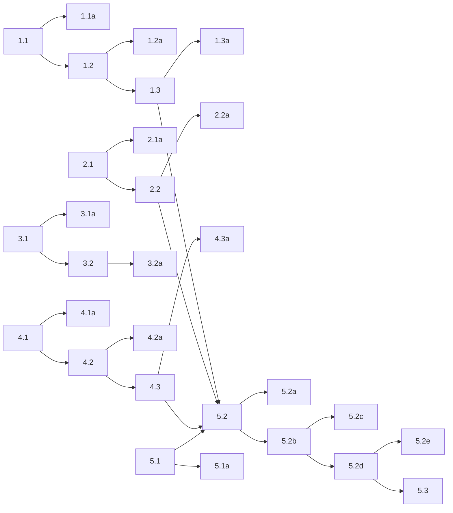

## 1. Client event model and reconnect behavior
- [x] 1.1 Add explicit live-client event types in `packages/client/src/eavesdrop/client/` for the MVP event families: `connected`, `disconnected`, `reconnecting`, `reconnected`, and `transcription`. Keep these events connection-focused; do not add app-specific events like `recording_started`.
- [x] 1.1a Verify the event type layer with focused unit tests that construct each event type, assert payload shape, and save the test output as an artifact.
- [x] 1.2 Expose a unified async iterator on `EavesdropClient` that yields the live-client events in temporal order for transcriber sessions.
- [x] 1.2a Verify the iterator contract with client tests that consume events using `async for`, assert initial connect and transcription delivery, and save the test output as an artifact.
- [x] 1.3 Add persistent reconnect behavior to the live transcriber client with a fixed 10-second retry cadence, client-boundary logging, and event emission for disconnect, reconnecting, and reconnected transitions.
- [x] 1.3a Verify reconnect behavior with a client test that forces socket loss, observes the retry path, and captures logs/events in test output as an artifact.

## 2. Client streaming lifecycle truthfulness
- [x] 2.1 Add one dedicated audio-loop task field in `packages/client/src/eavesdrop/client/core.py` so the client has an explicit source of truth for the active audio-send loop.
- [x] 2.1a Verify the dedicated task field with unit tests that assert task creation, completion, and cleanup behavior; save the test output as an artifact.
- [x] 2.2 Refactor `start_streaming()` so it awaits any incomplete prior audio-loop task before starting a new one, without changing the rule that `flush()` is valid whenever the live client is connected and no other flush is in flight.
- [x] 2.2a Verify repeated `start_streaming()` / `stop_streaming()` cycles on one connection with a client contract test that proves only one audio-loop task is active at a time and that `flush()` still works after stop; save the test output as an artifact.

## 3. Active-listener CLI and startup path
- [x] 3.1 Replace the placeholder `active_listener.main()` entrypoint with a bare Clypi command that starts the long-running service and uses the repo-standard logging setup from environment variables.
- [x] 3.1a Verify the CLI entrypoint with tests that cover command startup, logging setup, and non-zero failure on startup exceptions; save the test output as an artifact.
- [x] 3.2 Add startup prerequisite handling in `active-listener` that resolves the configured keyboard by exact device name, constructs the client, connects to the server, and fails fast if any prerequisite is missing.
- [x] 3.2a Verify startup prerequisite handling with automated tests for zero-match keyboard failure, multi-match keyboard failure, and server-unavailable failure; save the test output as an artifact.

## 4. Active-listener input handling and local state
- [x] 4.1 Implement an evdev input module that opens the configured device, reads key-down events via the async path, and exposes explicit helpers for grab/ungrab rather than scattering those calls throughout the app.
- [x] 4.1a Verify the input module with tests that simulate `KEY_CAPSLOCK` and `KEY_ESC` events, assert that only key-down events matter, and save the test output as an artifact.
- [x] 4.2 Implement the foreground app state machine in `active-listener` with only the states `starting`, `idle`, `recording`, and `reconnecting`.
- [x] 4.2a Verify the foreground state machine with tests that cover idle→recording, recording→idle via cancel, recording→idle via finish, and idle/reconnecting suppression behavior; save the test output as an artifact.
- [x] 4.3 Wire keyboard actions to app policy so `Caps Lock` starts and finishes recording, `Escape` cancels only the active recording, keyboard grabs exist only during recording, and connection loss during recording forces ungrab + local abort.
- [x] 4.3a Verify policy wiring with tests that assert grab/ungrab calls, ignored `Escape` while idle, ignored `Caps Lock` while reconnecting, and abort-on-disconnect behavior; save the test output as an artifact.

## 5. Finalization and text emission
- [x] 5.1 Add a dedicated text-emission module for `python-ydotool`/`pydotool` that initializes the backend once and exposes a narrow `emit_text(str)`-style API to the rest of `active-listener`.
- [x] 5.1a Verify text emission with a focused test that replaces the workstation boundary, asserts the correct `pydotool` calls, and saves the test output as an artifact.
- [x] 5.2 Wire `active-listener` to the client event stream so finished recordings stop the mic, flush in background, emit committed text, log disconnect-aborted recordings, and allow a new recording to start before an older finalization completes.
- [x] 5.2a Verify finalization behavior with automated tests that cover successful finish-and-emit, cancelled recordings that emit nothing, overlapping finalizations, and failed/disconnected finalizations that log truthfully; save the test output as an artifact.
- [ ] 5.2b Add a per-recording reducer module in `active-listener` that tracks `last_id` plus `parts`, ingests ordinary `TranscriptionEvent` messages while recording, skips the in-progress tail, and falls back to the whole completed prefix when the previous sentinel ID is missing from the current window.
- [ ] 5.2c Verify the reducer with focused tests that cover no completed segments, duplicate windows, sentinel-found windows, sentinel-missing fallback, and text-part accumulation without including the tail.
- [ ] 5.2d Wire the reducer into app finalization so each recording gets fresh reducer state, cancel discards it, finish hands it to background finalization, and the final flush response is ingested through the same reducer path before joining and typing text.
- [ ] 5.2e Verify long-recording finalization with automated tests where the final flush window alone is insufficient, proving that earlier `TranscriptionEvent` messages are required to reconstruct the full emitted text for one recording.
- [ ] 5.3 (HUMAN_REQUIRED) Verify end-to-end dictation on the target workstation: confirm `ydotoold` is reachable from the service environment and `uinput` is available, run `active-listener`, start a recording with `Caps Lock`, cancel one attempt with `Escape`, finish another with `Caps Lock`, confirm text is typed into the focused application, then force a server disconnect and confirm the keyboard is released, reconnect logs appear every 10 seconds, and start hotkeys are ignored until reconnection. Capture the relevant `journalctl` or console log output as evidence.

