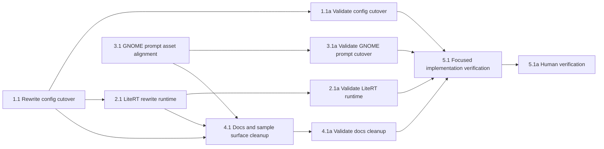

## 1. Rewrite config cutover
- [ ] 1.1 Replace the `llm_rewrite` runtime config in `packages/active-listener/src/active_listener/settings.py`, `config.py`, `config.yaml`, `config.sample.yaml`, and CLI/config tests so rewrite uses `enabled`, config-file-relative `model_path`, and config-file-relative `prompt_path`, with both normalized to absolute paths during config load.
- [ ] 1.1a Validate the config cutover with targeted automated coverage in `packages/active-listener/tests/test_config.py` and `tests/test_cli.py`, proving all of the following: relative paths resolve against the config file directory, absolute paths remain unchanged, the default XDG config path still works, and the removed `base_url` / `timeout_s` fields are no longer accepted by the strict config schema.

## 2. LiteRT rewrite runtime
- [ ] 2.1 Replace the OpenAI-compatible rewrite path in `packages/active-listener/pyproject.toml`, `src/active_listener/rewrite.py`, `bootstrap.py`, `service_ports.py`, `service.py`, and `recording_finalizer.py` with a resident LiteRT engine, fresh-per-request conversations, markdown-content-only prompt loading, startup fail-fast model initialization, and explicit rewrite-client cleanup on shutdown. Add the stable LiteRT Python dependency track (`litert-lm-api>=0.10,<0.11`) unless implementation proves a nightly-only API is required.
- [ ] 2.1a Validate the LiteRT runtime cutover with targeted automated coverage in `packages/active-listener/tests/test_rewrite.py` and `tests/test_app.py`, proving all of the following: override-first prompt resolution still works, empty prompt contents raise a request-scoped failure, startup fails when the LiteRT client cannot initialize, each rewrite request creates a fresh conversation with the current system prompt, rewrite output extraction is correct for the documented LiteRT response shape, dependency imports resolve, `ActiveListenerService.close()` now closes the rewrite client, startup prerequisite failure does not regress cleanup behavior for already-constructed dependencies, and service-level fallback/error behavior exercised through fake or failing rewrite clients is preserved.

## 3. GNOME prompt asset alignment
- [ ] 3.1 Update `packages/active-listener-ui-gnome/src/prefs.ts`, its packaged fallback prompt asset, and package build wiring so GNOME prefs still edits markdown prompt content but no longer depends on front matter or template semantics.
- [ ] 3.1a Validate the GNOME prompt cutover by running the package's build/typecheck path and capturing evidence that the fallback prompt asset is bundled successfully, prefs still points at the same override path, and no code path in the extension still assumes front matter is present.

## 4. Docs and sample surface cleanup
- [ ] 4.1 Update the rewrite-related sections of `packages/active-listener/README.md`, the repo `README.md`, `packages/active-listener/config.yaml`, and `packages/active-listener/config.sample.yaml` so they describe the LiteRT local-model requirement, the new `llm_rewrite.model_path` config, markdown-only prompt semantics, and the continued GNOME override workflow. Keep the already-correct XDG config/prompt path documentation intact.
- [ ] 4.1a Validate the docs/config cleanup by checking that the touched rewrite-related docs and samples contain the new LiteRT fields, document the local `.litertlm` prerequisite clearly enough for workstation setup, preserve the existing correct XDG path references, and no longer reference `base_url`, `timeout_s`, prompt-front-matter `model`, or Jinja prompt rendering in the active-listener rewrite path.

## 5. Focused implementation verification
- [ ] 5.1 Run the focused verification suite for the cutover: `uv run pytest tests/test_rewrite.py tests/test_app.py tests/test_cli.py`, `uv run basedpyright`, `uv run ruff check` in `packages/active-listener`, plus the GNOME package build/typecheck command used in task 3.1a. If adjacent service tests fail because of rewrite-boundary or shutdown changes, extend the verification set to include those affected tests (for example `test_state.py` or reducer-adjacent coverage) and capture outputs as evidence so a reviewer can see exactly which checks passed.
- [ ] 5.1a (HUMAN_REQUIRED) Verify the workstation flow manually with a real local `.litertlm` bundle: start `active-listener`, confirm rewrite-enabled startup fails fast when `model_path` is broken, then fix the model, edit the GNOME prompt override, trigger successive rewrites without restarting the service, and confirm prompt failures surface through DBus `PipelineFailed` while model-load failures surface through startup `FatalError`.

