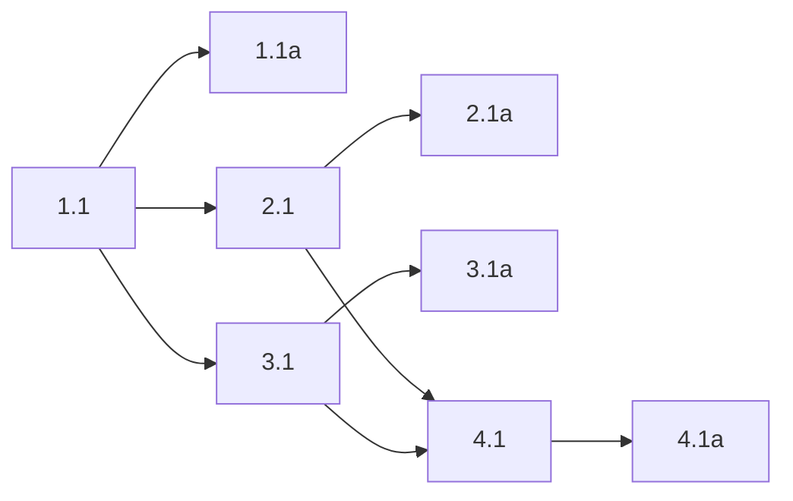

## 1. DBus contract and service boundary
- [ ] 1.1 Add the `python-sdbus` dependency and create the `active-listener` DBus service module that exports `ca.lmnop.Eavesdrop.ActiveListener1` at `/ca/lmnop/Eavesdrop/ActiveListener`, with a read-only `State` property (`starting|idle|recording|reconnecting`), `RecordingAborted(reason)`, `Reconnecting()`, `Reconnected()`, explicit user-bus startup via `sd_bus_open_user()`, a real `SdbusDbusService`, and `NoopDbusService`.
- [ ] 1.1a Validate the DBus service module with focused tests that prove the exported property/signal names match the spec, the property is locally mutable but read-only over DBus, empty signals emit correctly, and duplicate-name acquisition maps to the expected startup failure path.

## 2. Startup bootstrap and CLI mode selection
- [ ] 2.1 Extend the `active-listener` CLI/startup path so logging and DBus initialize first, default startup requires DBus, startup sets `State="starting"` before prerequisite checks, environmental bus failures suggest `--no-dbus`, duplicate instances fail fast, and `--no-dbus` swaps in `NoopDbusService` without scattering feature flags through the app.
- [ ] 2.1a Validate startup mode selection with focused CLI/startup tests covering default DBus mode, `--no-dbus` bypass, early `starting` publication, duplicate-instance failure, and the suggested `--no-dbus` error path when the session bus is unavailable.

## 3. Runtime state publication wiring
- [ ] 3.1 Inject the DBus service boundary into `create_service()` and `ActiveListenerService`, and publish the locked state/signal transitions at the existing lifecycle points only: startup success -> `idle`, start hotkey -> `recording`, cancel/finish -> `idle`, reconnecting event -> `reconnecting` + `Reconnecting()`, reconnected event -> `idle` + `Reconnected()`, and disconnect during recording -> `reconnecting` + `RecordingAborted(reason)` + `Reconnecting()`.
- [ ] 3.1a Validate runtime publication with focused service tests covering `idle -> recording -> idle`, reconnecting/reconnected transitions, disconnect-during-recording abort behavior, and the absence of any extra DBus signals beyond the locked contract.

## 4. Exported contract smoke verification
- [ ] 4.1 Add a DBus smoke/integration check that launches the exported object on the user bus and verifies the final contract end to end: bus name `ca.lmnop.Eavesdrop.ActiveListener`, object path `/ca/lmnop/Eavesdrop/ActiveListener`, interface `ca.lmnop.Eavesdrop.ActiveListener1`, read-only `State`, and exactly the three locked signals.
- [ ] 4.1a Run the focused DBus smoke check and capture an artifact-friendly test log or introspection output proving the exported surface matches the spec and remains suitable for a future passive shell extension.

