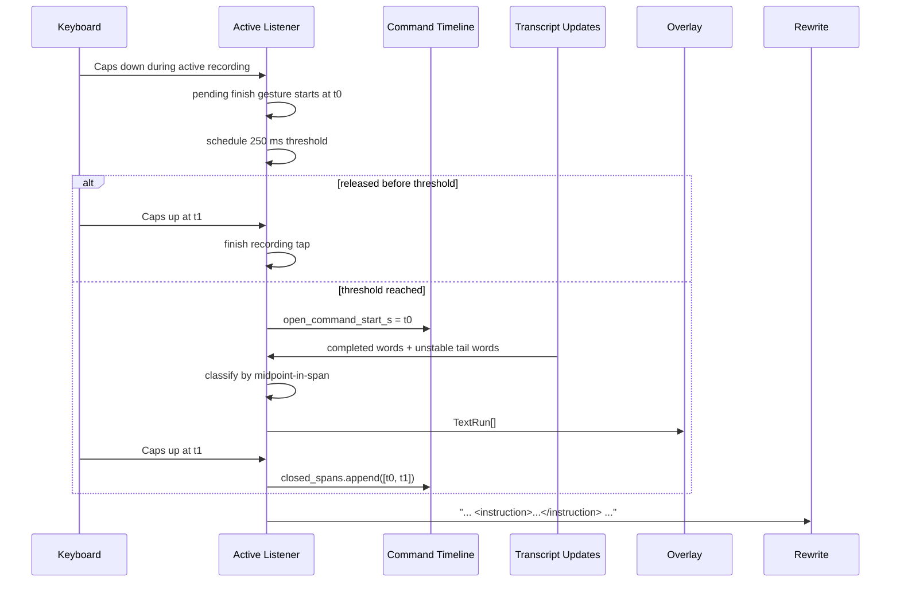
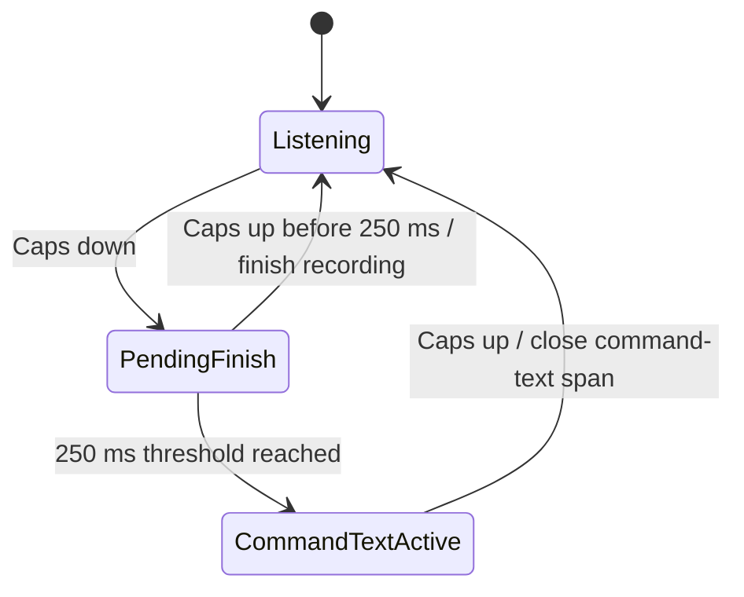

## Context

`active-listener` already has three useful boundaries for this feature, but they do not line up yet.

Observed current behavior from the repository:
- `packages/active-listener/src/active_listener/infra/keyboard.py` collapses `Caps Lock` into an immediate `START_OR_FINISH` action on key-down. There is no representation for a pending finish gesture, a committed hold, or key-up timing.
- `packages/active-listener/src/active_listener/recording/reducer.py` reduces transcription toward emitted text instead of preserving word-level structure for later classification.
- `packages/active-listener-ui-gnome/src/active-listener-service-client.ts` and `packages/active-listener-ui-gnome/src/transcript-overlay.ts` currently move `(completed segments, incomplete segment)` text over D-Bus and reconstruct one display string locally.
- `packages/active-listener-ui-gnome/src/transcript-attributes.ts` already treats completeness as a presentation axis by applying lower alpha to the incomplete tail.
- `packages/active-listener/src/active_listener/recording/finalizer.py` already runs a single-string finalization pipeline: `render_text(reducer_state.parts)` becomes `FinalizationState.text`, optional rewrite is called as `rewrite_text(instructions=..., transcript=state.text)`, and any pipeline-step exception already emits `PipelineFailed(step, reason)` and skips workstation emission.
- `packages/active-listener/src/active_listener/bootstrap.py` already constructs the live client with `EavesdropClient.transcriber(..., word_timestamps=True, ...)`, so this path does request word-level timings today.

A recently completed wire/server change flattened serialized segment and word timestamps onto the recording timeline. That matters here because command-text classification no longer needs segment-window math. The wire models now document `Word.start/end` and `Segment.start/end` as recording-relative, and `time_offset` is excluded from serialization. However, active-listener still ignores `Segment.words` entirely and only uses segment-level compatibility helpers (`absolute_start_time` / `absolute_end_time`) plus stripped segment text, so this feature must explicitly preserve word payloads through the active-listener path.

User decisions captured in this design:
- Command text must be word-accurate; segment-level boundaries are not acceptable.
- Command-text membership is decided by word midpoint.
- A committed command-text hold claims audio back to key-down, not hold-threshold crossing.
- A 250 ms hold threshold is a fixed behavioral constant, not runtime configuration.
- Command-text holds only matter during an active recording; no new idle-mode hold behavior is defined in this feature.
- Overlay should not show literal markers; it should color command text, with incomplete command text appearing more transparent than committed command text.
- Rewrite input must be one flat string with literal `<instruction>...</instruction>` markers inline.
- Rewrite failures in this mode must emit nothing and must be surfaced over D-Bus.

## Implementation-facing APIs

The implementor should treat the following interfaces and current behaviors as the concrete starting point.

### 1. Keyboard and foreground-policy APIs

`packages/active-listener/src/active_listener/infra/keyboard.py`

- `action_from_event(event: InputEvent) -> AppAction | None`
  - returns `None` unless `event.type == EV_KEY` and `event.value == 1`
  - maps `KEY_CAPSLOCK` to `AppAction.START_OR_FINISH`
  - maps `KEY_ESC` to `AppAction.CANCEL`
- `KeyboardInput.actions() -> AsyncIterator[AppAction]`
  - current service code receives normalized `AppAction`, not raw evdev events
- `KeyboardInput.recording_grab() -> AbstractAsyncContextManager[RecordingGrabRelease]`
  - used by `RecordingSession` to own the full recording-scoped keyboard grab
- `EvdevKeyboard._pending_grab` / `_pending_ungrab`
  - these are grab-lifecycle safety flags only
  - they are not user-gesture state and should not be repurposed as tap/hold semantics

`packages/active-listener/src/active_listener/app/state.py`

- `AppAction = START_OR_FINISH | CANCEL`
- `ForegroundPhase = STARTING | IDLE | RECORDING | RECONNECTING`
- `AppActionDecision = START_RECORDING | FINISH_RECORDING | CANCEL_RECORDING | IGNORE | SUPPRESS_RECONNECTING_START`
- `decide_app_action(phase, action)` currently means:
  - `IDLE + START_OR_FINISH -> START_RECORDING`
  - `RECORDING + START_OR_FINISH -> FINISH_RECORDING`
  - `RECORDING + CANCEL -> CANCEL_RECORDING`
  - `RECONNECTING + START_OR_FINISH -> SUPPRESS_RECONNECTING_START`

`packages/active-listener/src/active_listener/app/service.py`

- `ActiveListenerService.handle_action(action: AppAction) -> AppActionDecision`
  - start path calls `client.start_streaming()`, then `recording_session.start_recording()`, then sets `phase = RECORDING`
  - finish path calls `recording_session.finish_recording()`, sets `phase = IDLE`, and spawns background finalization via `RecordingFinalizer.finalize_recording(...)`
  - cancel path sets `phase = IDLE`, stops recording, and calls `client.cancel_utterance()`
- the current service layer does not see physical Caps/Escape directly; it only sees normalized `AppAction`

#### Required target keyboard/event boundary

The current `KeyboardInput.actions() -> AsyncIterator[AppAction]` boundary is **not sufficient** for this feature because it throws away:

- Caps key-up events
- event timestamps
- the distinction between physical keyboard events and higher-level start/finish policy

Junior-engineer rule: **do not try to implement hold detection using only `AppAction.START_OR_FINISH`**. That information has already been collapsed too far.

Target replacement boundary:

```python
class KeyboardEventKind(StrEnum):
    CAPSLOCK_DOWN = "capslock_down"
    CAPSLOCK_UP = "capslock_up"
    ESCAPE_DOWN = "escape_down"


@dataclass(frozen=True)
class KeyboardControlEvent:
    kind: KeyboardEventKind
    received_monotonic_s: float
```

Target `KeyboardInput` surface:

```python
class KeyboardInput(Protocol):
    def events(self) -> AsyncIterator[KeyboardControlEvent]:
        ...
```

Implementation note:
- keep `recording_grab()` exactly as the recording-grab ownership API
- stop using `actions()` for the hotkey loop
- let the service map physical events to `AppAction` only where appropriate

Recommended service split:

```python
async def handle_keyboard_event(event: KeyboardControlEvent) -> None:
    if event.kind is ESCAPE_DOWN:
        await handle_action(AppAction.CANCEL)
        return

    if phase is not RECORDING and event.kind is CAPSLOCK_DOWN:
        await handle_action(AppAction.START_OR_FINISH)
        return

    # RECORDING-only gesture logic handles CAPSLOCK_DOWN / CAPSLOCK_UP here.
```

This keeps the D-Bus menu/button path free to continue using `handle_action(AppAction.START_OR_FINISH)` without learning about low-level key-up timing.

### 2. Word-timestamp and wire-model APIs

`packages/active-listener/src/active_listener/bootstrap.py`

- `build_client(...)` currently calls:

```python
EavesdropClient.transcriber(
    host=config.host,
    port=config.port,
    audio_device=config.audio_device,
    word_timestamps=True,
    on_capture=on_capture,
)
```

This feature depends on that staying true unless the request path is made more explicit in config.

`packages/wire/src/eavesdrop/wire/transcription.py`

- `class Word(BaseModel)`
  - `start: float`
  - `end: float`
  - `word: str`
  - `probability: float`
- `class Segment(BaseModel)`
  - `start: float` and `end: float` are documented as recording-timeline seconds
  - `words: list[Word] | None` is present only when word timestamps are enabled
  - `time_offset` exists only as `Field(..., exclude=True)` compatibility state and is not serialized
  - `absolute_start_time` / `absolute_end_time` are compatibility properties, not wire fields
- `class UserTranscriptionOptions(BaseModel)`
  - `word_timestamps: bool | None = None`

### 3. Current reducer and recording-session APIs

`packages/active-listener/src/active_listener/recording/reducer.py`

- `RecordingReducerState`
  - `last_id: int | None`
  - `parts: list[str]`
  - `first_segment_start: float | None`
  - `last_segment_end: float | None`
- `OverlaySegment(id: int, text: str)`
- `TranscriptionUpdate(completed_segments: list[OverlaySegment], incomplete_segment: OverlaySegment)`
- `reduce_new_segments(segments, last_id) -> SegmentReduction`
  - treats `segments[-1]` as the current unstable tail
  - emits only newly committed prefix segments
- `build_transcription_update(reduction) -> TranscriptionUpdate | None`
  - currently strips text and returns only segment-id/text payloads
- `append_segment_text(state, segments)`
  - appends stripped segment text into `state.parts`
  - updates only segment-level timing bounds using `absolute_start_time` / `absolute_end_time`
- `render_text(parts) -> str`
  - joins committed text parts with single spaces

`packages/active-listener/src/active_listener/recording/session.py`

- `start_recording()` enters `keyboard.recording_grab()` and seeds `RecordingReducerState(last_id=self._connection_last_id)`
- `finish_recording() -> RecordingReducerState` releases grab, stops streaming, and returns the reducer snapshot used by finalization
- `ingest_live_transcription_message(message) -> TranscriptionUpdate | None`
- `ingest_transcription_message(state, message) -> TranscriptionUpdate | None`

This feature will have to widen these reducer/session contracts from segment text into word-aware structures.

#### Required target recording state

The current `RecordingReducerState(parts=[...])` shape is not enough. Junior-engineer rule: **do a full cutover**. Do not try to keep a second parallel `parts` accumulator beside the new word-aware state.

Target shape:

```python
@dataclass(frozen=True)
class TimeSpan:
    start_s: float
    end_s: float


@dataclass(frozen=True)
class TimedWord:
    text: str
    start_s: float
    end_s: float
    is_complete: bool


@dataclass
class RecordingReducerState:
    last_id: int | None = None
    completed_words: list[TimedWord] = field(default_factory=list)
    incomplete_words: list[TimedWord] = field(default_factory=list)
    closed_command_spans: list[TimeSpan] = field(default_factory=list)
    open_command_start_s: float | None = None
    first_word_start: float | None = None
    last_word_end: float | None = None
```

Meaning of each field:
- `completed_words`: stable prefix already committed by the server
- `incomplete_words`: words from the current unstable tail only
- `closed_command_spans`: completed command-text spans from prior holds
- `open_command_start_s`: the currently active hold start, or `None`
- `first_word_start` / `last_word_end`: duration tracking carried forward from words instead of segment compatibility helpers

Why this cutover matters:
- finalization needs the full ordered transcript, not just already-rendered text
- overlay needs command/normal plus complete/incomplete distinctions
- rewrite serialization needs the same grouped output as the overlay
- parallel representations (`parts` plus words plus runs) would drift and lie

Recommended additional session-owned state:

```python
@dataclass
class PendingCapsGesture:
    start_s: float
    threshold_task: asyncio.Task[None] | None
```

That pending gesture state belongs to the live recording session, not the final reducer snapshot. By the time `finish_recording()` returns, there must be no pending gesture and no open threshold task.

#### Recording timeline anchoring

This is a non-obvious but critical part of the feature.

The command-text classifier compares word timestamps from the server against local Caps timestamps. Those values must share one clock. The simplest first implementation should use a recording-local monotonic anchor:

```python
recording_started_monotonic_s = time.monotonic()

def recording_elapsed_s(now_monotonic_s: float) -> float:
    return now_monotonic_s - recording_started_monotonic_s
```

Recommended placement:
- set `recording_started_monotonic_s` inside `RecordingSession.start_recording()` immediately after recording ownership is established
- convert each Caps key event to recording-relative seconds before storing any pending gesture or command-text span state
- use that same helper everywhere; do not mix wall clock, evdev timestamps, and recording-relative word times in the same state

Why this needs to be explicit:
- if different clocks leak into the same span list, midpoint classification silently lies
- junior implementors are likely to reach for whichever timestamp is nearest unless the spec forbids it

Initial implementation rule:
- use **one** recording-local monotonic anchor consistently
- do **not** add calibration logic or extra offset heuristics in the first pass
- if later runtime testing shows systematic skew, fix that as a follow-up at the clock boundary, not in the classifier

### 4. Current finalization and rewrite APIs

`packages/active-listener/src/active_listener/recording/finalizer.py`

- `FinalizationState(text: str, rewrite_result: RewriteResult | None = None)`
- `RecordingFinalizer.finalize_recording(*, disconnect_generation: int, reducer_state: RecordingReducerState) -> None`
  - flushes the client
  - ingests the final message back through `ingest_transcription_message`
  - computes `raw_text = render_text(reducer_state.parts)`
  - runs `_pipeline_steps(...)`
  - emits `final_text` with `emitter.emit_text(final_text)`
- `_pipeline_steps(...)` currently runs, in order:
  1. `_apply_replacements`
  2. `_replace_symbols`
  3. optional `_rewrite_with_llm` when `config.llm_rewrite is not None`
  4. trailing-space append
- `_rewrite_with_llm(...)`
  - loads prompt through `active_listener.infra.rewrite.load_active_listener_rewrite_prompt(rewrite_config.prompt_path)`
  - calls `rewrite_client.rewrite_text(instructions=prompt.instructions, transcript=state.text)`
- `_run_pipeline(...)`
  - on any step exception, logs, awaits `dbus_service.pipeline_failed(step.__name__, str(exc))`, and returns `None`
  - there is no raw-text fallback after a pipeline error

`packages/active-listener/src/active_listener/app/ports.py`

- `ActiveListenerRewriteClient.rewrite_text(*, instructions: str, transcript: str) -> RewriteResult`
- `RewriteResult`
  - `text: str`
  - `model: str`
  - `input_tokens: int | None`
  - `output_tokens: int | None`
  - `cost: Decimal | None`

### 5. Current D-Bus and GNOME client APIs

`packages/active-listener/src/active_listener/infra/dbus.py`

- constants:
  - `DBUS_BUS_NAME = "ca.lmnop.Eavesdrop.ActiveListener"`
  - `DBUS_OBJECT_PATH = "/ca/lmnop/Eavesdrop/ActiveListener"`
  - `DBUS_INTERFACE_NAME = "ca.lmnop.Eavesdrop.ActiveListener1"`
- property:
  - `State: s`
- method:
  - `StartOrFinishRecording() -> s`
- signals:
  - `TranscriptionUpdated: a(ts)(ts)`
  - `SpectrumUpdated: ay`
  - `RecordingAborted: s`
  - `PipelineFailed: ss`
  - `FatalError: s`
  - `Reconnecting`
  - `Reconnected`
- `AppStateService.transcription_updated(completed_segments: list[tuple[int, str]], incomplete_segment: tuple[int, str])`
- `SdbusDbusService.pipeline_failed(step, reason)` already exists and is the current D-Bus failure surface used by finalizer pipeline errors

`packages/active-listener-ui-gnome/src/active-listener-service-client.ts`

- current D-Bus transcript types:

```ts
type DbusOverlaySegment = [number | bigint, string];
type DbusTranscriptionUpdatedPayload = [DbusOverlaySegment[], DbusOverlaySegment];

type TranscriptSegment = {
  sequenceNumber: number;
  text: string;
};

type TranscriptionUpdate = {
  completedSegments: TranscriptSegment[];
  incompleteSegment: TranscriptSegment;
};
```

- `ActiveListenerServiceEvents`
  - `onStateChanged(state)`
  - `onTranscriptionUpdated(update)`
  - `onSpectrumUpdated(levels)`
  - `onError(title, detail)`
- `handleProxySignal(...)`
  - currently handles only `TranscriptionUpdated`, `SpectrumUpdated`, and `PipelineFailed`
  - ignores `RecordingAborted`, `FatalError`, `Reconnecting`, and `Reconnected` as direct UI events

`packages/active-listener-ui-gnome/src/panel-indicator.ts`

- `PanelIndicator.setState(serviceState)` updates icon/menu state only
- there is no visible error rendering path in this file today

`packages/active-listener-ui-gnome/src/transcript-attributes.ts`

- `TranscriptDisplay = { text: string; incompleteStartByte: number | null }`
- `TranscriptAttributeSpec`
  - `foreground-color`
  - `foreground-alpha`
- `buildTranscriptDisplay(completedText, incompleteText)` builds one flat display string and tracks the incomplete start byte
- `buildTranscriptAttributeSpecs(display, colorHex)` applies full-range foreground color plus incomplete-tail alpha
- `INCOMPLETE_TRANSCRIPT_ALPHA` is derived from 54% opacity today

Any implementation that changes the overlay contract must update both the Python D-Bus signature and the TypeScript decode/render path together.

## Goals / Non-Goals

**Goals:**
- Preserve a truthful command-text timeline during active recordings.
- Distinguish tap-to-finish from hold-for-command-text using the same `Caps Lock` key during recording.
- Classify completed and unstable transcript words as normal text vs command text on the recording timeline.
- Produce one normalized `TextRun` representation that drives both overlay rendering and rewrite serialization.
- Keep the overlay presentation simple: command text differs only by color, while instability continues to differ only by transparency.
- Keep rewrite input simple: one linear transcript string with inline `<instruction>...</instruction>` markers.
- Preserve current incremental reducer semantics: append newly completed material once, rebuild the incomplete tail wholesale on each update.

**Non-Goals:**
- Defining any new meaning for holding `Caps Lock` while idle.
- Making command text visible as literal XML in the overlay.
- Introducing segment-aware UX or exposing segment concepts to the user.
- Defining new rewrite prompt semantics beyond inline instruction markers.
- Falling back to raw emitted text when rewrite fails for a command-text recording.
- Designing multiple overlapping open command spans or multi-key command gestures.

## Mental model

The clean way to think about this feature is:

1. Input handling decides whether a `Caps Lock` press inside a recording is a finish tap or a command-text hold.
2. That input layer produces command-text spans on the recording timeline.
3. Transcription already produces words on the same recording timeline.
4. A classifier labels each word as normal text or command text using midpoint-in-span.
5. A normalizer groups adjacent words with the same semantics into `TextRun` values.
6. The overlay paints `TextRun`s.
7. The rewrite serializer flattens the same `TextRun`s into one inline-marked string.

If those seven steps stay separate, the design stays honest.



## Canonical runtime representations

The feature needs two small, truthful models.

### 1. Command-text timeline

Use one state object for committed command-text history plus one optional open start for the currently active hold.

```python
class TimeSpan:
    start_s: float
    end_s: float


class CommandTextTimeline:
    closed_spans: list[TimeSpan]
    open_start_s: float | None
```

Separately, input gesture resolution needs its own pending state:

```python
class CapsGestureState:
    pending_press_start_s: float | None
```

Why keep these separate:
- `pending_press_start_s` means the app has not decided tap vs hold yet.
- `open_start_s` means the app has decided this press is command text and has retroactively claimed it back to key-down.
- `closed_spans` are stable history and are the main classifier input.

There is never more than one open command-text span because one key drives the gesture model.

### 2. Text runs

All downstream consumers should use one normalized run representation.

```python
class TextRun:
    text: str
    is_command: bool
    is_complete: bool
```

`TextRun` invariants are strict:
- `text` is non-empty and human-visible.
- adjacent runs with the same `(is_command, is_complete)` are merged immediately.
- a run sequence is ordered and lossless with respect to the original classified word stream.

This is the only presentation/rewrite representation the feature should expose over D-Bus or finalization boundaries.

### 3. Missing word payloads are a hard failure for command-text recordings

Word-accurate command text is a user requirement. That means segment-level fallback is not acceptable when a recording actually contains command-text spans.

Junior-engineer rule:

- if a recording never enters command text, existing plain-dictation behavior may continue using whatever simpler path is convenient
- if a recording contains any command-text span and any segment needed for classification arrives without `Segment.words`, treat that as a runtime failure for that recording
- do not silently downgrade to segment-level classification

Why:
- the user has no visibility into segments
- a plausible-looking but wrong command-text boundary is worse than an explicit failure

## Decisions

### 1. Start recording remains the current `IDLE + START_OR_FINISH` policy; command-text disambiguation only happens during recording

The first physical `Caps Lock` press still maps to `AppAction.START_OR_FINISH`, and the current `IDLE + START_OR_FINISH -> START_RECORDING` policy remains intact. This feature does **not** delay recording start to wait for tap/hold resolution. The new gesture logic only applies when a later `Caps Lock` press happens during an already-active recording.

Rationale:
- user explicitly left idle hold behavior open for later
- preserving immediate start avoids startup-latency regressions in the main dictation path
- the design problem here is finish-vs-command-text, not start-vs-command-text

### 2. A recording-time `Caps Lock` press becomes a pending finish gesture, resolved at 250 ms

During an active recording, key-down starts a pending gesture at `t0`. If the key is released before 250 ms, it is a finish tap. If 250 ms elapses first, the gesture commits into command text.

Pseudo-code:

```python
HOLD_THRESHOLD_S = 0.250

on_caps_down_during_recording(t0):
    gesture.pending_press_start_s = t0
    schedule_threshold(t0 + HOLD_THRESHOLD_S)

on_threshold():
    if gesture.pending_press_start_s is None:
        return

    command_text.open_start_s = gesture.pending_press_start_s
    gesture.pending_press_start_s = None

on_caps_up_during_recording(t1):
    if gesture.pending_press_start_s is not None:
        cancel_threshold_task_if_present()
        gesture.pending_press_start_s = None
        finish_recording()
        return

    command_text.closed_spans.append(
        TimeSpan(start_s=command_text.open_start_s, end_s=t1)
    )
    command_text.open_start_s = None
```

Junior-engineer notes:
- the threshold timer must be cancelled on early key-up, cancel, disconnect, and service shutdown
- if the threshold task fires after the gesture has already been cleared, it must become a no-op
- do not leave orphaned threshold tasks attached to a completed recording; they will mutate the next recording by accident

### 3. Command-text spans start at key-down, not threshold crossing

Once the hold threshold commits the gesture, the resulting command-text span starts at the original key-down time.

Rationale:
- user explicitly chose key-down as the start boundary
- this matches user intent better than saying the first 250 ms of the spoken command “didn’t count”
- transcription latency makes retroactive recolor complexity largely irrelevant in practice

### 4. Word classification happens on one shared recording timeline using midpoint-in-span

Each transcript word is classified independently. This depends on active-listener continuing to request `word_timestamps=True` and on the reducer/session path preserving `Segment.words` instead of flattening immediately to stripped segment text.

```python
def classify_word(word, closed_spans, open_start_s):
    midpoint = (word.start_s + word.end_s) / 2

    for span in closed_spans:
        if span.start_s <= midpoint <= span.end_s:
            return True

    if open_start_s is not None and open_start_s <= midpoint:
        return True

    return False
```

This is the decisive boundary for normal text vs command text.

Rationale:
- user accepted midpoint as the starting rule
- segment-level logic is not user-visible and therefore the wrong abstraction
- recording-relative word times make the classifier local and deterministic

### 5. Completeness comes only from transcription state, not gesture state

`is_complete` on `TextRun` is inherited from the source word’s transcription status:
- words from completed segments become `is_complete=True`
- words from the current unstable tail become `is_complete=False`

Open command-text state does not override completeness.

Concrete mapping rule:
- every word sourced from `segments[:-1]` in the current transcription window is `is_complete=True`
- every word sourced from `segments[-1]` in the current transcription window is `is_complete=False`
- when the old tail later moves into the committed prefix on a later update, those words are re-ingested as complete and must no longer exist in `incomplete_words`

Rationale:
- user explicitly chose completeness rule 1: it follows completed vs incomplete transcript state
- command-text semantics and transcript stability are independent axes

### 6. Overlay styling combines two independent axes: command-text kind and completeness

The overlay should treat text kind and completeness separately.

```python
style = {
    (False, True):  {"color": "normal",  "alpha": 1.00},
    (False, False): {"color": "normal",  "alpha": 0.60},
    (True, True):   {"color": "command", "alpha": 1.00},
    (True, False):  {"color": "command", "alpha": 0.60},
}
```

The only new visual cue for now is command-text color. Incomplete text continues to be expressed only through lower alpha.

Rationale:
- GNOME overlay already models incompleteness as alpha in `transcript-attributes.ts`
- user wants incomplete command text more transparent than committed command text
- no extra weight/italic treatment is needed now

### 7. D-Bus should carry `TextRun`s, not transcript segments or timed words

The UI side should not receive timing math or segment semantics. Active-listener should own command-text classification and send presentation-ready `TextRun` values over D-Bus.

This is intentionally a new boundary noun. The current D-Bus contract is segment-shaped (`a(ts)(ts)`), so this feature should replace that payload with one ordered array of runs under the same signal name.

Target Python-side payload:

```python
class TextRun:
    text: str
    is_command: bool
    is_complete: bool


async def transcription_updated(runs: list[tuple[str, bool, bool]]) -> None:
    ...
```

Target D-Bus signature:

```text
TranscriptionUpdated: a(sbb)
```

Target GNOME decode types:

```ts
type DbusTextRun = [string, boolean, boolean];

type TextRun = {
  text: string;
  isCommand: boolean;
  isComplete: boolean;
};

type TranscriptionUpdate = {
  runs: TextRun[];
};
```

Rationale:
- UI only needs color + alpha decisions
- keeping timing logic in one place avoids re-implementing midpoint classification in TypeScript
- current D-Bus segment contract is too coarse for command text anyway
- using `a(sbb)` keeps the payload minimal and ordered, while making the new noun explicit

### 8. The same `TextRun` sequence drives both overlay display and rewrite serialization

There is no need for two separate grouped representations.

Overlay rendering:
- iterate `TextRun`s
- apply command color based on `is_command`
- apply incomplete alpha based on `is_complete`

Rewrite serialization:

```python
def serialize_for_rewrite(runs):
    parts = []

    for run in runs:
        if run.is_command:
            parts.append(f"<instruction>{run.text}</instruction>")
        else:
            parts.append(run.text)

    return " ".join(parts)
```

Spacing rules are intentionally simple:
- assume punctuation is already attached to the preceding word token
- join words inside a grouped run with single spaces
- join adjacent runs with single spaces
- do not inject spaces inside `<instruction>` markers other than the spaces already implied by grouped word joins
- keep the existing finalizer behavior that appends one trailing space only after the full pipeline completes

Example:

```python
runs = [
    TextRun(text="I called Enercare", is_command=False, is_complete=True),
    TextRun(text="Enercare should be E-N-E-R-C-A-R-E", is_command=True, is_complete=True),
]

serialize_for_rewrite(runs)
# "I called Enercare <instruction>Enercare should be E-N-E-R-C-A-R-E</instruction>"
```

The resulting string must preserve user context, for example:

```text
I'd like to talk about the leak <instruction>scratch that</instruction> I'd like to give you an update on the leak in the basement.
```

Rationale:
- user explicitly wants inline XML-style markers because they work well across LLMs
- one shared run representation keeps the serializer and overlay aligned

### 9. Reducer behavior stays incremental at the completed/incomplete boundary

Do not introduce arbitrary run surgery. Keep the current reduction philosophy:
- append newly completed material once
- rebuild the current incomplete tail wholesale on each update
- normalize after concatenating both parts

Pseudo-code:

```python
state.completed_runs.extend(newly_completed_runs)
state.incomplete_runs = rebuild_runs_from_current_incomplete_tail(...)
display_runs = normalize(state.completed_runs + state.incomplete_runs)
```

Rationale:
- this matches how active-listener already reasons about completed prefix vs unstable tail
- it keeps tail revisions simple and local
- it minimizes surprising state transitions in both overlay and finalization

### 10. Rewrite failure for command-text recordings is terminal for emission

If rewrite fails for a recording that includes command text:
- emit nothing to the workstation
- notify failure over D-Bus so the user can see it
- log the failure truthfully

This preserves the current pipeline contract in `RecordingFinalizer`: pipeline-step failure already results in `PipelineFailed(step, reason)` plus no workstation emission. The new work here is to make that existing D-Bus failure visible in the GNOME experience for command-text recordings.

Rationale:
- user explicitly chose “emit nothing” over flattening or raw fallback
- command text exists to control rewrite; dropping it but still emitting text would misrepresent user intent

## Implementation blueprint

This section is intentionally concrete.

### A. Input state machine

Within `RECORDING`, the relevant states are:



Important note: this is a nested gesture state inside recording, not a new top-level app phase.

Recommended file ownership:
- `infra/keyboard.py`: raw low-level key event production
- `app/service.py`: routing raw events based on current foreground phase
- `recording/session.py`: recording-local gesture/timeline ownership

Do not split one gesture across three places unless the responsibilities are clear:
- keyboard file should not know recording phase
- service should not own long-lived per-recording command spans
- finalizer should not resolve live tap-vs-hold gestures

### B. Classification inputs and outputs

Inputs:
- ordered transcript words with recording-relative `start_s` and `end_s`
- word completeness from completed segments vs current incomplete tail
- `closed_spans`
- `open_start_s`

Outputs:
- ordered classified words
- normalized `TextRun[]`

### C. Classification and normalization pipeline

```python
def build_text_runs(completed_words, incomplete_words, timeline):
    completed_runs = normalize(classify_and_group(completed_words, timeline, is_complete=True))
    incomplete_runs = normalize(classify_and_group(incomplete_words, timeline, is_complete=False))
    return normalize(completed_runs + incomplete_runs)
```

Where `classify_and_group(...)`:
1. classifies each word by midpoint-in-span
2. groups adjacent words with same `(is_command, is_complete)`
3. joins grouped word text with spaces
4. drops impossible empty groups

Recommended helper breakdown:

```python
def segment_words(segment: Segment, *, is_complete: bool) -> list[TimedWord]:
    ...


def classify_words(words: list[TimedWord], timeline: RecordingReducerState) -> list[ClassifiedWord]:
    ...


def group_words(words: list[ClassifiedWord]) -> list[TextRun]:
    ...


def normalize_runs(runs: list[TextRun]) -> list[TextRun]:
    ...
```

Why separate them:
- `segment_words(...)` is the word-extraction boundary from wire models
- `classify_words(...)` is the time-based truth boundary
- `group_words(...)` is the semantic compression step
- `normalize_runs(...)` is the invariant-enforcement step

Junior-engineer rule: if one helper starts both reading wire models **and** formatting D-Bus tuples **and** inserting `<instruction>` markers, it is doing too much.

### D. Overlay contract

D-Bus transcription updates should stop being segment-shaped and become run-shaped. The GNOME side should receive ordered `TextRun` values and render them directly.

Concrete target API:

- Python `AppStateService.transcription_updated(...)` changes from

```python
async def transcription_updated(
    completed_segments: list[tuple[int, str]],
    incomplete_segment: tuple[int, str],
) -> None:
    ...
```

to

```python
async def transcription_updated(runs: list[tuple[str, bool, bool]]) -> None:
    ...
```

- D-Bus `TranscriptionUpdated` changes from `a(ts)(ts)` to `a(sbb)`.
- `ActiveListenerServiceClient.handleTranscriptionUpdated(...)` should decode `DbusTextRun[]` instead of `[completedSegments, incompleteSegment]`.
- `TranscriptOverlayController.applyTranscriptionUpdate(...)` should stop managing `completedTranscriptText` plus `incompleteTranscriptText` and instead render directly from ordered runs.
- `buildTranscriptAttributeSpecs(...)` should continue owning Pango byte-range styling, but expand from one foreground color + optional incomplete alpha into command-color plus incomplete-alpha composition.

Recommended GNOME-side rendering algorithm:

```ts
function buildDisplayFromRuns(runs: TextRun[]): TranscriptDisplay {
  const parts: string[] = [];
  const specs: TranscriptAttributeSpec[] = [];
  let byteCursor = 0;

  for (const run of runs) {
    const text = parts.length === 0 ? run.text : ` ${run.text}`;
    const startByte = byteCursor;
    const endByte = startByte + utf8Encoder.encode(text).byteLength;

    parts.push(text);
    specs.push(colorSpecFor(run, startByte, endByte));
    if (!run.isComplete) {
      specs.push(alphaSpec(startByte, endByte));
    }

    byteCursor = endByte;
  }

  return { text: parts.join(''), specs };
}
```

This is more detailed than the current `buildTranscriptDisplay(completedText, incompleteText)` helper because each run may now have its own foreground color and completeness.

The overlay must never display literal `<instruction>` markers.

### E. Final rewrite contract

At recording finalization:
1. reduce the full recording to normalized `TextRun[]`
2. serialize that sequence into one flat string with inline `<instruction>...</instruction>` markers
3. pass that string into the existing `RecordingFinalizer` rewrite step by replacing the current `render_text(reducer_state.parts)` single-string construction with run-aware serialization before `_apply_replacements`, `_replace_symbols`, and `_rewrite_with_llm`
4. keep prompt loading on the current config-driven path: `load_active_listener_rewrite_prompt(rewrite_config.prompt_path)`
5. on success, emit rewritten output
6. on failure, keep the existing `PipelineFailed(step, reason)` + no-emission behavior and make that failure visible in the GNOME layer

Recommended order inside finalizer:

```python
text_runs = build_text_runs_from_reducer_state(reducer_state)
rewrite_input = serialize_for_rewrite(text_runs)
state = FinalizationState(text=rewrite_input)
state = await _apply_replacements(state)
state = await _replace_symbols(state)
state = await _rewrite_with_llm(state)
state = await append_trailing_space(state)
```

Do **not**:
- serialize to `<instruction>` markers after the LLM rewrite step
- run rewrite separately on command runs and normal runs
- keep a second “display string” and a different “rewrite string” source of truth

One representation in, one serialized string out.

### F. Invariants worth defending in tests

- a finish tap during recording never creates a command-text span
- a committed command-text hold always starts at key-down
- at most one open command-text span exists at a time
- finalization cannot observe an open command-text span because recording cannot end until the key is released
- words are classified solely from recording-relative time and command-text spans
- `TextRun`s are always non-empty and adjacency-merged
- incomplete command text is visually distinct from committed command text by alpha only
- rewrite serialization preserves ordering and wraps only command-text runs
- recordings that request command text but receive missing `Segment.words` fail explicitly instead of silently falling back to segment boundaries

## Recommended implementation order

Junior-engineer guidance: implement this in the following order. Each step unlocks the next one.

1. **Keyboard event boundary**
   - widen `keyboard.py` and the service pump so Caps down/up and Escape down are observable
   - keep old `handle_action()` for D-Bus/menu control

2. **Recording-session gesture state**
   - add pending gesture state, threshold task lifecycle, recording-local monotonic anchor, and command-span storage
   - make sure cancel/disconnect/shutdown clean all of it up

3. **Reducer cutover to words**
   - replace `parts`-first reduction with `completed_words` / `incomplete_words`
   - preserve incremental prefix/tail semantics

4. **Classification and run normalization**
   - implement `TimedWord -> TextRun[]`
   - make unit tests pass here before touching D-Bus or finalizer

5. **D-Bus contract change**
   - switch Python signal signature and TypeScript decode path together
   - then update overlay rendering to consume runs directly

6. **Finalizer cutover**
   - remove `render_text(reducer_state.parts)` as the source of rewrite input
   - serialize from `TextRun[]` instead

7. **Failure visibility in GNOME**
   - consume the existing `onError` signal path in a user-visible way

If a step feels blocked, do not workaround it in a later layer. Fix the boundary that is missing the truth.

## Open edge deliberately left out of this spec

Holding `Caps Lock` while idle is intentionally left unspecified. The user has an idea for that path, but it is explicitly not part of this design pass. Any implementation should preserve current idle-start behavior and avoid baking in a broader idle hold contract.

## Open questions

1. Visible rewrite-failure surface in GNOME
   - The D-Bus signal already exists: `PipelineFailed(step, reason)`.
   - The GNOME service client already maps that to `events.onError(title, detail)`.
   - `panel-indicator.ts` does not currently render any visible error state.
   - The remaining design choice is where that visibility lives: panel indicator, overlay, notification, or another GNOME-specific surface.

2. GNOME-side test scaffold
   - Active-listener already has app/reducer tests.
   - This spec has not verified an existing GNOME overlay/client test harness.
   - If the GNOME package has no current tests for these modules, implementation should plan to add them rather than assuming a ready-made scaffold.

3. Word-timestamp dependency visibility
   - Runtime behavior currently depends on `bootstrap.build_client()` hardcoding `word_timestamps=True`.
   - `ActiveListenerConfig` does not surface that dependency today.
   - The feature can rely on the current bootstrap contract, but if the team wants this dependency to be more obvious, it may be worth promoting it into explicit runtime policy later.
