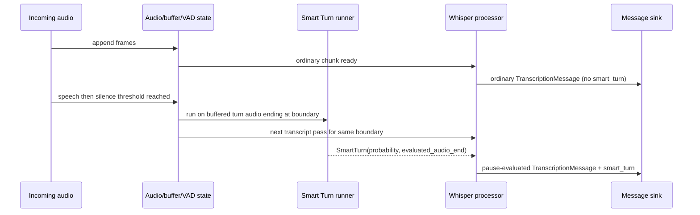

## Context

`TranscriptionMessage` is currently transcript-focused: it carries `stream`, `segments`, `language`, and optional `flush_complete`, plus inherited `timestamp` from `BaseMessage`. The wire codec does not omit all `None` optionals generically; it has an explicit `flush_complete` special-case in `serialize_message()`, and omitted fields are reconstructed during `deserialize_message()` through dataclass defaults. The server produces ordinary incremental transcript updates whenever `_handle_transcription_output()` has segments to emit and no pending flush suppresses them; chunks with no segments produce no envelope at all. Downstream consumers treat `TranscriptionMessage` as the canonical unit of transcript state. Earlier design exploration considered a separate Smart Turn message type, but that would push correlation, missing-message handling, and timing edge cases onto every client.

Smart Turn itself is pause-triggered. It runs after a speech-to-silence transition, using buffered audio from the current turn and returning a probability that speech has ended. That makes it conceptually coupled to transcript state, but not necessarily to transcript execution timing. This feature therefore needs to bind Smart Turn output to the matching transcript update without forcing clients to coordinate multiple message types.

Constraints from prior discussion:

- Smart Turn data must be part of `TranscriptionMessage`.
- It must not appear on every transcription update; only updates tied to a speech-to-silence evaluation may carry it.
- The payload is raw signal only, not a server-side complete/incomplete verdict.
- Consumers should see `None` after deserialization when Smart Turn data was omitted on the wire.
- Triggering is simple and source-agnostic: run after any speech-to-silence transition for live or RTSP streams.

## Goals / Non-Goals

**Goals:**
- Extend `TranscriptionMessage` with optional Smart Turn metadata so clients consume one message type for transcript-aware turn-ending decisions.
- Keep ordinary incremental transcript updates fast and unchanged when no speech-to-silence evaluation occurred.
- Ensure pause-evaluated transcript updates include Smart Turn data from the same evaluated audio boundary.
- Support same contract for live and RTSP transcription outputs.
- Preserve existing optional-field wire behavior: omit unavailable Smart Turn data on the wire, hydrate to `None` during deserialization.

**Non-Goals:**
- Defining a server-authoritative turn-complete boolean or threshold policy.
- Emitting a separate Smart Turn message type for application logic.
- Running Smart Turn continuously during unchanged silence.
- Redesigning segment semantics, flush semantics, or client reducer invariants beyond attaching optional Smart Turn metadata.
- Solving source-specific gating for RTSP noise or ambient speech; Smart Turn runs after any speech-to-silence transition.

## Mental model for implementors

Junior-engineer summary:

1. Whisper still decides transcript text.
2. Smart Turn does **not** replace transcript generation.
3. Smart Turn runs only when VAD says speech has transitioned into silence.
4. That Smart Turn result is attached to the **next transcript update for that same evaluated pause**.
5. Ordinary transcript updates keep working exactly as they do today and usually carry no `smart_turn` field.

Useful terms used throughout this spec:

- **ordinary update**: normal transcript emission from `_handle_transcription_output()` that is not tied to a speech-to-silence evaluation.
- **pause-evaluated update**: transcript emission for which Smart Turn was run against buffered turn audio.
- **evaluated audio boundary**: the stream-relative end time of the audio slice passed into Smart Turn. This is what `evaluated_audio_end` means.
- **tentative tail**: current incomplete segment at end of each emitted transcript envelope.
- **completed prefix**: already-committed transcript history that appears before the tentative tail.

If you keep those five ideas in mind, most implementation choices become straightforward.

## Decisions

### 1. Attach Smart Turn to `TranscriptionMessage`

`TranscriptionMessage` gains an optional `smart_turn` field with this shape:

```python
{
    "probability": float,
    "evaluated_audio_end": float,
}
```

Rationale:
- Transcript and turn-ending probability are usually consumed together in this project.
- One message type keeps client state machines simple.
- Existing wire contract already handles optional fields cleanly.

Alternatives considered:
- Separate `SmartTurnMessage`: rejected because every client would need correlation logic and missing-message handling.
- Segment-level Smart Turn fields: rejected because Smart Turn evaluates turn boundary, not individual segments.
- Boolean-only field: rejected because server should expose raw signal, not policy.

### 2. Omit unavailable Smart Turn data on wire, deserialize to `None`

Wire serialization should omit `smart_turn` when unavailable. Message models should default the field to `None`, letting deserialization materialize absence as `None` in memory. Because current omission behavior exists only for `flush_complete`, implementation must extend `serialize_message()` explicitly for `smart_turn`; there is no generic `exclude_none=True` behavior today.

Rationale:
- Matches existing `flush_complete` behavior.
- Keeps wire payload lean.
- Gives clients explicit in-memory semantics without forcing JSON field-presence checks.

Alternatives considered:
- Always serialize `"smart_turn": null`: rejected because repo already omits absent optional wire fields.
- Make field required with sentinel values: rejected because absence is semantically meaningful.

### 3. Smart Turn runs on speech-to-silence transitions, once per transition

Server should trigger Smart Turn after any detected speech-to-silence transition. It should evaluate buffered turn audio ending at that silence boundary, using configurable context duration in seconds, capped to Smart Turn's supported window. It should not poll repeatedly during unchanged silence; a new run happens only after new speech creates a new transition.

Rationale:
- Matches Smart Turn's documented invocation pattern.
- Keeps trigger rule simple for both live and RTSP sources.
- Prevents duplicate evaluations for same unchanged pause.

Alternatives considered:
- Poll repeatedly as silence lengthens: rejected because it adds work without new turn context.
- Apply extra server-side gating for RTSP: rejected by prior discussion; trigger should be any speech-to-silence transition.

### 4. Execution stays decoupled; pause-evaluated emission is coupled

Smart Turn inference runs independently of ASR scheduling, but the transcript update representing that evaluated pause waits for both ASR and Smart Turn results before being emitted. Ordinary in-progress transcript updates that are not tied to a pause evaluation continue flowing without Smart Turn metadata.

Rationale:
- Preserves low latency for ordinary transcript updates.
- Guarantees that when `smart_turn` is present, it matches the same evaluated audio boundary as the transcript update.
- Avoids teaching clients to merge late-arriving Smart Turn payloads onto earlier transcript messages.

Alternatives considered:
- Make transcription wait on Smart Turn for all updates: rejected because Smart Turn is not applicable to most updates.
- Emit transcript first and patch Smart Turn later: rejected because it recreates two-message coordination problem.

### 5. Expose raw signal only: probability plus evaluated boundary

Smart Turn payload includes only `probability` and `evaluated_audio_end` as float seconds. It does not include model name/version or a derived complete/incomplete decision.

Rationale:
- Probability is enough for clients to choose their own thresholds.
- `evaluated_audio_end` tells consumers exactly which audio boundary the probability describes.
- Omitting model/version avoids leaking implementation detail into the public wire contract.

Alternatives considered:
- Add model identifier: rejected because client does not need it.
- Add derived decision: rejected because user explicitly wanted raw probability only.

### 6. Contract is source-agnostic

`smart_turn` may appear on any `TranscriptionMessage` regardless of source mode. Implementation should support live and RTSP emissions under same message shape. File-mode support is not required to define the contract and may remain absent until explicitly implemented.

Current gap that implementation must close: RTSP transport is not yet metadata-complete. `StreamingTranscriptionProcessor` emits a shared `TranscriptionResult`, but `RTSPTranscriptionSink.send_result()` currently forwards only `segments` and `language` into `RTSPSubscriberManager.send_transcription()` and `RTSPTranscriptionCache.add_transcription()`. Unlike the live WebSocket sink, RTSP rebuilds `TranscriptionMessage` instances without `flush_complete` or any future result-level metadata. Source-agnostic contract therefore requires widening RTSP sink, subscriber, and cache plumbing to preserve optional result metadata.

### 6a. Concrete new types and field names

To remove ambiguity for implementation, use these exact names unless a later review changes them:

#### Wire payload type

Add a new wire payload type named `SmartTurn` and use it on `TranscriptionMessage`.

Recommended shape:

```python
@dataclass(frozen=True, kw_only=True)
class SmartTurn:
  probability: float = Field(ge=0.0, le=1.0)
  evaluated_audio_end: float = Field(ge=0.0)
```

And in `TranscriptionMessage`:

```python
smart_turn: SmartTurn | None = None
```

Why these exact names:

- `probability` matches upstream Smart Turn output.
- `evaluated_audio_end` says what the probability applies to.
- `smart_turn` is short, explicit, and already used consistently throughout this spec.

#### Server-internal result type

Use the same `SmartTurn` payload shape inside `TranscriptionResult` as the internal processor-to-sink contract. Do not create a second semantically-equivalent type unless typing constraints force it. Junior-friendly rule: one concept, one representation.

That means `TranscriptionResult` should become:

```python
segments: list[Segment]
language: str | None = None
flush_complete: bool | None = None
language_probability: float | None = None
smart_turn: SmartTurn | None = None
```

#### Server configuration names

Add a nested config object on `TranscriptionConfig` named `smart_turn` so related settings stay together.

Recommended shape:

```python
class SmartTurnConfig(BaseModel):
  enabled: bool = False
  model: str = "pipecat-ai/smart-turn-v3"
  revision: str | None = None
  context_seconds: float = Field(default=8.0, gt=0.0, le=8.0)
  cpu_threads: int = Field(default=1, gt=0)

class TranscriptionConfig(BaseModel):
  ...
  smart_turn: SmartTurnConfig = Field(default_factory=SmartTurnConfig)
```

Why nested config instead of loose top-level fields:

- current config already uses nested config objects (`buffer`, `debug_audio`, `rtsp.cache`)
- all Smart Turn knobs belong together
- disabling feature becomes a single obvious switch: `transcription.smart_turn.enabled`

If implementation later chooses a different field layout, that change must be reflected in this spec before coding continues.

### 6b. Behavior matrix

This table is authoritative for when `smart_turn` should be present.

| Case | Transcript emitted? | `smart_turn` present? | Notes |
|---|---|---:|---|
| ordinary live/RTSP update with segments, no pause evaluation | yes | no | normal existing behavior |
| speech-to-silence transition evaluated, ASR update emitted for same boundary | yes | yes | main new feature |
| chunk produces no transcript segments and is not a flush response | no | n/a | existing early-return behavior |
| flush-triggered terminal response with no Smart Turn evaluation for that cycle | yes | no | flush semantics unchanged |
| Smart Turn evaluation failed for a pause-evaluated cycle | yes | no | log failure; do not fabricate value |

Important rule for junior implementors: **absence does not mean low probability**. It means "not evaluated for this emitted update" or "evaluation unavailable".

### 6c. End-to-end sequence

This is intended as the primary implementation mental model.



Equivalent pseudocode:

```python
on_audio(frame):
    append_to_stream_buffer(frame)
    update_turn_audio_buffer(frame)

if speech_to_silence_transition_detected():
    boundary_end = current_stream_time()
    smart_turn_future = run_smart_turn(
        audio=last_n_seconds_of_current_turn(config.smart_turn.context_seconds),
        evaluated_audio_end=boundary_end,
    )

transcription_result = run_asr_if_chunk_ready()

if transcription_result.is_pause_evaluated_update:
    smart_turn = await matching_smart_turn_future_for_same_boundary()
    emit(transcription_result.with_smart_turn(smart_turn))
else:
    emit(transcription_result.with_smart_turn(None))
```

Non-obvious rule: do **not** attach "latest available" Smart Turn result to a transcript update. Attach only the Smart Turn result for the same evaluated boundary. Stale-but-plausible data is worse than missing data.

## Implementation touchpoints

### Wire layer

- `packages/wire/src/eavesdrop/wire/messages.py`
  - `BaseMessage.timestamp: float = Field(default_factory=time.time)`.
  - `TranscriptionMessage` is a kw-only pydantic dataclass with:

    ```python
    type: Literal["transcription"] = "transcription"
    stream: str
    segments: list[Segment]
    language: str | None = None
    flush_complete: bool | None = None
    ```

  - Add `smart_turn: SmartTurn | None = None` here first so both live and RTSP paths can emit it.
- `packages/wire/src/eavesdrop/wire/codec.py`
  - `serialize_message(message: Message) -> str` uses `TypeAdapter(message_type).dump_json(...)`.
  - Current omission logic is exact and narrow:

    ```python
    if isinstance(message, TranscriptionMessage) and message.flush_complete is None:
      return adapter.dump_json(message, exclude={"flush_complete"}).decode("utf-8")
    ```

  - `deserialize_message(json_str: str) -> Message` wraps payload as `{"message": <json>}` and validates through `_MessageCodec` with discriminator `type`; omitted fields come back from dataclass defaults.
  - To keep `smart_turn` omitted on wire but `None` in memory, extend this explicit codec logic and add tests for omitted/present round-trips.
- Existing wire tests that anchor current behavior:
  - `packages/wire/tests/test_wire_codec_contracts.py::test_ordinary_transcription_omits_flush_complete_on_wire`
  - `packages/wire/tests/test_wire_codec_contracts.py::test_flush_satisfying_transcription_serializes_flush_complete_true`
  - `packages/wire/tests/test_wire_codec_contracts.py::test_decode_preserves_transcription_metadata_fields`

### Server internal emission contract

- `packages/server/src/eavesdrop/server/streaming/interfaces.py`
  - `TranscriptionResult` is the processor-to-sink envelope. Current fields:

    ```python
    segments: list[Segment]
    language: str | None = None
    flush_complete: bool | None = None
    language_probability: float | None = None
    ```

  - `TranscriptionSink.send_result(self, result: TranscriptionResult) -> None` is the internal emission API to extend with `smart_turn`.
- `packages/server/src/eavesdrop/server/streaming/processor.py`
  - `StreamingTranscriptionProcessor._process_transcription_result()` computes:
    - `pending_flush = self._pending_flush()`
    - `flush_boundary_reached = self._covers_flush_boundary(...)`
    - `emit_result = pending_flush is None or flush_boundary_reached`
    - `flush_complete = flush_boundary_reached`
    - `force_complete = bool(flush_boundary_reached and pending_flush and pending_flush.force_complete)`
  - `StreamingTranscriptionProcessor._handle_transcription_output(...)` is the single output path for both live and RTSP processors.
  - Current early-return behavior matters:

    ```python
    if not result and not flush_complete:
      self.buffer.advance_processed_boundary(duration)
      return
    ```

    No message is emitted for empty non-flush chunks.
  - Segment completion behavior:
    - every non-final segment is forced complete
    - final segment completion is delegated to `_should_complete_segment_by_silence(...)`
    - `force_complete=True` converts tentative tail to completed history during flush handling
  - Single-tail invariant for every emitted envelope:

    ```python
    segments_for_client = list(self.session.most_recent_completed_segments(...))
    segments_for_client.append(current_incomplete_segment or synthetic_incomplete_segment)
    ```

    This guarantees one `completed=False` tail when an envelope is emitted.
  - Current `TranscriptionResult` construction happens at end of `_handle_transcription_output()` and is exact place to add `smart_turn`.
- `packages/server/src/eavesdrop/server/config.py`
  - `TranscriptionConfig.silence_completion_threshold: float = 0.8`
  - `align_vad_parameters()` maps it into `vad_parameters.min_silence_duration_ms`
  - `EavesdropConfig` currently has only `transcription: TranscriptionConfig` and `rtsp: RTSPConfig`; no Smart Turn config exists yet.
  - Add Smart Turn configuration to `TranscriptionConfig` so `load_config_from_file()` validates it automatically through `EavesdropConfig.model_validate(config_data)`.

### Live transport path

- `packages/server/src/eavesdrop/server/streaming/audio_flow.py`
  - `WebSocketTranscriptionSink.send_result()` maps `TranscriptionResult` into `TranscriptionMessage(stream=..., segments=result.segments, language=result.language, flush_complete=result.flush_complete)`.
  - This sink currently ignores `language_probability`; new `smart_turn` must be wired explicitly.

### RTSP transport path

- `packages/server/src/eavesdrop/server/rtsp/audio_flow.py`
  - `RTSPTranscriptionSink.send_result()` currently takes `TranscriptionResult` but forwards only `segments` and `language`.
- `packages/server/src/eavesdrop/server/rtsp/subscriber.py`
  - `RTSPSubscriberManager.send_transcription()` reconstructs `TranscriptionMessage(stream=stream_name, segments=segments, language=language)`.
- `packages/server/src/eavesdrop/server/rtsp/cache.py`
  - `RTSPTranscriptionCache.add_transcription()` persists/replays `TranscriptionMessage(stream=..., segments=segments, language=language)`.
- All three RTSP touchpoints must be widened together or RTSP will silently strip `smart_turn`.

### Client and consumer touchpoints

- `packages/client/src/eavesdrop/client/events.py`
  - `TranscriptionEvent.message: TranscriptionMessage` is the transcript-bearing event type.
- `packages/client/src/eavesdrop/client/connection.py`
  - `_process_message()` dispatches by wire message type.
  - In transcriber mode it only forwards transcription callbacks when `transcription.stream == stream_name` and `transcription.segments` is truthy.
  - Any separate Smart Turn message type would need explicit protocol handling; nothing correlates alternate message types today.
- `packages/client/src/eavesdrop/client/core.py`
  - `_on_transcription_message(message: TranscriptionMessage)` enqueues canonical transcript updates.
  - `flush(force_complete: bool = True) -> TranscriptionMessage` drains stale queue items and waits until queued message has `flush_complete is True`.
  - Optional `smart_turn` must not change flush semantics.
- `packages/active-listener/src/active_listener/app/service.py`
  - `ActiveListenerService.handle_client_event(...)` routes `TranscriptionEvent` into recording state.
- `packages/active-listener/src/active_listener/recording/session.py`
  - `RecordingSession.ingest_live_transcription_message(message: TranscriptionMessage)` is the live transcript entrypoint.
- `packages/active-listener/src/active_listener/recording/reducer.py`
  - `reduce_new_segments(...)` consumes `message.segments` and segment IDs only; new optional metadata on `TranscriptionMessage` is additive and does not require cross-message correlation.

### Source modes and file-mode boundary

- `packages/wire/src/eavesdrop/wire/transcription.py`
  - `TranscriptionSourceMode` currently has exactly `LIVE = "live"` and `FILE = "file"`.
  - `UserTranscriptionOptions.source_mode` defaults to `LIVE`.
- `packages/server/src/eavesdrop/server/streaming/client.py`
  - `WebSocketStreamingClient.start()` branches `FILE` into `_run_file_mode_lifecycle()` and treats every non-`FILE` value as live.
  - `source_mode` is setup-time routing only; it is not part of `TranscriptionMessage`.

### Runtime packaging and cache conventions

- `packages/server/src/eavesdrop/server/constants.py`
  - `CACHE_PATH` resolves to `${XDG_CACHE_HOME:-~/.cache}/eavesdrop`.
  - `SINGLE_MODEL = True` enables class-level Whisper model reuse.
- `packages/server/src/eavesdrop/server/streaming/processor.py`
  - `_resolve_model_path()` -> `_download_and_convert_model()` -> `_convert_to_ct2()` is current model-loading flow.
  - Converted CTranslate2 models are cached under `${CACHE_PATH}/whisper-ct2-models/...`.
  - `snapshot_download(repo_id=model_ref, repo_type="model")` currently uses default Hugging Face cache rather than explicit `CACHE_PATH`.
- `packages/server/pyproject.toml`
  - heavy inference stack is intentionally not declared as ordinary runtime deps; comments note these come from Docker/base image instead.
- `packages/server/docker/Dockerfile` and base Dockerfiles
  - runtime convention is split: `uv sync --active --inexact` keeps base-image inference packages in place.
  - Any Smart Turn dependency needs both manifest/runtime story and Docker/base-image story.

### Third-party APIs and versions to implement against

#### Smart Turn upstream contract

- Upstream repo: `https://github.com/pipecat-ai/smart-turn`
- Upstream `requirements_inference.txt` lists only:

  ```text
  numpy
  onnxruntime
  transformers
  ```

- Upstream `inference.py` contract is:

  ```python
  import onnxruntime as ort
  from transformers import WhisperFeatureExtractor

  feature_extractor = WhisperFeatureExtractor(chunk_length=8)
  session = ort.InferenceSession(onnx_path, sess_options=so)
  outputs = session.run(None, {"input_features": input_features})
  probability = outputs[0][0].item()
  ```

- Upstream `audio_utils.py` truncates or left-pads to 8 seconds at 16 kHz mono:

  ```python
  max_samples = n_seconds * sample_rate
  if len(audio_array) > max_samples:
      return audio_array[-max_samples:]
  elif len(audio_array) < max_samples:
      return np.pad(audio_array, (padding, 0), mode="constant", constant_values=0)
  ```

- Practical interpretation for this repo:
  - input must be mono `np.ndarray`
  - sample rate must be `16000`
  - keep most recent audio, not oldest audio
  - if shorter than target duration, pad on the **left** with zeros so newest audio remains aligned at end of window

- Junior-engineer warning: right-padding would change model semantics. Upstream model expects newest speech at end of window.

#### `onnxruntime` API

- Current PyPI release researched today: `1.25.0`.
- Python requirement from PyPI: `>=3.11`.
- Implement against official Python API docs for `1.25.x`:
  - `onnxruntime.InferenceSession(model_path, sess_options=options, providers=[...])`
  - `onnxruntime.SessionOptions()`
  - `session.run(output_names, input_feed)`
- Minimal Smart Turn session pattern:

  ```python
  import onnxruntime as ort

  options = ort.SessionOptions()
  options.execution_mode = ort.ExecutionMode.ORT_SEQUENTIAL
  options.inter_op_num_threads = 1
  options.graph_optimization_level = ort.GraphOptimizationLevel.ORT_ENABLE_ALL

  session = ort.InferenceSession(model_path, sess_options=options)
  outputs = session.run(None, {"input_features": input_features})
  ```

- For this repo, default provider should stay CPU. Do not assume `onnxruntime-gpu` or ROCm execution-provider support.

- Recommended session helper behavior for this repo:

  ```python
  def _build_smart_turn_session(model_path: str, cpu_threads: int) -> ort.InferenceSession:
      options = ort.SessionOptions()
      options.execution_mode = ort.ExecutionMode.ORT_SEQUENTIAL
      options.inter_op_num_threads = cpu_threads
      options.graph_optimization_level = ort.GraphOptimizationLevel.ORT_ENABLE_ALL
      return ort.InferenceSession(model_path, sess_options=options)
  ```

- Keep this helper isolated from Whisper model-loading code. Smart Turn is ONNX-based and should not reuse CTranslate2 code paths.

#### `transformers` API

- Current PyPI release researched today: `5.6.0`.
- Python requirement from PyPI: `>=3.10`.
- Implement against official Whisper docs/source for `5.x` `WhisperFeatureExtractor`.
- Relevant constructor/defaults from current source:

  ```python
  WhisperFeatureExtractor(
      feature_size=80,
      sampling_rate=16000,
      hop_length=160,
      chunk_length=30,
      n_fft=400,
      padding_value=0.0,
      dither=0.0,
      return_attention_mask=False,
  )
  ```

- Relevant call signature from current source:

  ```python
  feature_extractor(
      raw_speech,
      truncation=True,
      return_tensors="np",
      padding="max_length",
      max_length=8 * 16000,
      sampling_rate=16000,
      do_normalize=True,
      device="cpu",
  )
  ```

- For Smart Turn compatibility, create it as `WhisperFeatureExtractor(chunk_length=8)` and read `inputs.input_features` from returned `BatchFeature`.

- Recommended preprocessing sequence for this repo:

  ```python
  audio = truncate_or_left_pad(audio, seconds=config.smart_turn.context_seconds)
  batch = feature_extractor(
      audio,
      sampling_rate=16000,
      return_tensors="np",
      padding="max_length",
      max_length=int(config.smart_turn.context_seconds * 16000),
      truncation=True,
      do_normalize=True,
      device="cpu",
  )
  input_features = batch.input_features.squeeze(0).astype(np.float32)
  input_features = np.expand_dims(input_features, axis=0)
  ```

- Expected ONNX input name from upstream sample is `"input_features"`.
- Expected output handling from upstream sample is `outputs[0][0].item()`.

If actual downloaded model differs, update this spec and tests before changing implementation.

#### `huggingface_hub` download API

- Existing server code already imports `snapshot_download`.
- Official docs say `snapshot_download(repo_id=..., repo_type=..., revision=..., cache_dir=..., allow_patterns=...)` downloads an entire repository revision and returns the local snapshot directory path.
- If Smart Turn downloads weights from `pipecat-ai/smart-turn-v3`, implementation can reuse this API rather than adding a separate downloader.

- Recommended download shape if using Hub-hosted model:

  ```python
  snapshot_dir = snapshot_download(
      repo_id=config.smart_turn.model,
      repo_type="model",
      revision=config.smart_turn.revision,
      cache_dir=...,  # see open question on cache policy
      allow_patterns=["*.onnx", "*.json", "*.md"],
  )
  ```

- Junior-engineer warning: `snapshot_download()` returns a directory, not a single file. Implementation must locate the ONNX file inside that directory before creating `InferenceSession`.

#### Pipecat wrapper option

- Current PyPI release researched today: `1.0.0`.
- Official docs expose:

  ```python
  LocalSmartTurnAnalyzerV3(
      smart_turn_model_path: str | None = None,
      cpu_count: int = 1,
      **kwargs,
  )
  ```

- Pipecat docs say Smart Turn deps are bundled and model weights are bundled.
- This remains a fallback option only; it is not the primary implementation plan for Eavesdrop.

## Implementation order

Follow this order. It keeps breakage small and makes debugging easier.

1. Add new wire type and wire tests.
2. Add `TranscriptionResult.smart_turn` and compile sinks without populating it yet.
3. Add `SmartTurnConfig` and config-file tests.
4. Add standalone Smart Turn runner/helper with unit tests around preprocessing and ONNX output parsing.
5. Integrate live streaming path.
6. Integrate RTSP sink/subscriber/cache path.
7. Run targeted package validation.

Reason for this order:

- wire first gives stable types for all later steps
- isolated runner tests catch dependency/model issues before transport complexity enters
- live path is simpler than RTSP path
- RTSP should come after internal payload plumbing is already working

## Testing matrix

Minimum tests expected before implementation is considered done:

### Wire tests

- `smart_turn` omitted on wire when `None`
- `smart_turn` serialized when present
- omitted `smart_turn` deserializes to `None`
- present `smart_turn` round-trips with same `probability` and `evaluated_audio_end`

### Config tests

- default `transcription.smart_turn.enabled == False`
- custom config file with Smart Turn block validates
- invalid `context_seconds <= 0` fails validation
- invalid `context_seconds > 8.0` fails validation if upper bound kept

### Smart Turn runner tests

- audio longer than context window is truncated from front
- audio shorter than context window is left-padded with zeros
- feature extractor produces `input_features` with expected dtype/shape
- ONNX output scalar is converted to Python float probability

### Live processor tests

- ordinary update emits no `smart_turn`
- pause-evaluated update emits matching `smart_turn`
- flush path still works unchanged when `smart_turn` absent
- stale Smart Turn result is not attached to unrelated update

### RTSP tests

- RTSP live fanout preserves `smart_turn`
- RTSP cache replay preserves `smart_turn`
- RTSP ordinary update still omits field when absent

## Common failure modes

Junior-engineer checklist of likely mistakes:

1. **Generic `exclude_none=True` in codec**
   - wrong because current codec intentionally special-cases `flush_complete`
   - update codec explicitly for `smart_turn` instead

2. **Attach latest Smart Turn result to any later message**
   - wrong because boundary correlation matters
   - use exact evaluated boundary matching

3. **Change flush semantics accidentally**
   - wrong because client `flush()` waits only on `flush_complete is True`
   - `smart_turn` is additive metadata only

4. **Update live path but forget RTSP cache/subscriber**
   - wrong because RTSP silently strips metadata today
   - change all RTSP constructors/replay paths together

5. **Use right-padding instead of left-padding**
   - wrong because upstream Smart Turn keeps newest audio aligned at end

6. **Route Smart Turn through Whisper model-loading path**
   - wrong because Smart Turn uses ONNX Runtime, not CTranslate2

7. **Assume GPU ONNX support on ROCm host**
   - wrong for default plan
   - start with CPU `onnxruntime`

### Validation touchpoints

- `packages/server`
  - package manifest declares `pytest`, `pytest-asyncio`, and `basedpyright` in dev groups.
  - package config contains `[tool.pytest.ini_options]` for asyncio mode.
  - expected validation commands after changes:

    ```bash
    cd packages/server
    uv run pytest <targeted tests>
    uv run basedpyright
    uv run ruff check
    ```

- `packages/client`
  - package manifest declares `pytest`, `pytest-asyncio`, and `basedpyright` in dev groups.
  - expected validation commands after changes:

    ```bash
    cd packages/client
    uv run pytest <targeted tests>
    uv run basedpyright
    uv run ruff check
    ```

- `packages/wire`
  - package manifest declares `pytest` and `basedpyright` in dev groups.
  - there is no `[tool.pytest.ini_options]` block, so keep test invocation explicit and avoid relying on asyncio defaults.
  - expected validation commands after changes:

    ```bash
    cd packages/wire
    uv run pytest <targeted tests>
    uv run basedpyright
    uv run ruff check
    ```

- Caveat: `ruff` is configured in all three package manifests but is not declared in their dependency groups. Implementation work must either rely on workspace-provided `ruff` or formalize package-local provisioning before making `uv run ruff check` a hard requirement.

Rationale:
- Clients should not need different parsing rules per source.
- RTSP is a target use case, not a future protocol fork.

Alternatives considered:
- Live-only wire contract: rejected because it would force future protocol expansion for RTSP.

### 7. Use standalone Smart Turn inference deps, not Pipecat runtime

Implementation should use Smart Turn's standalone inference stack instead of importing the full Pipecat framework.

Recommended dependency set:

- `onnxruntime` CPU package, current PyPI release `1.25.0`, implement against `1.25.x` Python API docs.
- `transformers`, current PyPI release `5.6.0`, implement against `5.x` Whisper feature-extractor docs.
- Existing repo `numpy` remains sufficient for waveform preparation; no additional audio I/O library is required for server integration.

Deliberately excluded from server integration:

- `librosa`, `soundfile`, `pyaudio`: upstream `smart-turn` demo-only dependencies used by CLI/sample scripts, not by model inference itself.
- `pipecat-ai`, current PyPI release `1.0.0`: viable wrapper option, but it introduces a much larger framework than this repo needs and would hide model loading/runtime details behind Pipecat abstractions.

Rationale:
- Upstream `pipecat-ai/smart-turn` inference code uses only `numpy`, `onnxruntime`, and `transformers` for local inference.
- Eavesdrop already has its own VAD, buffering, transport, and message contracts; Pipecat would duplicate those concerns.
- Official ONNX Runtime docs currently present CPU `onnxruntime` as straightforward Python install, while GPU guidance is CUDA/TensorRT specific. Official ROCm execution-provider docs say ROCm EP was removed after ONNX Runtime 1.23, so this repo should default Smart Turn to CPU inference even on AMD/ROCm hosts.

Alternatives considered:
- `pipecat-ai` wrapper (`LocalSmartTurnAnalyzerV3`): rejected as primary plan because it bundles the model and dependencies but pulls in unrelated conversation/runtime framework surface.
- `onnxruntime-gpu`: rejected as default because official install docs target CUDA/TensorRT and current ROCm provider guidance is not a drop-in fit for this AMD/ROCm project.

## Risks / Trade-offs

- [Pause-evaluated update can be delayed if Smart Turn is slower than expected] → Keep Smart Turn execution independent, cap context window, and only wait on pause-evaluated updates.
- [Smart Turn result can drift from transcript if keyed loosely] → Bind results to exact evaluated audio boundary and only attach matching result to that update.
- [RTSP streams may trigger many evaluations in noisy environments] → Accept this as part of simple speech-to-silence trigger rule; expose raw probability and let consumers choose policy.
- [Clients may misread missing `smart_turn` as low confidence] → Document that absence means not evaluated or unavailable, not negative result.
- [New inference dependency increases server footprint] → Isolate Smart Turn loading/execution behind server-side module boundaries, and update both package manifests/runtime env and Docker/base-image provisioning together.
- [RTSP silently drops result-level metadata today] → Widen RTSP sink, subscriber, and cache plumbing before claiming parity with live transport.
- [CPU-only ONNX inference may leave GPU acceleration unused on AMD host] → Accept CPU default initially; official ONNX Runtime ROCm provider guidance is unstable/removed, while Smart Turn upstream advertises fast CPU inference.

## Migration Plan

1. Extend wire models and codec behavior to carry optional `smart_turn` metadata while preserving backward-compatible omission of unavailable fields.
2. Add server-side Smart Turn inference support and `TranscriptionConfig` fields for enablement/context duration.
3. Integrate Smart Turn triggering into speech-to-silence transitions and bind results to pause-evaluated transcript emissions at `StreamingTranscriptionProcessor._handle_transcription_output()`.
4. Update live sink mapping plus RTSP sink/subscriber/cache plumbing so both transports preserve optional result metadata.
5. Extend client- and server-side tests for wire omission, flush behavior, live updates, and RTSP replay/fanout with and without `smart_turn`.
6. Roll out with Smart Turn disabled by default if dependency or runtime confidence requires a staged launch; enable per source once behavior is validated.

Rollback strategy: disable Smart Turn emission/configuration and continue sending ordinary `TranscriptionMessage` payloads without the optional field. Existing clients remain compatible because field absence already deserializes to `None`.

## Open Questions

1. Should Smart Turn model assets be forced into `CACHE_PATH`, or should implementation follow current mixed behavior where `snapshot_download()` uses default Hugging Face cache while converted artifacts live under `${CACHE_PATH}`?
2. How should Smart Turn runtime dependencies be provisioned across local development and Docker images, given current server convention that heavy inference packages are supplied by base images rather than only by `pyproject.toml`?
3. Should package-local `ruff` invocation be formalized for `packages/server`, `packages/client`, and `packages/wire`, or should validation tasks treat lint as workspace-provided tooling rather than package-provided tooling?
4. Should implementation download Smart Turn weights from Hugging Face with `snapshot_download()`, or vendor/commit a specific ONNX file into runtime assets the way Pipecat bundles its copy?
