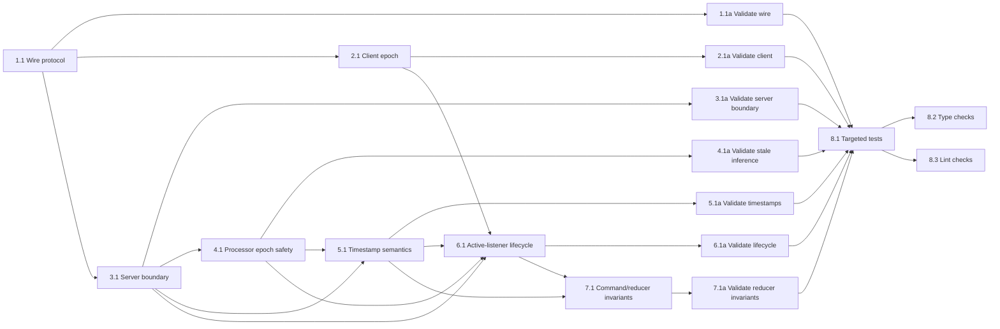

## 1. Wire Protocol
- [x] 1.1 Add `RecordingStartedMessage` to `packages/wire`, add optional `recording_id` to live transcription/control messages, update codec union exports, and keep file/RTSP compatibility explicit.
- [x] 1.1a Validate wire protocol serialization/deserialization with targeted wire tests and type checking for touched wire files.

## 2. Client Recording Epoch
- [x] 2.1 Update `WebSocketConnection`, `EavesdropClient`, and `AudioCapture` so `start_streaming(recording_id)` serializes `control_recording_started` before audio capture starts, drains stale capture/message/event queues for the new epoch, uses `loop.call_soon_threadsafe(queue.put_nowait, audio_data)` for the sounddevice callback handoff, includes `recording_id` on flush/cancel controls, and filters stale transcription messages by active/finalizing recording id.
- [x] 2.1a Validate client ordering, audio callback handoff, and stale-message filtering with targeted client tests covering start-before-audio, queue drain, flush matching, cancel matching, and stale result drop evidence.

## 3. Server Recording Boundary
- [x] 3.1 Update live server text-frame handling so `control_recording_started` is accepted only in live mode, establishes the current recording epoch, fully resets the audio buffer/session/completed history/pending flush/language-local state, and rejects illegal controls before a recording epoch exists.
- [x] 3.1a Validate server recording-boundary behavior with targeted server lifecycle tests proving buffer start/processed time reset to zero, old completed segments are cleared, pending flush is cleared, and controls before a recording boundary are rejected.

## 4. Processor Epoch Safety
- [x] 4.1 Thread recording epoch identity through `StreamingTranscriptionProcessor` so waits wake on new recording boundaries, in-flight old-epoch transcription results are dropped before any mutation/emission, and emitted live results carry the current `recording_id`.
- [x] 4.1a Validate stale inference safety with targeted processor/server tests where an old transcription pass finishes after a new recording starts and does not mutate session, buffer, language, or sink output.

## 5. Recording-Relative Timestamp Semantics
- [x] 5.1 Ensure live active-listener segment and word timestamps emitted by the server are recording-relative projections from the current recording sample timeline, including completed segments, incomplete tail segments, synthetic incomplete segments, flush responses, buffer advancement comparisons, and sample counts derived from mono float32 PCM byte lengths.
- [x] 5.1a Validate timestamp semantics with targeted server tests proving first-recording audio starts at `0`, second recording on the same WebSocket also starts at `0`, and no WebSocket-age offset appears in segment or word timestamps.

## 6. Active-Listener Recording Lifecycle
- [x] 6.1 Update active-listener start/finish/cancel lifecycle so active-listener generates `recording_id`, starts `RecordingSession(recording_id)` before `client.start_streaming(recording_id)`, carries `recording_id` in `FinishedRecording`, and uses that id for cancel/finalization flush while preserving the invariant that locally stored bytes are the bytes sent upstream from sample 0.
- [x] 6.1a Validate active-listener lifecycle with targeted app tests covering no missed initial captured chunks, cancel resets cursor/epoch, finish flush uses the finished recording id, and a new start cannot destructively reset an unflushed finished recording.

## 7. Command Timeline and Reducer Invariants
- [x] 7.1 Move active-listener command classification toward recording sample spans, or otherwise guarantee existing `TimeSpan`/`TimedWord` seconds are sample-derived projections from the same recording epoch before reducer comparisons happen.
- [x] 7.1a Validate command and reducer invariants with targeted reducer/app tests proving command text cannot flip to normal text after caps release, prior canceled recording text cannot appear in a new recording, initial segment history is empty after a new recording, and long-recording prefix text is retained while incomplete tail updates.

## 8. End-to-End Verification
- [x] 8.1 Run package-specific targeted test suites with `uv run pytest` from each touched package directory and save the observed output as implementation evidence.
- [x] 8.2 Run type checks: `uv run basedpyright` from the repository root and `task typecheck-server` from the repository root when server code is touched; save the observed output as implementation evidence.
- [x] 8.3 Run lint/format checks with `uv run ruff check` and `uv run ruff format --check` from each touched package directory; save the observed output as implementation evidence.

